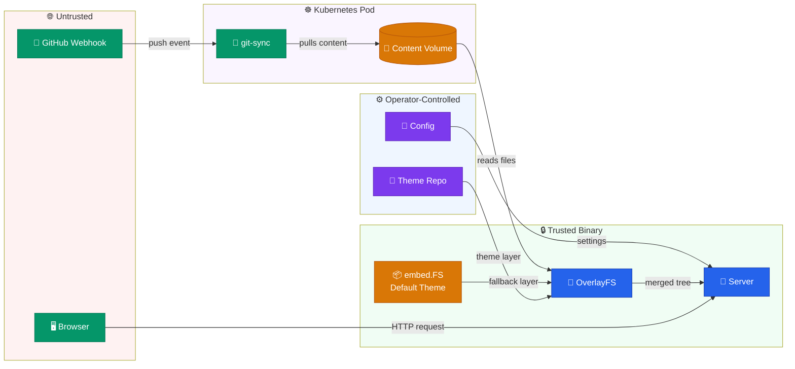

# Contributing to BlogFlow

Welcome — and thank you for considering a contribution to BlogFlow!
Whether you're fixing a typo, adding a feature, or improving documentation,
every contribution makes BlogFlow better for everyone.

BlogFlow is licensed under the [Apache License 2.0](LICENSE). By submitting a
pull request you agree that your contribution is licensed under the same terms.

---

## Getting Started

### Prerequisites

| Tool            | Version   | Purpose                     |
| --------------- | --------- | --------------------------- |
| **Go**          | 1.26+     | Build and test              |
| **Docker**      | 24+       | Container builds and smoke tests |
| **golangci-lint** | v2      | Static analysis             |
| **gofumpt**     | latest    | Code formatting             |
| **kubeconform** | latest    | Kubernetes manifest linting (optional) |

### Fork, Clone, and Verify

```bash
# Fork on GitHub, then:
git clone https://github.com/<you>/blogflow.git
cd blogflow
make build && make test
```

All tests should pass before you start working. If they don't, open an issue.

---

## Development Workflow

1. **Branch from `main`** — use a descriptive branch name:
   ```
   feat/overlay-cache
   fix/webhook-auth-header
   docs/contributing-guide
   ```

2. **Make small, focused commits** using
   [Conventional Commits](https://www.conventionalcommits.org/):

   | Prefix   | Use when …                          |
   | -------- | ----------------------------------- |
   | `feat:`  | Adding a new feature                |
   | `fix:`   | Fixing a bug                        |
   | `docs:`  | Documentation-only changes          |
   | `chore:` | Build, CI, dependency updates       |
   | `test:`  | Adding or improving tests           |

3. **Reference issues** in commit bodies with `Fixes #N` or `Refs #N`.

4. **Open a PR to `main`** when your work is ready for review.

---

## Code Standards

### Linting and Formatting

```bash
make lint    # golangci-lint v2 (config: .golangci.yml)
make fmt     # gofumpt formatting
```

Both must pass before CI will approve your PR.

### Style Guidelines

- **Package godoc** — every exported package must have a `// Package …` comment.
- **Error wrapping** — wrap errors with `fmt.Errorf("context: %w", err)` to
  preserve the error chain.
- **Consistent terminology** — use the project glossary: "content repo" (not
  "posts repo"), "overlay FS" (not "layered filesystem"), "sync" (not "refresh"),
  "front matter" (not "metadata header").
- **Keep functions short** — if a function exceeds ~40 lines, consider
  extracting helpers.

---

## Testing

BlogFlow has multiple testing layers. Run them with `make`:

```bash
make test         # Unit tests with -race detector
make smoke-test   # Container smoke tests (requires Docker)
make e2e          # End-to-end tests via Docker Compose
make k8s-lint     # Validate K8s manifests and Helm chart
```

- **Unit tests** are required for all new logic.
- **Smoke tests** verify the container image boots, serves pages, and exposes
  health/readiness endpoints.
- **E2E tests** exercise the full stack — content sync, rendering, and serving.
- **K8s lint** validates all manifests and Helm chart variants with
  `kubeconform`.

---

## Make Targets

| Target         | Description                                       |
| -------------- | ------------------------------------------------- |
| `make build`   | Compile the `blogflow` binary to `bin/`           |
| `make test`    | Run unit tests with race detector                 |
| `make lint`    | Run golangci-lint static analysis                 |
| `make fmt`     | Format Go source files with gofumpt               |
| `make docker`  | Build the Docker image                            |
| `make run`     | Build and run blogflow with `--dev` defaults      |
| `make dev`     | Build and run with local `data/content` and `data/theme` dirs |
| `make smoke-test` | Run container smoke tests (requires Docker)    |
| `make e2e`     | Run end-to-end tests via Docker Compose           |
| `make k8s-lint`| Validate K8s manifests and Helm chart             |
| `make clean`   | Remove build artifacts and caches                 |
| `make help`    | Show available targets                            |

---

## Architecture

BlogFlow is a single Go binary that serves a blog from a Git-backed content
repo, with theme overlay support and live sync.

```
cmd/blogflow/          Entry point, CLI flags, bootstrap, health checks
internal/
  config/              Configuration loading and validation
  content/             Content repo sync, markdown parsing, front matter
  theme/               Theme loading, template rendering
  overlayfs/           Overlay filesystem — merges content and theme trees
  server/              HTTP server, routes, middleware, metrics
  gitops/              Git operations — clone, pull, webhook receivers
  envfile/             Environment file parsing
defaults/              Embedded default theme and content
deploy/                Helm chart and Kubernetes manifests
examples/              Example K8s deployments and configurations
```

---

## Mermaid Diagram Standards

BlogFlow uses [Mermaid](https://mermaid.js.org/) diagrams throughout its
documentation — architecture overviews, deployment flows, sequence diagrams, and
decision trees. Follow these standards so every diagram is visually consistent
and immediately readable.

### Color Scheme (`classDef` Classes)

Every Mermaid diagram **must** use the standard `classDef` palette instead of
inline `style` directives on individual nodes. Define these classes at the
bottom of every diagram block:

```text
classDef primary   fill:#2563eb,stroke:#1e40af,color:#fff
classDef secondary fill:#7c3aed,stroke:#5b21b6,color:#fff
classDef external  fill:#059669,stroke:#047857,color:#fff
classDef storage   fill:#d97706,stroke:#b45309,color:#fff
classDef danger    fill:#dc2626,stroke:#991b1b,color:#fff
classDef success   fill:#16a34a,stroke:#15803d,color:#fff
classDef muted     fill:#6b7280,stroke:#4b5563,color:#fff
```

| Class       | Use for                          | Examples                                      |
| ----------- | -------------------------------- | --------------------------------------------- |
| `primary`   | BlogFlow core components         | Server, OverlayFS, Theme Engine               |
| `secondary` | Supporting / internal components | Config, Scanner, Cache                        |
| `external`  | External systems                 | GitHub, git-sync, Browser, Prometheus         |
| `storage`   | Data, files, volumes             | Content dir, PVC, embed.FS, ConfigMap         |
| `danger`    | Errors, anti-patterns            | Stale pods, failures, rejected paths          |
| `success`   | Recommended, healthy states      | Synced pods, approved patterns                |
| `muted`     | Context, background info         | Trust boundaries, optional paths              |

### Subgraph Backgrounds

Use tinted subgraph fills to convey trust boundaries at a glance:

| Boundary              | Style                       | Use                              |
| --------------------- | --------------------------- | -------------------------------- |
| Trusted (compiled)    | `style TB fill:#f0fdf4`     | embed.FS, binary code            |
| Operator-controlled   | `style OP fill:#eff6ff`     | Config, theme repos              |
| Untrusted / external  | `style UT fill:#fef2f2`     | User input, external APIs        |
| K8s Pod boundary      | `style K8S fill:#faf5ff`    | Container grouping               |

### Formatting Rules

- **Always specify direction** — start every diagram with `graph LR`, `graph TD`,
  `sequenceDiagram`, or another explicit direction.
- **Line breaks** — use `<br/>` only; never use `\n`.
- **Emojis** — allowed in text labels (e.g., `["🚀 Server"]`), but **never** in
  node IDs.
- **No inline `style`** on individual nodes — use `classDef` + `:::className`
  (see [Color Scheme](#color-scheme-classdef-classes) above).
- **Node shapes** — pick the shape that matches the concept:
  - `[rect]` — components and services
  - `[(database)]` — storage and persistence
  - `{{decision}}` — choices and conditions
  - `([rounded])` — events and triggers

### Example Diagram

Below is a complete reference diagram that demonstrates every standard class,
subgraph background, and formatting rule:

````markdown

````

---

## AI-Assisted Development

BlogFlow uses a structured AI-agent workflow to maintain quality and
consistency across contributions.

### Agent Personas

Ten specialized agent personas live in `docs/persona/agents/`. Each encodes
domain expertise, decision heuristics, and collaboration handoff rules:

| Persona | Focus Area |
| ------- | ---------- |
| Cloud-Native Systems Engineer | Core Go services, server, sync |
| Cloud-Native Distributed Systems Architect | System design, scalability |
| Cloud-Native Front-End Engineer | Templates, themes, CSS |
| Cloud-Native Site Reliability Engineer | Observability, deployments |
| Cloud-Native Security SME | Auth, secrets, hardening |
| Solutions Engineer / Developer Success | Quick-start, DX |
| Product Manager | Roadmap, prioritization |
| Program Manager | Process, milestones |
| Privacy & Compliance / GRC Lead | Licensing, data governance |
| Technical Writer | Documentation, style |

### Skills

Five reusable skills in `.github/skills/` automate common workflows:

| Skill | Purpose |
| ----- | ------- |
| `design-doc` | Draft an ADR or design document |
| `implement-work-item` | Implement a feature or fix from an issue |
| `review-fix-loop` | Iterative review → fix cycle |
| `review-pr` | Structured PR review |
| `update-changelog` | Generate a changelog entry |

### Review-Fix Loop (RFL)

The RFL process uses a **3-agent council** to review changes:

1. A **code reviewer** evaluates correctness, style, and test coverage.
2. A **security reviewer** checks for vulnerabilities and compliance.
3. A **product reviewer** assesses user impact and documentation.

All three reviewers must reach a ⭐⭐⭐⭐⭐ rating before the change is
approved. If any reviewer rates below five stars, the author addresses
feedback and re-submits for another round.

---

## Changelog

BlogFlow uses the **Prometheus/Cortex ecosystem changelog convention** in [`CHANGELOG.md`](CHANGELOG.md).

### Entry Format

```
* [CATEGORY] Component: Description of change. #PR
```

### Categories

| Tag          | Use when …                           |
| ------------ | ------------------------------------ |
| `[FEATURE]`  | New user-facing capability           |
| `[BUGFIX]`   | Bug fix                              |
| `[ENHANCEMENT]` | Improvement to existing feature   |
| `[CHANGE]`   | Breaking or behavioral change        |

### Component Prefixes

Use the package or area name — for example: `Server`, `Content`, `Theme`,
`OverlayFS`, `GitOps`, `Config`, `Helm`, `CI`, `Docs`.

### Example

```
* [FEATURE] Server: Add Prometheus /metrics endpoint. #42
* [BUGFIX] GitOps: Fix webhook signature validation for SHA-256. #55
* [ENHANCEMENT] OverlayFS: Cache merged file tree between syncs. #61
```

Add your entry under the **`main / unreleased`** section at the top of the
file. Maintainers move entries to a versioned section at release time.

---

## Pull Request Process

Before opening a PR, confirm:

- [ ] **CI is green** — `make lint`, `make test`, and `make smoke-test` pass.
- [ ] **RFL report** — if applicable, include the review-fix loop summary.
- [ ] **Changelog entry** — add a line to `CHANGELOG.md` under
      `main / unreleased`.
- [ ] **Issues linked** — reference related issues with `Fixes #N` or
      `Refs #N` in the PR description.
- [ ] **Docs updated** — if your change affects user-facing behavior, update
      the relevant documentation.

### What to Expect

1. CI runs automatically on every push.
2. A maintainer (or AI reviewer) will review within a few days.
3. You may be asked to revise — this is normal and collaborative.
4. Once approved, a maintainer will squash-merge your PR.

---

## Release Process

BlogFlow follows [Semantic Versioning](https://semver.org/).

| Event | Trigger | Result |
| ----- | ------- | ------ |
| **Tag push** (`v*`) | `git tag v1.2.3 && git push --tags` | `release.yml` builds and pushes to GHCR |
| **Merge to `main`** | PR merge | `publish.yml` pushes the `:main` tag to GHCR |

Release artifacts are published to
`ghcr.io/khaines/blogflow:<version>`.

Only maintainers create release tags. Contributors do not need to tag releases —
just ensure your changelog entry is in place and CI is green.

---

_Thank you for helping make BlogFlow better! If you have questions, open an
issue or start a discussion._
