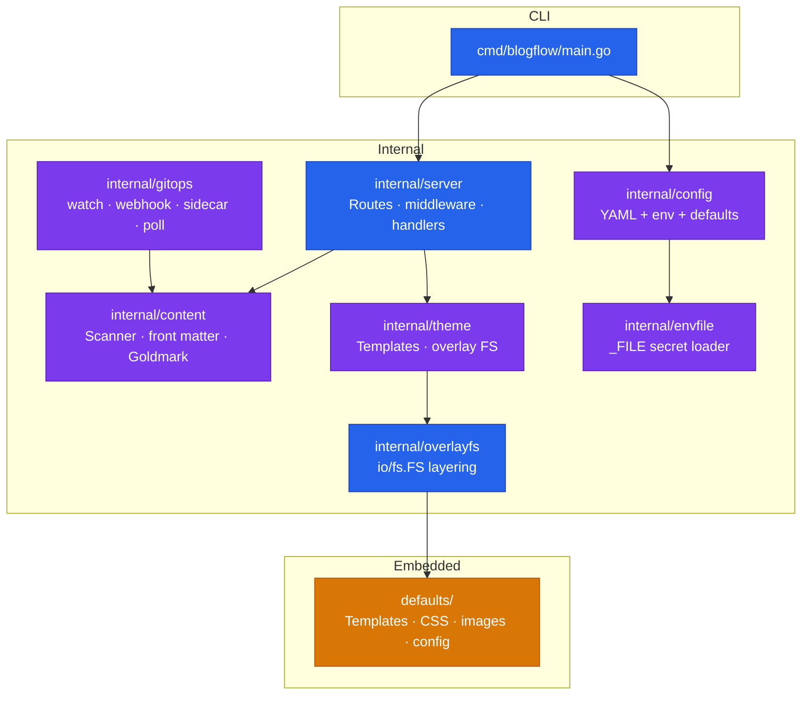

# BlogFlow

[](LICENSE)
[](go.mod)
[](https://github.com/khaines/blogflow/actions/workflows/ci.yml)
[](https://github.com/khaines/blogflow/releases/latest)
[](https://github.com/khaines/blogflow/pkgs/container/blogflow)

**A git-driven blog engine that just serves markdown.**

## What Is BlogFlow?

BlogFlow is a single-binary blog engine written in Go. It embeds a complete default theme, templates, and configuration — just add markdown. An overlay FS layers your content, config, and theme files over the embedded defaults, so you only override what you need. The container image ships under 25 MB on a distroless base with no shell and no package manager. Push markdown to a content repo and BlogFlow renders your site.

## Quick Start

```bash
docker run -p 8080:8080 ghcr.io/khaines/blogflow:latest
```

Open [http://localhost:8080](http://localhost:8080) — a working blog with embedded sample content.

To serve your own posts:

```bash
docker run -p 8080:8080 \
  -v ./content:/data/content:ro \
  ghcr.io/khaines/blogflow:latest
```

## Features

### Core

- **Overlay FS** — external files override embedded defaults via a layered `io/fs.FS`
- **Goldmark renderer** — GitHub Flavored Markdown with tables, task lists, footnotes, and link sanitization
- **Chroma syntax highlighting** — fenced code blocks rendered with CSS classes
- **Render cache** — in-memory LRU with configurable TTL and max entries
- **Atom / RSS feeds** — auto-generated at `/feed.xml` with configurable item count
- **Sitemap** — auto-generated `sitemap.xml`

### Content

- **Front matter** — YAML metadata: `title`, `date`, `tags`, `slug`, `draft`, `author`, `template`, `image`, `weight`, and more
- **Pagination** — configurable posts-per-page with paginated index and tag listings
- **Page sort** — posts sorted by date descending; pages sorted by weight then title
- **Best-effort scanner** — collects parse errors and slug conflicts without aborting the scan
- **Slug override** — set `slug` in front matter or let BlogFlow derive it from the filename

### Sync Strategies

| Strategy | Trigger | Best for |
|---|---|---|
| **watch** | fsnotify file events | Local development — instant reload |
| **webhook** | GitHub/GitLab push event (HMAC-SHA256) | Public sites — instant sync on push |
| **sidecar** | git-sync symlink swap | Kubernetes — no inbound ingress needed |
| **poll** | Periodic `git pull` on a timer | Multi-replica clusters without git-sync |

### Observability

- **Prometheus metrics** — `/metrics` endpoint with request counters, latencies, and overlay FS stats
- **RED dashboard** — request rate, error rate, duration (p50/p95/p99) plus per-path breakdowns
- **Grafana dashboard** — [pre-built JSON](examples/grafana/) with RED, HTTP detail, overlay FS, and Go runtime panels
- **Structured logging** — `slog` JSON in production, text in `--dev` mode; includes request-ID, method, path, status, duration
- **Request-ID** — generated per-request with proxy-aware client IP detection

### Security

- **Content-Security-Policy** — restrictive CSP header on every response
- **HSTS** — `Strict-Transport-Security` when `tls_terminated: true`
- **Permissions-Policy** — disables camera, microphone, geolocation, and other browser APIs
- **Rate limiting** — LRU-based limiter with TTL eviction (configurable per-minute cap)
- **Body limits** — `MaxBytesReader` on webhook payloads to prevent oversized requests
- **`_FILE` secrets** — `BLOGFLOW_WEBHOOK_SECRET_FILE` reads the secret from a mounted file (K8s-native)
- **Distroless container** — `gcr.io/distroless/static-debian12:nonroot`, UID 65532, read-only root FS, all capabilities dropped

### Deployment

- **< 25 MB image** — single static binary, stripped debug symbols
- **Healthcheck CLI** — `blogflow healthcheck` subcommand for distroless containers (no curl/wget needed)
- **Health endpoints** — `/healthz` (liveness) and `/readyz` (readiness with atomic gate)
- **Helm chart** — production-ready chart with sidecar, webhook, and watch strategies ([`deploy/helm/blogflow/`](deploy/helm/blogflow/))
- **K8s manifests** — plain YAML examples for sidecar and webhook patterns ([`examples/k8s/`](examples/k8s/))
- **Config reload** — runtime `Reload()` with `OnChange()` callbacks; no restart needed
- **PodDisruptionBudget** — optional PDB, startup probes, and emptyDir size limits in Helm

## Configuration

BlogFlow merges three configuration layers (highest priority first):

1. **Environment variables** (`BLOGFLOW_*`)
2. **`site.yaml`** in your config directory
3. **Embedded defaults**

See [`examples/config/site.yaml`](examples/config/site.yaml) for a fully annotated example.

### Key Environment Variables

| Variable | Description |
|---|---|
| `BLOGFLOW_SITE_TITLE` | Site title |
| `BLOGFLOW_SITE_BASE_URL` | Canonical base URL (set to HTTPS in production) |
| `BLOGFLOW_SERVER_PORT` | HTTP listen port (default `8080`) |
| `BLOGFLOW_CACHE_ENABLED` | Enable render cache (`true` / `false`) |
| `BLOGFLOW_SYNC_STRATEGY` | Sync strategy: `watch`, `webhook`, `sidecar`, `poll` |
| `BLOGFLOW_WEBHOOK_SECRET` | Webhook HMAC secret (≥ 32 bytes — **never in YAML**) |
| `BLOGFLOW_WEBHOOK_SECRET_FILE` | Path to secret file (`_FILE` convention) |
| `BLOGFLOW_SYNC_WEBHOOK_RATE_LIMIT` | Webhook rate limit (1–100 req/min) |
| `BLOGFLOW_FEED_TYPE` | Feed format: `atom` or `rss` |
| `BLOGFLOW_SERVER_TLS_TERMINATED` | Enable HSTS header (`true` when behind TLS proxy) |

## Deployment

Four deployment patterns — same binary, different sync strategy:

| Pattern | Strategy | Docs |
|---|---|---|
| Local development | `watch` | [Deployment Guide § Pattern 1](docs/deployment-guide.md#pattern-1-local-development-watch) |
| K8s git-sync sidecar | `sidecar` | [Deployment Guide § Pattern 2](docs/deployment-guide.md#pattern-2-kubernetes--git-sync-sidecar) |
| K8s webhook + go-git | `webhook` | [Deployment Guide § Pattern 3](docs/deployment-guide.md#pattern-3-kubernetes--webhook--go-git-pull) |
| Docker / VM production | `webhook` | [Deployment Guide § Pattern 4](docs/deployment-guide.md#pattern-4-docker-production-webhook) |

For full details — architecture diagrams, Helm values, auth setup — see the **[Deployment Guide](docs/deployment-guide.md)**.

## Content Format

Posts live in `content/posts/` as markdown files with YAML front matter:

```yaml
---
title: "My First Post"
date: 2025-06-15T09:00:00Z
tags: ["go", "blogging"]
draft: false
---

Your markdown content here.
```

### Front Matter Fields

| Field | Type | Required | Description |
|---|---|---|---|
| `title` | string | ✓ | Post title |
| `date` | RFC 3339 | ✓ | Publish date |
| `slug` | string | | URL path segment (default: filename) |
| `draft` | bool | | Exclude from published index |
| `tags` | list | | Tag labels for categorization |
| `categories` | list | | Category labels |
| `author` | string | | Author name (overrides site default) |
| `description` | string | | Summary for feeds and SEO |
| `template` | string | | Override the rendering template |
| `image` | string | | Featured image URL |
| `weight` | int | | Sort priority for pages (lower = first) |
| `updated` | RFC 3339 | | Last-modified date |
| `reading_time` | int | | Manual reading-time override (minutes) |

### Supported Markdown

GitHub Flavored Markdown via Goldmark: tables, task lists, strikethrough, autolinks, footnotes, and fenced code blocks with syntax highlighting.

## Development

```bash
make build        # Compile binary to bin/blogflow
make test         # Unit tests with race detector
make lint         # golangci-lint static analysis
make fmt          # Format with gofumpt
make docker       # Build container image
make smoke-test   # Container smoke tests (health, feeds, metrics)
make e2e          # Docker Compose end-to-end suite
make k8s-lint     # Validate K8s manifests and Helm chart with kubeconform
make run          # Build and run locally (dev mode)
make dev          # Build and run with local content
make clean        # Remove build artifacts
```

## Architecture



**Overlay FS resolution** (first match wins):

```
External theme → External content → External config → Embedded defaults
```

**Content pipeline**:

```
Markdown → YAML front matter + Goldmark → Go html/template → Render cache → HTTP response
```

Design documents and ADRs are in [`docs/engineering/design/`](docs/engineering/design/).

## Contributing

See [CONTRIBUTING.md](CONTRIBUTING.md) for guidelines. The short version:

1. Fork and create a feature branch
2. Write tests — `make test`
3. Lint — `make lint`
4. Open a pull request to `main`

## License

[Apache License 2.0](LICENSE)
