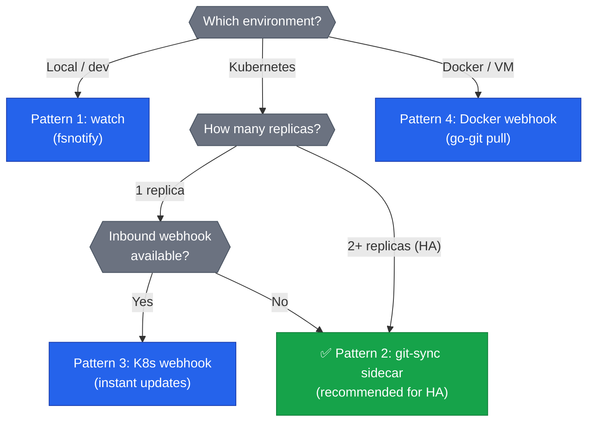
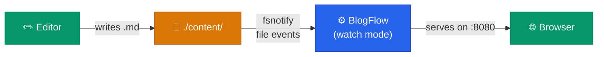
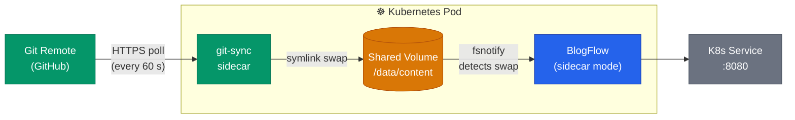
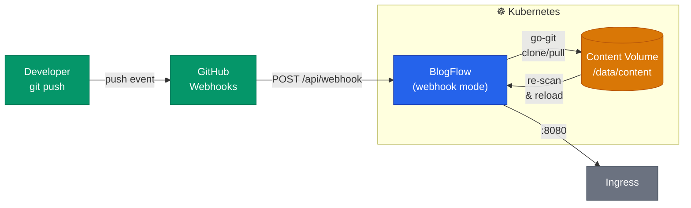
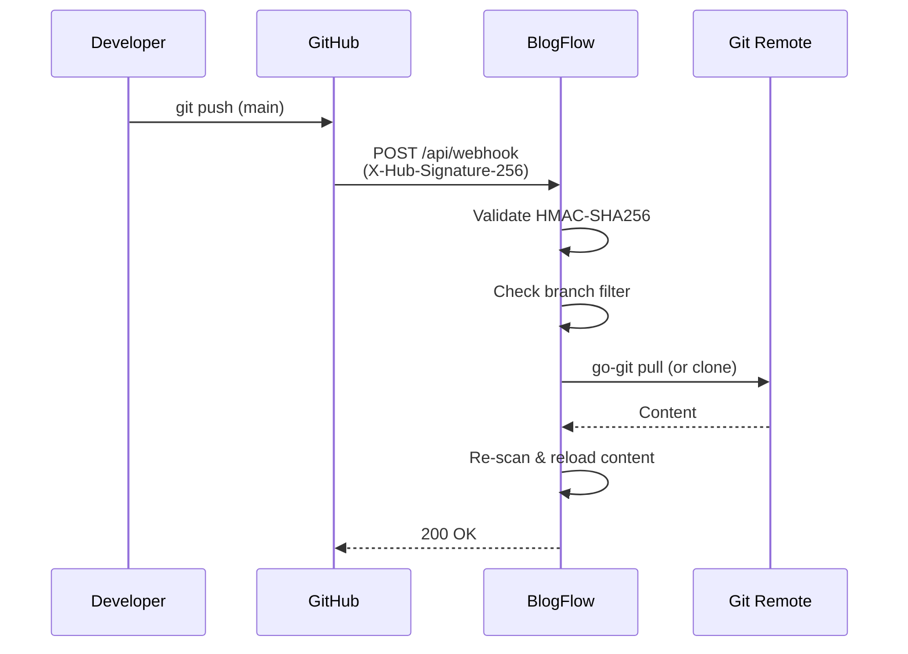
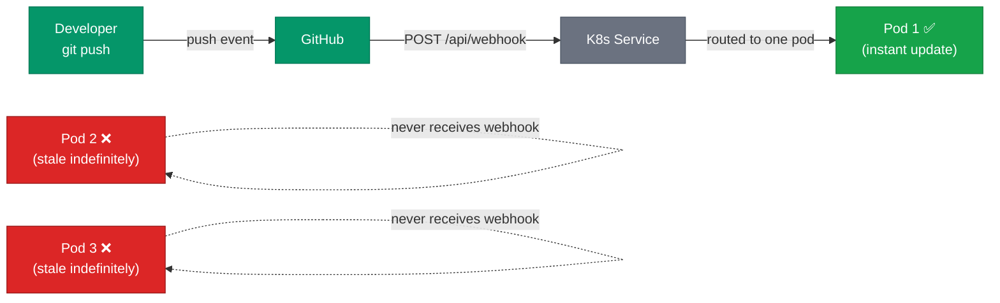
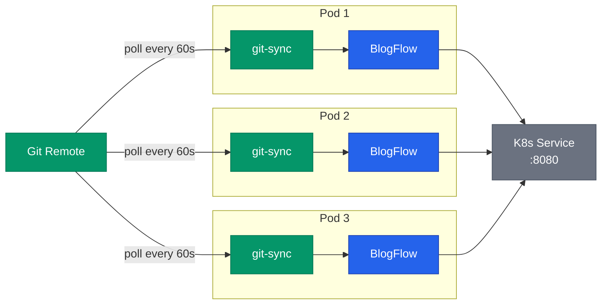
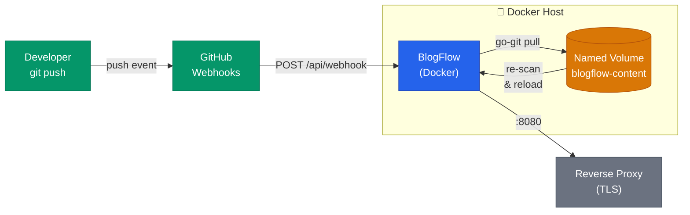

# Deployment Guide

> How to deploy BlogFlow in four patterns: local development, Kubernetes with
> git-sync sidecar, Kubernetes with webhook + go-git, and Docker production.

## Table of Contents

- [Overview](#overview)
- [Pattern 1: Local Development (watch)](#pattern-1-local-development-watch)
- [Pattern 2: Kubernetes — git-sync Sidecar](#pattern-2-kubernetes--git-sync-sidecar)
- [Pattern 3: Kubernetes — Webhook + go-git Pull](#pattern-3-kubernetes--webhook--go-git-pull)
- [Pattern 4: Docker Production (Webhook)](#pattern-4-docker-production-webhook)
- [Health & Readiness Endpoints](#health--readiness-endpoints)
- [Observability](#observability)
- [Helm Chart Installation](#helm-chart-installation)
- [Authentication Reference](#authentication-reference)
- [Environment Variable Reference](#environment-variable-reference)

---

## Overview

BlogFlow supports three content sync strategies plus an in-process git puller.
Choose a deployment pattern based on your environment and update-latency needs:

| Pattern | Strategy | Trigger | Latency | Replicas | Network requirement |
|---|---|---|---|---|---|
| Local dev | `watch` | fsnotify file events | Instant (< 1 s) | 1 | None |
| K8s sidecar | `sidecar` | git-sync symlink swap | ≤ poll period (default 60 s) | 1+ (**recommended for HA**) | Egress to git remote |
| K8s webhook | `webhook` | GitHub push webhook | Instant on push | 1 | Ingress (webhook) + egress (git clone) |
| K8s webhook + poll | `webhook` | Webhook + `poll_interval` | Instant (1 pod) / up to `poll_interval` (others) | 2+ (if sidecar not possible) | Ingress (webhook) + egress (git clone) |
| Docker prod | `webhook` | GitHub push webhook | Instant on push | 1 | Ingress (webhook) + egress (git clone) |

All patterns share the same binary and container image. Only the `sync.strategy`
config value and surrounding infrastructure differ.



---

## Pattern 1: Local Development (watch)

### Architecture



The `watch` strategy uses [fsnotify](https://github.com/fsnotify/fsnotify) to
recursively monitor content directories. Changes to `.md`, `.html`, `.css`, and
`.yaml` files trigger a debounced content reload (500 ms window). Temporary
files, swap files, and `.git` paths are ignored.

### Option A: docker compose

```bash
# Start with live-reload (volumes mounted read-write, --dev flag)
docker compose -f docker-compose.yml -f docker-compose.dev.yml up
```

This mounts `./examples/content` and `./examples/config` into the container
with read-write access and passes the `--dev` flag for development niceties.
The port is bound to `127.0.0.1:8080` only.

### Option B: make dev

```bash
# Build and run locally (no Docker)
make dev
```

This compiles the binary and runs it with `--dev`. If `./data/content` or
`./data/theme` directories exist, they are passed automatically.

### Config (site.yaml)

```yaml
site:
  title: "My Dev Blog"
  base_url: "http://localhost:8080"

sync:
  strategy: "watch"

cache:
  enabled: false          # disable cache during development
```

### Volume strategy

| Path | Source | Access |
|---|---|---|
| `/data/content` | Bind mount to your local content dir | Read-write |
| `/data/config` | Bind mount to your config dir | Read-write |

No persistent volumes are needed — you are editing files directly on your host.

### Security notes

- The dev compose overlay disables `read_only` on the root filesystem for
  convenience. Do **not** use `docker-compose.dev.yml` in production.
- Port is bound to `127.0.0.1` only in dev mode.

---

## Pattern 2: Kubernetes — git-sync Sidecar

### Architecture



**How it works:** The [git-sync](https://github.com/kubernetes/git-sync)
sidecar container polls the git remote on a configurable interval (default
60 s). When new commits are found, it clones them into a new directory and
atomically swaps a symlink to point at the new content. BlogFlow's `sidecar`
strategy watches `/data/content` with fsnotify and detects the symlink
Create/Remove/Rename events, then triggers a debounced content reload.

**Why choose this pattern:**
- No inbound webhook needed — ideal for restricted networks or air-gapped clusters
- git-sync is a mature, well-tested Kubernetes-native tool
- BlogFlow never needs git credentials — git-sync handles authentication
- Clean separation of concerns: git-sync manages git, BlogFlow manages content

### Quick Start

Production-ready manifests (Deployment, Service, ConfigMap, Namespace) are in
[`examples/k8s/sidecar/`](../examples/k8s/sidecar/). Deploy with Kustomize:

```bash
kubectl apply -k examples/k8s/sidecar/
```

> **Tip:** Edit the `--repo` arg in `deployment.yaml` and create a
> `blogflow-git-credentials` Secret before applying. See the manifests for
> full details.

### Key Sidecar Excerpt

The critical piece is the git-sync sidecar container definition (see
[`examples/k8s/sidecar/deployment.yaml`](../examples/k8s/sidecar/deployment.yaml)
for the full Deployment):

```yaml
        # --- git-sync sidecar container ---
        - name: git-sync
          image: registry.k8s.io/git-sync/git-sync:v4.4.0
          args:
            - --repo=https://github.com/your-org/blog-content.git
            - --ref=main
            - --root=/data/content
            - --period=60s
            - --link=current
          env:
            - name: GITSYNC_USERNAME
              value: "x-access-token"
            - name: GITSYNC_PASSWORD
              valueFrom:
                secretKeyRef:
                  name: blogflow-git-credentials
                  key: token
          securityContext:
            runAsUser: 65532
            runAsNonRoot: true
            readOnlyRootFilesystem: true
            allowPrivilegeEscalation: false
            capabilities:
              drop: ["ALL"]
```

### Config (site.yaml)

```yaml
site:
  title: "My Blog"
  base_url: "https://blog.example.com"

server:
  tls_terminated: true        # behind ingress TLS termination
  hsts_max_age: 63072000

sync:
  strategy: "sidecar"

cache:
  enabled: true
  ttl: "1h"
```

Deploy this as a ConfigMap:

```bash
kubectl create configmap blogflow-config \
  --from-file=site.yaml=site.yaml \
  -n blogflow
```

### Volume strategy

| Volume | Type | Writer | Reader | Purpose |
|---|---|---|---|---|
| `content` | `emptyDir` | git-sync | BlogFlow (read-only mount) | Shared content via symlink swap |
| `config` | `ConfigMap` | — | BlogFlow | `site.yaml` configuration |
| `cache` | `emptyDir` | BlogFlow | BlogFlow | Rendered page cache (ephemeral) |
| `tmp` | `emptyDir` (Memory) | BlogFlow | BlogFlow | Go temp files in RAM |
| `tmp-gitsync` | `emptyDir` (Memory) | git-sync | git-sync | git-sync temp files in RAM |

The content volume is an `emptyDir` shared between both containers. git-sync
writes to it; BlogFlow mounts it as `readOnly: true`. Using `emptyDir` instead
of a PVC is intentional — git-sync fully repopulates it on startup, so there is
nothing to persist across pod restarts.

### Authentication setup

git-sync handles all git authentication. BlogFlow itself needs no git
credentials in this pattern.

**Option A: Personal Access Token (PAT) or GitHub App token**

```bash
kubectl create secret generic blogflow-git-credentials \
  --from-literal=token=ghp_YourTokenHere \
  -n blogflow
```

The Deployment YAML above references this secret via `GITSYNC_PASSWORD`.

**Option B: SSH key**

```bash
kubectl create secret generic blogflow-git-ssh \
  --from-file=ssh-key=/path/to/deploy_key \
  --from-file=known_hosts=/path/to/known_hosts \
  -n blogflow
```

Update the git-sync container to use SSH:

```yaml
args:
  - --repo=git@github.com:your-org/blog-content.git
  - --ref=main
  - --root=/data/content
  - --period=60s
  - --ssh-key-file=/etc/git-secret/ssh-key
  - --ssh-known-hosts-file=/etc/git-secret/known_hosts
volumeMounts:
  - name: git-ssh
    mountPath: /etc/git-secret
    readOnly: true

# Add to volumes:
- name: git-ssh
  secret:
    secretName: blogflow-git-ssh
    defaultMode: 0400
```

### Security notes

- Both containers run as UID 65532 (nonroot) with all capabilities dropped.
- Root filesystem is read-only; only explicit `emptyDir` volumes are writable.
- No inbound webhook endpoint is needed — no ingress path to protect.
- Network policy: allow egress TCP 443 (git HTTPS) and UDP/TCP 53 (DNS) only.
- See [Container Security Guide](engineering/container-security.md) for the
  full security context reference.

---

## Pattern 3: Kubernetes — Webhook + go-git Pull

### Architecture



**How it works:** GitHub sends a push webhook to BlogFlow's `/api/webhook`
endpoint. BlogFlow validates the HMAC-SHA256 signature, checks the branch
filter, and then uses [go-git](https://github.com/go-git/go-git) to clone
(first time) or pull (subsequent) the content repository to a read-write
volume. Content is reloaded immediately after pull completes.



**Why choose this pattern:**
- Instant updates — no polling delay
- Single container — simpler than the sidecar pattern
- BlogFlow manages git directly via go-git (shallow clone, single-branch)

**Trade-offs:**
- Requires inbound webhook access (Ingress must expose `/api/webhook`)
- Requires egress to git remote (HTTPS or SSH)
- BlogFlow needs git credentials (unlike the sidecar pattern)

### Quick Start

Production-ready manifests (Deployment, Service, Ingress, Secret, ConfigMap,
Namespace) are in [`examples/k8s/webhook/`](../examples/k8s/webhook/). Deploy
with Kustomize:

```bash
kubectl apply -k examples/k8s/webhook/
```

> **Tip:** Edit the repo URL in `deployment.yaml`, create secrets (see
> [Secrets](#secrets) below), and update the Ingress host before applying.

### Key Webhook Excerpt

The webhook pattern uses a single container with environment-injected secrets
(see [`examples/k8s/webhook/deployment.yaml`](../examples/k8s/webhook/deployment.yaml)
for the full Deployment):

```yaml
          env:
            - name: BLOGFLOW_SYNC_STRATEGY
              value: "webhook"
            - name: BLOGFLOW_WEBHOOK_SECRET
              valueFrom:
                secretKeyRef:
                  name: blogflow-webhook-secret
                  key: webhook-secret
            - name: BLOGFLOW_GIT_TOKEN
              valueFrom:
                secretKeyRef:
                  name: blogflow-secrets
                  key: git-token

          volumeMounts:
            - name: content
              mountPath: /data/content       # read-write — go-git pulls here
            - name: config
              mountPath: /data/config
              readOnly: true
```

### Secrets

```bash
# Generate a strong webhook secret (min 32 characters)
WEBHOOK_SECRET=$(openssl rand -hex 32)

kubectl create secret generic blogflow-secrets \
  --from-literal=webhook-secret="$WEBHOOK_SECRET" \
  --from-literal=git-token=ghp_YourTokenHere \
  -n blogflow
```

### Config (site.yaml)

```yaml
site:
  title: "My Blog"
  base_url: "https://blog.example.com"

server:
  tls_terminated: true
  hsts_max_age: 63072000

sync:
  strategy: "webhook"
  webhook:
    path: "/api/webhook"
    branch_filter: "main"
    allowed_events:
      - push
    rate_limit: 10            # max webhook requests per minute per IP

cache:
  enabled: true
  ttl: "5m"                   # lower TTL to reduce stale window after deploys
```

### GitHub Webhook Setup

1. Go to your **content repository** → Settings → Webhooks → Add webhook.
2. Set **Payload URL** to `https://blog.example.com/api/webhook`.
3. Set **Content type** to `application/json`.
4. Set **Secret** to the same value as `BLOGFLOW_WEBHOOK_SECRET`.
5. Under **Which events?**, select **Just the push event**.
6. Save.

Alternatively, use the GitHub Actions workflow from
[Content Deploy Setup](content-deploy-setup.md) for a CI-driven webhook that
computes the HMAC signature via a GitHub Actions secret.

**Verifying the webhook:**

```bash
# Send a test payload (use printf to avoid trailing-newline mismatch with HMAC)
BODY='{"ref":"refs/heads/main"}'
SIG=$(printf '%s' "$BODY" | openssl dgst -sha256 -hmac "$WEBHOOK_SECRET" | cut -d' ' -f2)
curl -s -X POST \
  -H "Content-Type: application/json" \
  -H "X-Hub-Signature-256: sha256=$SIG" \
  -d "$BODY" \
  https://blog.example.com/api/webhook
```

### Volume strategy

| Volume | Type | Access | Purpose |
|---|---|---|---|
| `content` | PVC (`ReadWriteOnce`) | Read-write | go-git clone/pull target |
| `config` | `ConfigMap` | Read-only | `site.yaml` |
| `cache` | `emptyDir` | Read-write | Rendered page cache |
| `tmp` | `emptyDir` (Memory) | Read-write | Temp files in RAM |

The content volume uses a PVC (not `emptyDir`) so that cloned content survives
pod restarts. On startup, go-git detects the existing `.git` directory and
pulls instead of re-cloning. If the pull fails (e.g., shallow clone corruption),
it falls back to a full re-clone automatically.

### Authentication setup

BlogFlow's go-git puller needs credentials to access private content repos.
Credentials are loaded from environment variables at startup.

**Option A: Personal Access Token (PAT) or GitHub App installation token**

```bash
# Set via environment variable
BLOGFLOW_GIT_TOKEN=ghp_YourTokenHere
```

go-git uses this as `x-access-token` basic auth (GitHub convention).

**Option B: SSH deploy key**

```bash
# Set via environment variable
BLOGFLOW_GIT_SSH_KEY=/etc/blogflow/ssh/deploy_key
```

Mount the key as a Kubernetes Secret:

```yaml
env:
  - name: BLOGFLOW_GIT_SSH_KEY
    value: /etc/blogflow/ssh/deploy_key
volumeMounts:
  - name: git-ssh
    mountPath: /etc/blogflow/ssh
    readOnly: true

# Add to volumes:
volumes:
  - name: git-ssh
    secret:
      secretName: blogflow-git-ssh
      defaultMode: 0400   # required: key must be 0600 or 0400
```

> **SSH key permissions:** BlogFlow validates that the SSH key file has
> permissions `0600` or `0400`. Keys with group/other access are rejected.

**Option C: No auth (public repos)**

If your content repository is public, no credentials are needed. BlogFlow
defaults to `AuthNone`.

### Security notes

- The webhook endpoint validates HMAC-SHA256 signatures on every request.
  Requests with missing or invalid signatures are rejected with 401.
- Branch filtering prevents non-target branches from triggering reloads.
- Rate limiting (default: 10 requests/minute/IP) prevents abuse.
- Request body size is capped at 1 MB by default.
- The webhook secret must be set via `BLOGFLOW_WEBHOOK_SECRET` environment
  variable — never in `site.yaml` (BlogFlow rejects YAML containing secrets).
- Consider restricting webhook ingress to [GitHub's webhook IP
  ranges](https://api.github.com/meta) via NetworkPolicy or ingress annotations.
- Apply a NetworkPolicy restricting ingress to TCP 8080 from the ingress
  controller and egress to DNS (UDP/TCP 53) and HTTPS (TCP 443) to git remotes.
  See the [Container Security Guide](engineering/container-security.md#network-policy)
  for a ready-to-use NetworkPolicy manifest.

### High Availability (Multi-Replica Deployments)

#### Decision matrix

| Replicas | Recommended strategy | Update latency | Content staleness | Complexity |
|----------|---------------------|----------------|-------------------|------------|
| 1 | **Webhook** | Instant | None | Low — single container, no sidecar |
| 2+ | **Sidecar** ✅ | ≤ `--period` (default 60 s) | None — all pods converge | Low — git-sync is battle-tested |
| 2+ (sidecar not possible) | Webhook + `poll_interval` | Instant (1 pod), up to `poll_interval` (others) | Up to `poll_interval` for N−1 pods | Medium — must accept staleness window |

#### ⚠️ What does NOT work

> **Do NOT use webhook alone with multiple replicas.** A GitHub webhook POST
> reaches exactly one pod (whichever the Service selects). The remaining
> replicas never receive the event and will serve stale content **indefinitely**
> — until a pod restart or another webhook happens to land on them.



---

#### ✅ Recommended: Sidecar for multi-replica HA

The [sidecar pattern](#pattern-2-kubernetes--git-sync-sidecar) is **the
recommended strategy** for multi-replica deployments:

- **Every pod** runs its own git-sync sidecar that independently polls the git
  remote — no webhook routing concerns.
- **All replicas converge** within the git-sync `--period` (typically 60 s).
- **No shared storage** — each pod uses its own `emptyDir` volume.
- **No inbound endpoint** required — only outbound HTTPS to the git remote.
- **Self-healing** — pod restarts automatically get a fresh clone on startup.



No additional configuration is needed beyond the standard
[sidecar deployment](#pattern-2-kubernetes--git-sync-sidecar). Set
`replicas: N` in your Deployment and each pod independently stays current.

---

#### Webhook is best for single-replica deployments

For **single-replica** deployments, webhook is the best choice:

- **Instant updates** — content reloads the moment GitHub pushes, with zero
  polling delay.
- **Simpler** — no sidecar container needed; BlogFlow handles git directly.
- The single-replica problem (only one pod gets the webhook) does not apply.

See the [webhook pattern above](#pattern-3-kubernetes--webhook--go-git-pull)
for full setup instructions.

---

#### Alternative: Webhook + poll (multi-replica with documented staleness)

If you **cannot use the sidecar pattern** (e.g., you need sub-second update
latency on at least one pod and are willing to accept staleness on others),
you can combine webhook with `poll_interval`:

- The pod that receives the webhook updates **instantly**.
- All other pods poll on `poll_interval` and will catch up within that window.
- **Staleness window = `poll_interval`** (e.g., 5 minutes).

This is a **tradeoff, not a recommendation.** Use the sidecar pattern if
consistent convergence across all pods matters more than instant latency on
a single pod.

**Example site.yaml (webhook + poll):**

```yaml
sync:
  strategy: webhook
  webhook:
    path: "/api/webhook"
    branch_filter: "main"
  poll_interval: "5m"           # other pods catch up within 5 minutes
```

> **Staleness guarantee:** With `poll_interval: 5m`, the worst-case staleness
> for pods that did not receive the webhook is 5 minutes. Reduce this value
> for tighter convergence at the cost of more git remote traffic.

**Fan-out alternative:** Instead of polling, use a CI step or CronJob that
curls each pod's webhook endpoint individually (via pod IPs or a headless
Service) to ensure all replicas receive the event. This eliminates staleness
but adds operational complexity.

---

#### Kubernetes considerations for multi-replica deployments

- **Egress** — Each pod needs egress to the git remote. Ensure your
  NetworkPolicy allows HTTPS (TCP 443) outbound.
- **Auth** — Pass git credentials via `BLOGFLOW_GIT_TOKEN` environment variable
  sourced from a Kubernetes Secret.
- **Storage** — For webhook multi-replica, use a StatefulSet so each replica
  gets its own PVC, or switch to `emptyDir` volumes (content is re-cloned on
  restart). The sidecar pattern already uses `emptyDir` by default.
- **Readiness probes** — Use the `/readyz` endpoint so traffic is not routed
  to pods that haven't completed their initial content load. The probe returns
  `200 OK` when ready and `503 Service Unavailable` during startup.

---

## Pattern 4: Docker Production (Webhook)

### Architecture



This is the same webhook + go-git pull pattern as Pattern 3, but deployed with
docker compose instead of Kubernetes.

### docker-compose.yml

```yaml
services:
  blogflow:
    image: ghcr.io/your-org/blogflow:latest   # pin by digest in production
    command: ["serve", "--content", "/data/content", "--config", "/data/config"]
    ports:
      - "8080:8080"
    volumes:
      - blogflow-content:/data/content        # persistent R/W volume for go-git
      - ./config:/data/config:ro              # site.yaml
    environment:
      - BLOGFLOW_SYNC_STRATEGY=webhook
      - BLOGFLOW_WEBHOOK_SECRET=${BLOGFLOW_WEBHOOK_SECRET}
      - BLOGFLOW_GIT_TOKEN=${BLOGFLOW_GIT_TOKEN}
      - BLOGFLOW_SERVER_PORT=8080
    restart: unless-stopped
    read_only: true
    cap_drop:
      - ALL
    security_opt:
      - no-new-privileges:true
    tmpfs:
      - /tmp:rw,noexec,nosuid,size=64m
      - /data/cache:rw,noexec,nosuid,size=128m
    deploy:
      resources:
        limits:
          memory: 256M
          cpus: "1.0"
    logging:
      driver: json-file
      options:
        max-size: "10m"
        max-file: "3"

volumes:
  blogflow-content:               # named volume persists across restarts
```

### Config (site.yaml)

Place this in `./config/site.yaml` on the Docker host:

```yaml
site:
  title: "My Blog"
  base_url: "https://blog.example.com"

server:
  tls_terminated: true
  hsts_max_age: 63072000

sync:
  strategy: "webhook"
  webhook:
    path: "/api/webhook"
    branch_filter: "main"
    allowed_events:
      - push
    rate_limit: 10

cache:
  enabled: true
  ttl: "5m"
```

### Environment file

Create a `.env` file alongside `docker-compose.yml` (never commit this):

```bash
BLOGFLOW_WEBHOOK_SECRET=your-webhook-secret-min-32-chars
BLOGFLOW_GIT_TOKEN=ghp_YourTokenHere
```

### Reverse proxy

Place a reverse proxy (nginx, Caddy, Traefik) in front of BlogFlow for TLS
termination. Example with Caddy added to the compose file:

```yaml
services:
  caddy:
    image: caddy:2-alpine
    ports:
      - "80:80"
      - "443:443"
    volumes:
      - ./Caddyfile:/etc/caddy/Caddyfile:ro
      - caddy-data:/data
      - caddy-config:/config
    depends_on:
      - blogflow

volumes:
  caddy-data:
  caddy-config:
```

```
# Caddyfile
blog.example.com {
    reverse_proxy blogflow:8080
}
```

### GitHub Webhook Setup

Follow the same steps as [Pattern 3](#github-webhook-setup):

1. Content repo → Settings → Webhooks → Add webhook.
2. Payload URL: `https://blog.example.com/api/webhook`
3. Content type: `application/json`
4. Secret: same as `BLOGFLOW_WEBHOOK_SECRET`
5. Events: push only.

### Volume strategy

| Volume | Type | Access | Purpose |
|---|---|---|---|
| `blogflow-content` | Named Docker volume | Read-write | go-git clone/pull target; persists across restarts |
| `./config` | Bind mount | Read-only | `site.yaml` |
| `/tmp` (tmpfs) | tmpfs | Read-write | Temp files in RAM, 64 MB |
| `/data/cache` (tmpfs) | tmpfs | Read-write | Render cache in RAM, 128 MB |

The named volume `blogflow-content` persists the cloned content repo across
container restarts. go-git detects the existing clone and pulls incrementally.

### Authentication setup

Set credentials via environment variables in `.env`:

| Variable | Purpose |
|---|---|
| `BLOGFLOW_GIT_TOKEN` | PAT or GitHub App token for private content repos |
| `BLOGFLOW_GIT_SSH_KEY` | Path to SSH deploy key (mount into container) |
| `BLOGFLOW_WEBHOOK_SECRET` | HMAC-SHA256 shared secret (min 32 chars) |

For SSH auth, mount the key into the container:

```yaml
volumes:
  - /path/to/deploy_key:/etc/blogflow/ssh/deploy_key:ro
environment:
  - BLOGFLOW_GIT_SSH_KEY=/etc/blogflow/ssh/deploy_key
```

### Security notes

- Container runs with `read_only: true`, `cap_drop: ALL`, and
  `no-new-privileges`.
- Secrets are injected via environment variables, never baked into the image.
- Use a reverse proxy for TLS termination — BlogFlow listens on plain HTTP
  (port 8080).
- Restrict webhook access at the reverse proxy level (e.g., IP allowlist for
  GitHub's webhook ranges).
- Pin the image by SHA256 digest in production (see
  [Container Security Guide](engineering/container-security.md#image-pinning)).

---

## Health & Readiness Endpoints

BlogFlow exposes three health endpoints. Choose the right one for your deployment:

### Endpoint Reference

| Endpoint | Status | Response | Use case |
|----------|--------|----------|----------|
| `GET /healthz` | 200 always (if server is listening) | `ok` | **Liveness probe** — restart if BlogFlow crashes |
| `GET /readyz` | 200 always (warns if no content) | `ready` or `ready (no content)` | **Graceful readiness** — serve embedded defaults while waiting for sync |
| `GET /readyz?strict=true` | 503 until posts exist | `not ready (no content)` → `ready` | **Strict readiness** — hold traffic until content is synced |
| `GET /readyz/content` | 503 until posts exist | `no content` → `content available` | **Content-only check** — dedicated endpoint for content availability |

### How Content Readiness Works

BlogFlow counts **real posts only** — the embedded defaults include zero posts (only a placeholder `about` page). This means:

- **Before first sync**: `PostCount() == 0` → readyz reports "no content"
- **After content syncs**: `PostCount() > 0` → readyz reports "ready"
- **Content deleted/cleared**: `PostCount()` drops back to 0 → readyz warns again

This is checked atomically on every request — no caching or delay.

### Choosing a Readiness Strategy

#### Local Development / Docker

Use `/readyz` (graceful) — you want the server available immediately, even before content is mounted:

```yaml
# docker-compose.yml
healthcheck:
  test: ["/app", "healthcheck"]  # checks /healthz
  interval: 30s
```

#### Kubernetes — Single Replica

Use `/readyz?strict=true` — don't serve traffic until content is ready:

```yaml
readinessProbe:
  httpGet:
    path: /readyz?strict=true
    port: 8080
  initialDelaySeconds: 5
  periodSeconds: 5
livenessProbe:
  httpGet:
    path: /healthz
    port: 8080
  initialDelaySeconds: 10
  periodSeconds: 10
```

#### Kubernetes — Multi-Replica (HA)

Use `/readyz?strict=true` with the sidecar strategy — each pod independently syncs content and only receives traffic once ready:

```yaml
readinessProbe:
  httpGet:
    path: /readyz?strict=true
    port: 8080
  initialDelaySeconds: 10
  periodSeconds: 5
  failureThreshold: 12  # allow 60s for initial clone
```

### Metrics Port

When `server.metrics_port` is configured, `/healthz` is available on **both** the main port and the metrics port. `/readyz` and `/readyz/content` are only on the main port.

| Port | `/healthz` | `/readyz` | `/metrics` |
|------|-----------|-----------|------------|
| Main (8080) | ✅ | ✅ | ❌ (when metrics_port set) |
| Metrics (9090) | ✅ | ❌ | ✅ |

---

## Observability

BlogFlow exposes metrics via Prometheus (built-in) and supports OpenTelemetry
tracing and metrics export (opt-in). Both systems work independently — enable
one, both, or neither.

### Prometheus (built-in)

Prometheus metrics are always available. No extra configuration is needed.

| Feature | Details |
|---------|---------|
| Endpoint | `/metrics` on the main port, or on a dedicated `metrics_port` |
| RED metrics | Request rate, error rate, and duration (p50/p95/p99) per path |
| Content analytics | Views per content item: `blogflow_content_views_total{type, slug}` |
| Overlay FS metrics | Layer hit rate, cache hit ratio, resolve duration, negative-cache size |
| Go runtime | Goroutines, memory, GC pause duration, open file descriptors |
| Grafana dashboard | [Pre-built JSON](../examples/grafana/) — import and go |

To move metrics off the main port:

```yaml
server:
  port: 8080
  metrics_port: 9090   # /metrics served here only
```

#### Content analytics

`blogflow_content_views_total` is a Prometheus counter incremented on every
successful content serve. Use it to answer "which posts are popular?":

```promql
# Top 10 posts in the last 7 days
topk(10, increase(blogflow_content_views_total{type="post"}[7d]))

# Total views by content type
sum by (type) (increase(blogflow_content_views_total[24h]))
```

| Label | Values | Description |
|-------|--------|-------------|
| `type` | `post`, `page`, `tag`, `list`, `posts_list`, `home` | Content type served |
| `slug` | e.g. `hello-world`, `about` | Content identifier (empty for list/posts\_list/home) |

### OpenTelemetry (opt-in)

OpenTelemetry is **disabled by default**. When the `OTEL_*` environment
variables below are unset, BlogFlow registers a no-op tracer and meter —
**zero overhead**.

#### Tracing

Set `OTEL_TRACES_EXPORTER=otlp` and point `OTEL_EXPORTER_OTLP_ENDPOINT` at
your collector or backend:

```bash
OTEL_TRACES_EXPORTER=otlp
OTEL_EXPORTER_OTLP_ENDPOINT=http://otel-collector:4318
OTEL_SERVICE_NAME=blogflow        # default: "blogflow"
```

**What gets traced:**

- HTTP requests (method, path, status, duration)
- Content views — span attributes: `content.type`, `content.slug`, `content.title`, `content.tags`
- Content scans (directory walk, front-matter parsing)
- Git operations (clone, pull, diff)
- Template rendering (template name, render duration)
- Config reloads (reload trigger, changed keys)
- Overlay FS resolution (layer lookups, cache hits/misses)

**Propagation:** W3C Trace Context and Baggage headers are propagated
automatically.

#### Metrics bridge

Set `OTEL_METRICS_EXPORTER=otlp` to **dual-export** metrics — Prometheus
scraping via `/metrics` continues to work while the same metrics are pushed
to your OTel backend via OTLP:

```bash
OTEL_METRICS_EXPORTER=otlp
OTEL_EXPORTER_OTLP_ENDPOINT=http://otel-collector:4318
```

The bridge reads from the default Prometheus gatherer and exports every 30
seconds.

#### Log correlation

When tracing is active, `trace_id` and `span_id` are automatically injected
into every `slog` log line. Use these fields to jump from a log entry to its
distributed trace in your backend.

```json
{"time":"…","level":"INFO","msg":"request","trace_id":"abc123…","span_id":"def456…","method":"GET","path":"/"}
```

### Example: docker-compose with OTel Collector

```yaml
services:
  blogflow:
    image: ghcr.io/khaines/blogflow:latest
    environment:
      OTEL_TRACES_EXPORTER: otlp
      OTEL_METRICS_EXPORTER: otlp
      OTEL_EXPORTER_OTLP_ENDPOINT: http://otel-collector:4318
      OTEL_SERVICE_NAME: blogflow

  otel-collector:
    image: otel/opentelemetry-collector:latest
    ports:
      - "4318:4318"    # OTLP HTTP receiver
      - "4317:4317"    # OTLP gRPC receiver
    volumes:
      - ./otel-collector-config.yaml:/etc/otelcol/config.yaml
```

### Example: Kubernetes with sidecar collector

Add the OTel env vars to your Deployment spec:

```yaml
env:
  - name: OTEL_TRACES_EXPORTER
    value: "otlp"
  - name: OTEL_METRICS_EXPORTER
    value: "otlp"
  - name: OTEL_EXPORTER_OTLP_ENDPOINT
    value: "http://localhost:4318"   # sidecar on same pod
  - name: OTEL_SERVICE_NAME
    value: "blogflow"
```

Deploy the collector as a sidecar container in the same pod, or as a
DaemonSet that all pods forward to. The [OpenTelemetry Operator for
Kubernetes](https://opentelemetry.io/docs/kubernetes/operator/) can inject
sidecars automatically.

### Provider examples

BlogFlow uses standard OTLP — no provider-specific dependencies. Point
`OTEL_EXPORTER_OTLP_ENDPOINT` at any OTLP-compatible receiver:

| Provider | Endpoint target |
|----------|----------------|
| **Grafana Tempo** | Tempo distributor (`http://tempo:4318`) |
| **Jaeger** | Jaeger OTLP receiver (`http://jaeger:4318`) |
| **Datadog** | Datadog Agent OTLP ingestion (`http://datadog-agent:4318`) |
| **Azure Monitor** | Azure Monitor OTLP endpoint, or route through an OTel Collector |

> **Tip:** Run a local collector during development to inspect traces before
> configuring a production backend. The `debug` exporter in the OTel Collector
> prints spans to stdout.

---

## Helm Chart Installation

A Helm chart is available in [`deploy/helm/blogflow/`](../deploy/helm/blogflow/)
for deploying BlogFlow to Kubernetes with a single command. It supports all
three sync strategies (`watch`, `sidecar`, `webhook`) via Helm values.

### Quick Start

```bash
# Sidecar pattern
helm install blogflow deploy/helm/blogflow/ \
  --set sync.strategy=sidecar \
  --set sync.sidecar.repo=https://github.com/your-org/blog-content.git

# Webhook pattern
helm install blogflow deploy/helm/blogflow/ \
  --set sync.strategy=webhook \
  --set sync.webhook.secret="$WEBHOOK_SECRET"

# Watch pattern (default — local/dev use)
helm install blogflow deploy/helm/blogflow/
```

### Configuration

All options are documented in
[`deploy/helm/blogflow/values.yaml`](../deploy/helm/blogflow/values.yaml).
Key configuration areas:

| Section | What it controls |
|---|---|
| `sync.strategy` | `watch`, `sidecar`, or `webhook` |
| `sync.sidecar.*` | git-sync image, repo URL, branch, poll period, resources |
| `sync.webhook.*` | Webhook path, secret, branch filter, rate limit |
| `siteConfig` | Full `site.yaml` content (title, base URL, cache, feed, etc.) |
| `ingress` | Ingress class, TLS, hosts (disabled by default) |
| `resources` | CPU/memory requests and limits |

### Upgrading

```bash
helm upgrade blogflow deploy/helm/blogflow/ --set sync.sidecar.repo=https://github.com/your-org/new-content.git
```

---

## Authentication Reference

BlogFlow loads git authentication from environment variables at startup via
`LoadAuthFromEnv()`. The precedence order:

| Priority | Environment variable | Auth method | Use case |
|---|---|---|---|
| 1 | `BLOGFLOW_GIT_SSH_KEY` | SSH public key | Deploy keys, machine users |
| 2 | `BLOGFLOW_GIT_TOKEN` | Token (basic auth) | PATs, GitHub App installation tokens |
| — | *(neither set)* | None | Public repositories |

### SSH key requirements

- File permissions must be `0600` or `0400` (no group/other access).
- BlogFlow validates permissions at startup and rejects unsafe keys.
- The key is passed to go-git's SSH transport as the `git` user.

### Token auth

- Tokens are sent as HTTP basic auth with username `x-access-token` (GitHub
  convention for fine-grained PATs and GitHub App tokens).
- Classic PATs (`ghp_*`) and fine-grained PATs both work.
- For GitHub Apps: generate an installation access token and set it as
  `BLOGFLOW_GIT_TOKEN`. Tokens expire (typically 1 hour), so use a sidecar or
  cron job to refresh them.

### Webhook secret

- Set via `BLOGFLOW_WEBHOOK_SECRET` (environment variable only — never YAML).
- Must be at least 32 characters.
- Used for HMAC-SHA256 signature validation on incoming webhooks.
- Must match the secret configured in GitHub's webhook settings.

---

## Environment Variable Reference

The table below covers the most common deployment variables. For server tuning
and feed options, see the inline comments in the config examples above.

| Variable | Description | Default | Used by |
|---|---|---|---|
| `BLOGFLOW_SYNC_STRATEGY` | Sync strategy: `watch`, `webhook`, `sidecar` | `watch` | All patterns |
| `BLOGFLOW_WEBHOOK_SECRET` | HMAC-SHA256 webhook secret (≥ 32 bytes) | *(required for webhook)* | Webhook patterns (3, 4) |
| `BLOGFLOW_GIT_TOKEN` | Git PAT or GitHub App token | — | Webhook patterns (3, 4) |
| `BLOGFLOW_GIT_SSH_KEY` | Path to SSH private key file | — | Webhook patterns (3, 4) |
| `BLOGFLOW_SERVER_PORT` | HTTP listen port | `8080` | All patterns |
| `BLOGFLOW_SERVER_TLS_TERMINATED` | Enable HSTS header | `false` | Production patterns |
| `BLOGFLOW_SERVER_HSTS_MAX_AGE` | HSTS max-age in seconds | `63072000` | Production patterns |
| `BLOGFLOW_SERVER_READ_TIMEOUT` | HTTP read timeout | `5s` | All patterns |
| `BLOGFLOW_SERVER_WRITE_TIMEOUT` | HTTP write timeout | `10s` | All patterns |
| `BLOGFLOW_SERVER_IDLE_TIMEOUT` | HTTP idle timeout | `120s` | All patterns |
| `BLOGFLOW_SITE_BASE_URL` | Canonical site URL | `http://localhost:8080` | All patterns |
| `BLOGFLOW_CACHE_ENABLED` | Enable/disable render cache | `true` | All patterns |
| `BLOGFLOW_SYNC_WEBHOOK_RATE_LIMIT` | Max webhook requests/min/IP | `10` | Webhook patterns (3, 4) |
| `BLOGFLOW_FEED_TYPE` | Feed format: `atom` or `rss` | `atom` | All patterns |
| `OTEL_TRACES_EXPORTER` | Enable OTel tracing (set to `otlp`) | *(disabled)* | All patterns |
| `OTEL_METRICS_EXPORTER` | Enable OTel metrics bridge (set to `otlp`) | *(disabled)* | All patterns |
| `OTEL_EXPORTER_OTLP_ENDPOINT` | OTLP collector/backend URL | — | All patterns |
| `OTEL_SERVICE_NAME` | Service name in traces/metrics | `blogflow` | All patterns |
