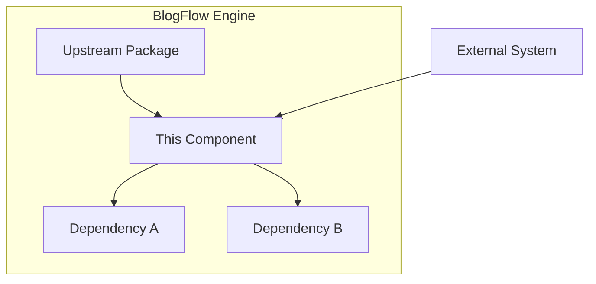
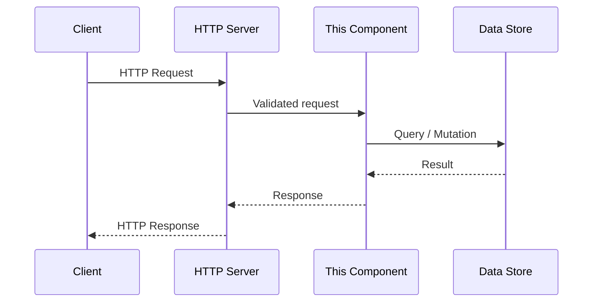
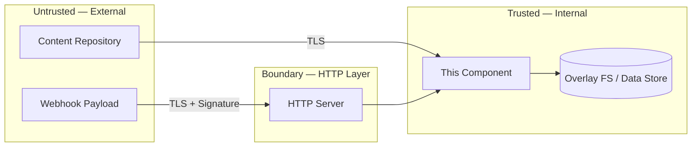

# [Component Name] — Design Document

> **Status**: Draft | In Review | Approved | Superseded  
> **Issue**: [#NNN](link)  
> **Author**: [agent persona or person]  
> **Reviewers**: [agent personas or people]  
> **Last Updated**: YYYY-MM-DD  
> **Supersedes**: [link to previous design doc, if any]  
> **Superseded by**: [link, if this doc has been replaced]

---

## 1 · Overview

### 1.1 What This Component Is

<!--
A concise description of the component: its name, role in the platform, and how it fits into the broader BlogFlow architecture. Keep this to 2–4 sentences.
-->

### 1.2 Functionality It Provides

<!--
List the core capabilities this component delivers. Use a bullet list. Each item should describe a user-facing or system-facing capability, not an implementation detail.
-->

### 1.3 Why It Is Important

<!--
Explain the business and technical motivation. Why does BlogFlow need this component? What gap does it fill? Reference architectural requirements or user needs where relevant.
-->

### 1.4 Requirements Traceability

<!--
Link to the source requirements that drive this component. If the GitHub issue references REQ-* identifiers, list them here. If no formal requirements exist, reference the issue directly.
-->

| Requirement | Version | Priority | Summary |
|-------------|---------|----------|---------|
| REQ-XXX-001 | v1 | P0 | Brief description |
| REQ-XXX-002 | v1 | P1 | Brief description |

---

## 2 · Logical Architecture

### 2.1 High-Level Architecture

<!--
A Mermaid diagram showing where this component sits in the BlogFlow architecture. Include neighbouring packages, external dependencies, and data stores it interacts with.
-->

### 2.2 Component Boundaries & Responsibilities

<!--
Define what this component owns and what it does NOT own. Be explicit about boundaries — this prevents scope creep and clarifies handoff points with adjacent packages.
-->

| Responsibility | Owned by This Component | Owned by |
|----------------|:-----------------------:|----------|
| Capability A | ✅ | — |
| Capability B | ❌ | [Other Package] |

### 2.3 Data Flow

<!--
A Mermaid sequence diagram showing the primary request/response paths through this component. Include the happy-path flow and at least one error path.
-->

### 2.4 Data Model / Schema

<!--
Define the core data entities this component manages. Use tables for field definitions. Include data types, constraints, and scoping fields. If the component uses specific structs or types, show their definitions.
-->

### 2.5 API Surface

<!--
Define the public API contracts: HTTP/REST endpoints, internal Go interfaces, or event schemas. Include request/response shapes, error codes, and rate-limit expectations. Reference the handler file path if applicable.
-->

### 2.6 Dependencies

<!--
List internal packages and external systems this component depends on. For each, note the communication pattern (HTTP call, library call, filesystem, etc.) and failure behaviour.
-->

| Dependency | Type | Communication | Failure Behaviour |
|------------|------|---------------|-------------------|
| go-git | Library | In-process | Return error, log context |
| goldmark | Library | In-process | Return parse error |
| fsnotify | Library | In-process | Retry watch, degrade to polling |
| External API | External | HTTPS | Retry 3×, then degrade |

### 2.7 Content Integrity & Isolation

<!--
Describe how this component ensures content integrity and isolation. BlogFlow ingests content from external git repositories via the overlay filesystem — explain how this component validates that content, prevents path traversal or unauthorized file access, and ensures the overlay FS only reads/writes within designated boundaries. Specify how untrusted input (markdown, front matter, webhook payloads) is sanitized before processing.
-->

---

## 3 · Functional Test Scenarios

### 3.1 Happy-Path Scenarios

<!--
Describe the primary success scenarios as numbered test cases. Each scenario should have a clear precondition, action, and expected result.
-->

| # | Scenario | Precondition | Action | Expected Result |
|---|----------|--------------|--------|-----------------|
| 1 | Example scenario | State X exists | Perform action Y | Outcome Z |

### 3.2 Edge Cases & Error Scenarios

<!--
Describe boundary conditions, invalid inputs, race conditions, and failure modes. These are the scenarios most likely to reveal bugs.
-->

| # | Scenario | Input / Condition | Expected Behaviour |
|---|----------|-------------------|--------------------|
| 1 | Example edge case | Invalid input X | Return error code Y |

### 3.3 Integration Test Boundaries

<!--
Define the integration points that require cross-package testing. Specify which dependencies should be real vs. mocked in integration tests.
-->

### 3.4 Acceptance Criteria Mapping

<!--
Map the acceptance criteria from the source issue to the test scenarios above. Every acceptance criterion should have at least one corresponding test scenario.
-->

| Acceptance Criterion | Test Scenario(s) | Coverage |
|----------------------|-------------------|----------|
| Criterion from issue | §3.1 #1, §3.2 #3 | ✅ Covered |

---

## 4 · Performance

### 4.1 Expected Load Profile

<!--
Describe the anticipated traffic patterns: steady-state load, peak multipliers, burst characteristics. Reference the three blog traffic scenarios where applicable:
- Small blog: ~100 daily visitors, infrequent content updates
- Medium blog: ~5K daily visitors, regular content updates, moderate webhook activity
- High-traffic blog: ~50K+ daily visitors, frequent content updates, high webhook throughput
-->

### 4.2 Latency Targets

| Percentile | Target | Measurement Point |
|------------|--------|-------------------|
| p50 | ≤ X ms | HTTP request to response |
| p95 | ≤ X ms | HTTP request to response |
| p99 | ≤ X ms | HTTP request to response |

### 4.3 Throughput Targets

<!--
Define the sustained and peak throughput this component must handle. Express in requests per second, events per second, or operations per second as appropriate.
-->

### 4.4 Scaling Strategy

<!--
Describe whether the component scales horizontally, vertically, or both. Identify the scaling bottleneck (CPU, memory, I/O, connection pool, etc.) and the scaling trigger (metric threshold, queue depth, etc.).
-->

### 4.5 Resource Budgets

<!--
Define CPU, memory, and storage budgets per replica. Reference the runtime environment checklist for container sizing guidance.
-->

| Resource | Budget per Replica | Notes |
|----------|-------------------|-------|
| CPU | X cores | |
| Memory | X Mi/Gi | |
| Storage | X Gi | Persistent / ephemeral |

### 4.6 Performance Test Plan

<!--
Outline the performance testing approach: load test tool, target scenarios, pass/fail thresholds, and when performance tests run (CI, pre-release, etc.).
-->

---

## 5 · Security

### 5.1 Authentication & Authorization

<!--
Describe how requests are authenticated (JWT, API key, webhook signature) and authorized (RBAC, path-based policies). Reference the security best-practices and ADRs. See docs/engineering/adr/ for BlogFlow ADRs.
-->

### 5.2 Data Classification & Encryption

<!--
Classify the data this component handles (public, internal, confidential, restricted). Specify encryption at rest and in transit requirements.
-->

| Data Element | Classification | Encrypted at Rest | Encrypted in Transit |
|-------------|----------------|:-----------------:|:--------------------:|
| Example field | Confidential | ✅ | ✅ |

### 5.3 Input Validation & Sanitization

<!--
Describe the input validation strategy: where validation occurs, which fields are validated, maximum sizes, allowed character sets, and how invalid input is rejected.
-->

### 5.4 Content Integrity

<!--
Describe how this component ensures content integrity. Focus on:
- Preventing path traversal in the overlay filesystem (no escape from designated content roots)
- Validating markdown and front matter input (rejecting malformed or oversized content)
- Ensuring webhook signatures are verified before processing payloads
- Ensuring git operations only read from / write to designated volumes
-->

---

## 6 · Threat Model

### 6.1 Trust Boundaries

<!--
A Mermaid diagram showing the trust boundaries this component sits across. Include network boundaries, authentication boundaries, and content boundaries.
-->

### 6.2 Threat Actors & Attack Surfaces

<!--
Identify who or what might attack this component and how. Consider: malicious webhook payloads, compromised content repositories, path traversal attempts, unauthorized config injection, insider threats, supply-chain attacks.
-->

| Threat Actor | Attack Surface | Motivation |
|-------------|----------------|------------|
| Malicious webhook payload | Webhook endpoint | Trigger arbitrary actions, inject content |
| Compromised content repo | Git clone / pull | Inject malicious content, overwrite files |
| Path traversal attempt | Overlay filesystem | Escape content root, access system files |
| Unauthorized config injection | Configuration input | Alter engine behaviour, exfiltrate data |

### 6.3 STRIDE Analysis

<!--
Apply the STRIDE framework (Spoofing, Tampering, Repudiation, Information Disclosure, Denial of Service, Elevation of Privilege) to this component's interfaces.
-->

| Threat Category | Applicable? | Threat Description | Mitigation |
|----------------|:-----------:|--------------------|------------|
| **S**poofing | ✅ / ❌ | | |
| **T**ampering | ✅ / ❌ | | |
| **R**epudiation | ✅ / ❌ | | |
| **I**nformation Disclosure | ✅ / ❌ | | |
| **D**enial of Service | ✅ / ❌ | | |
| **E**levation of Privilege | ✅ / ❌ | | |

### 6.4 Mitigations & Residual Risks

<!--
For each identified threat, describe the mitigation implemented. For residual risks (threats accepted but not fully mitigated), document the rationale for acceptance.
-->

---

## 7 · Observability

### 7.1 Logging Strategy

<!--
Define the structured logging approach for this component. Specify log levels, required context fields (request_id, trace_id), and PII handling.
-->

| Log Level | When Used | Example |
|-----------|-----------|---------|
| ERROR | Unrecoverable failures | Git clone failed, filesystem write error |
| WARN | Degraded but operational | Webhook retry succeeded, cache miss |
| INFO | Significant state changes | Content synced, config reloaded |
| DEBUG | Diagnostic detail | Parsed front matter fields, overlay resolution path |

### 7.2 Metrics & Dashboards

<!--
Define the key metrics this component exposes. Use RED (Rate, Error, Duration) for request-driven components and USE (Utilisation, Saturation, Errors) for resource-driven components.
-->

| Metric | Type | Labels | Description |
|--------|------|--------|-------------|
| `component_requests_total` | Counter | `method`, `status` | Total requests |
| `component_request_duration_seconds` | Histogram | `method` | Request latency |
| `component_errors_total` | Counter | `method`, `error_type` | Error count |

### 7.3 Distributed Tracing

<!--
Describe the tracing strategy: which operations create spans, how trace context propagates, and which attributes are attached to spans.
-->

### 7.4 Alerting Rules & Escalation

<!--
Define the alerting rules that detect problems with this component. For each alert, specify the condition, severity, response, and escalation path.
-->

| Alert Name | Condition | Severity | Response |
|------------|-----------|----------|----------|
| HighErrorRate | Error rate > X% for Y minutes | 🔴 Critical | Page on-call SRE |
| HighLatency | p99 > X ms for Y minutes | 🟠 High | Investigate, auto-scale |

---

## 8 · Rollout & Risk

### 8.1 Rollout Strategy

<!--
Describe how this component will be deployed: canary, blue-green, feature flags, or a combination. Reference the relevant ADRs and runtime environment checklist. See docs/engineering/adr/ for BlogFlow ADRs.
-->

### 8.2 Rollback Plan

<!--
Define how to roll back if the deployment fails. Include: rollback trigger criteria, rollback procedure, data migration reversal (if applicable), and expected rollback time.
-->

### 8.3 Risk Register

<!--
Identify the risks associated with this component's launch. For each risk, assess likelihood and impact, and define mitigation actions.
-->

| Risk | Likelihood | Impact | Mitigation |
|------|:----------:|:------:|------------|
| Example risk | Medium | High | Mitigation action |

### 8.4 Dependencies & Sequencing

<!--
List other components or infrastructure that must be in place before this component can be deployed. Define the deployment order.
-->

### 8.5 Launch Checklist

<!--
A pre-launch checklist specific to this component. Reference the relevant engineering checklists and add component-specific items.
-->

- [ ] All acceptance criteria from the source issue are met
- [ ] Integration tests pass against staging environment
- [ ] Performance tests meet targets defined in §4
- [ ] Security review completed (§5 and §6 reviewed by Security SME)
- [ ] Observability in place: dashboards, alerts, and runbook created
- [ ] Rollback procedure tested
- [ ] Documentation updated

---

## 9 · Open Questions & Decisions

<!--
Track unresolved questions that need answers before or during implementation. Convert resolved questions into decisions and link to ADRs if the decision is significant enough. See docs/engineering/adr/ for BlogFlow ADRs.
-->

| # | Question | Status | Resolution |
|---|----------|--------|------------|
| 1 | Example question | 🟡 Open | — |
| 2 | Example resolved question | ✅ Resolved | Decision and rationale |

---

## 10 · References

<!--
Links to the source issue, related requirements, ADRs, engineering docs, and other design documents. See docs/engineering/adr/ for BlogFlow ADRs.
-->

- **Source issue**: [#NNN](link)
- **Requirements**: [REQ-XXX-001](link), [REQ-XXX-002](link)
- **ADRs**: See `docs/engineering/adr/` for BlogFlow ADRs
- **Related design docs**: [link]
- **Engineering best-practices**: [link]
