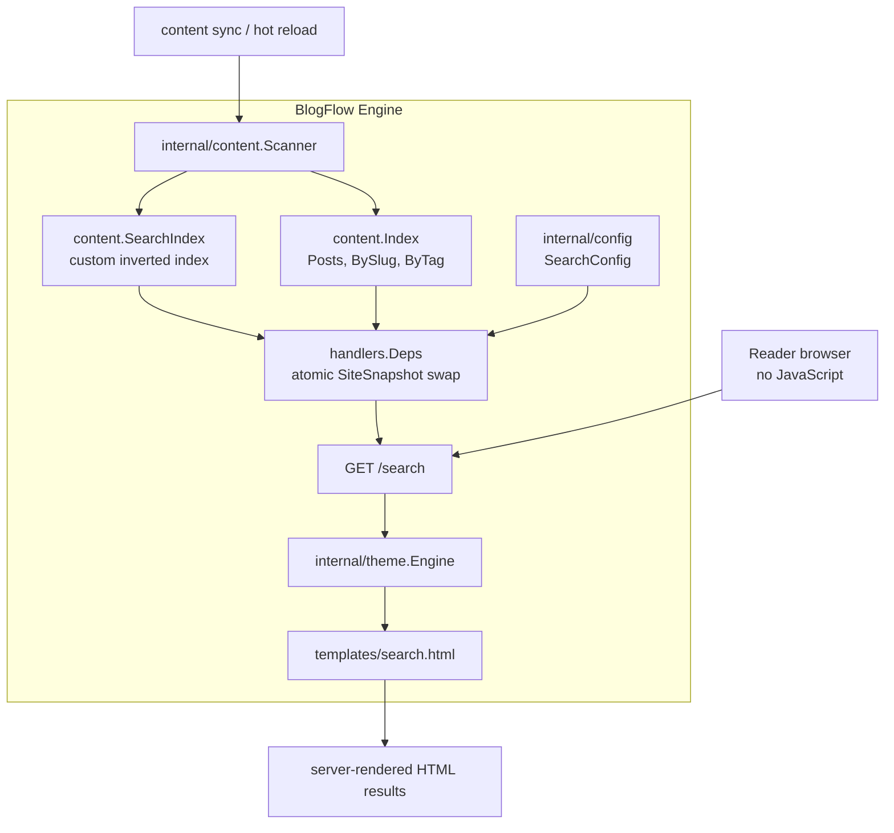
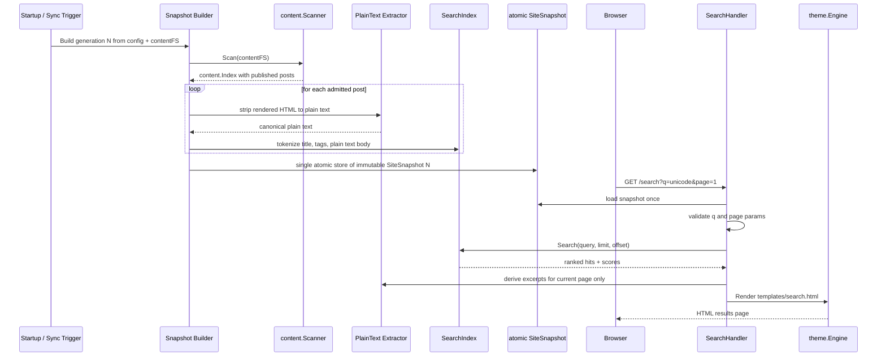
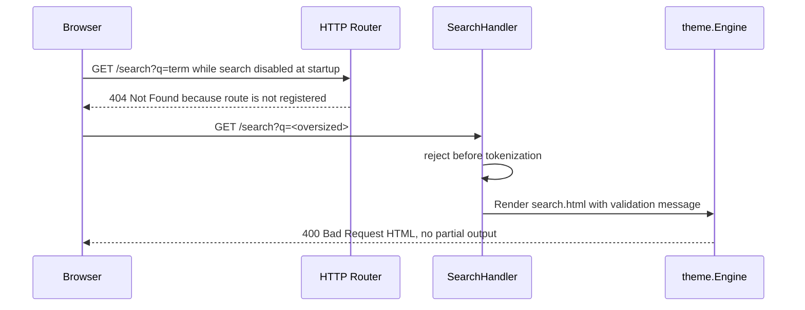
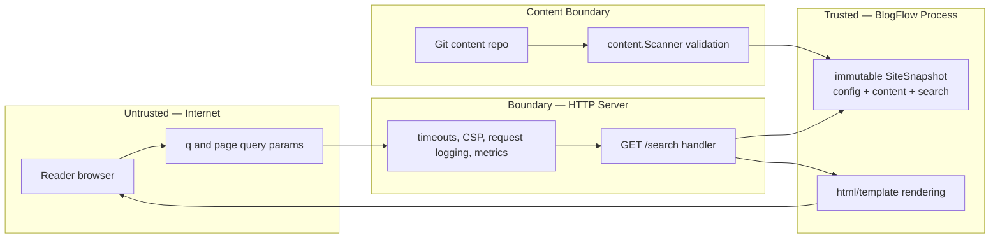

# Full-Text Search — Design Document

> **Status**: Draft  
> **Issue**: [#129](https://github.com/khaines/blogflow/issues/129)  
> **Author**: BlogFlow maintainers  
> **Reviewers**: Cloud-Native Distributed Systems Architect, Cloud-Native Security SME, Cloud-Native Site Reliability Engineer  
> **Last Updated**: 2026-07-20  
> **Supersedes**: —  
> **Superseded by**: —

---

## 1 · Overview

### 1.1 What This Component Is

Full-Text Search adds an optional, server-rendered search experience for BlogFlow posts. It builds an in-memory search index from the existing content scan and exposes a `GET /search?q=` route that renders HTML results through the theme engine without requiring client-side JavaScript.

### 1.2 Functionality It Provides

- Search published blog posts by title, tags, and Markdown body text.
- Render an accessible HTML search page with a query form, result count, excerpts, dates, and relevance ordering, while exposing numeric scores only as template metadata by default.
- Keep search indexes fresh when content is scanned at startup, synchronized by webhook/git-sync, or hot-reloaded in local development.
- Allow operators to enable or disable search through `site.yaml`, with route registration changes taking effect on restart/router rebuild.
- Support Unicode-aware matching consistent with BlogFlow's existing i18n slug handling.

### 1.3 Why It Is Important

Issue #129 identifies search as a core reader expectation for blogs with more than a small number of posts. BlogFlow's default experience is server-rendered and intentionally avoids requiring JavaScript, so the selected design is **Option B: server-side search, no JavaScript**. This keeps the default theme accessible, works in hardened CSP environments, and preserves BlogFlow's “single static binary with sensible defaults” philosophy.

### 1.4 Requirements Traceability

No formal `REQ-*` requirements are referenced by the issue; the source issue is the requirement authority.

| Requirement | Version | Priority | Summary |
|-------------|---------|----------|---------|
| ISSUE-129-001 | v1 | P0 | Search by title, tags, and body content |
| ISSUE-129-002 | v1 | P0 | Results show title, excerpt, and date; relevance score controls ordering and is exposed as optional template metadata, hidden from default reader-visible body text |
| ISSUE-129-003 | v1 | P0 | Handle Unicode content, aligned with urlize i18n behavior |
| ISSUE-129-004 | v1 | P0 | Configurable through `search.enabled: true` in `site.yaml` |
| ISSUE-129-005 | v1 | P0 | Accessible, keyboard-navigable results |
| ISSUE-129-006 | v1 | P1 | Resolve approach among client-side, server-side, and Pagefind options |

---

## 2 · Logical Architecture

### 2.1 High-Level Architecture



The design uses a **lightweight custom in-memory inverted index** for v1, not Bleve. Bleve is feature-rich and battle-tested, but it adds substantial dependency surface, binary-size pressure, and operational knobs that exceed BlogFlow's current need. A small custom index over title, tags, and body tokens fits the single-binary/distroless model, integrates directly with `content.Index`, and provides deterministic ranking and excerpts with far less complexity.

### 2.2 Component Boundaries & Responsibilities

| Responsibility | Owned by This Component | Owned by |
|----------------|:-----------------------:|----------|
| Tokenizing post title, tags, and body for search | ✅ | — |
| Building posting lists during content scan | ✅ | — |
| Query parsing, bounds checking, ranking, pagination, and excerpts | ✅ | — |
| `GET /search?q=` handler and search page data model | ✅ | — |
| `templates/search.html` and default search form markup | ✅ | — |
| Markdown parsing, rendering, draft filtering, slug indexing | ❌ | `internal/content.Scanner` |
| HTML escaping and template execution | ❌ | `internal/theme` / `html/template` |
| HTTP middleware, CSP, request logging, Prometheus HTTP metrics | ❌ | `internal/server` |
| Git clone/pull, webhook validation, filesystem watch triggers | ❌ | `internal/gitops` / sync layer |
| External search service operation | ❌ | Not in scope |
| Client-side JavaScript search | ❌ | Explicitly out of scope for Option B |

### 2.3 Data Flow

#### Index Build and Query Path



A single immutable `SiteSnapshot` bundles the `config.Config`, `content.Index`, and `SearchIndex` produced from the same reload generation. The server publishes it with one `atomic.Pointer` store only after the content scan and search-index build both succeed. Handlers load the snapshot once per request and never mix config, content, and search indexes from different generations. Maps and slices inside the snapshot are immutable after publication. If a rebuild fails, the previous snapshot remains active and the failed generation is logged and counted; this invariant is required to pass `go test -race`.

#### Disabled and Invalid Query Paths



`search.enabled` is read when the router is built at startup/restart. If it is false, `/search` is not registered and the default theme receives `Search.Enabled=false` so global header/nav search affordances are omitted site-wide. Runtime content reloads rebuild the content and, when the route exists, the search index inside the snapshot, but they do **not** register or unregister routes. `search.enabled` is restart-scoped: a runtime config reload that attempts to change this value logs WARN, keeps the router-state value in template data, and requires restart/router rebuild to take effect. Other search tunables reload together with content and search in a single snapshot generation. This preserves the decided disabled behavior (`/search` → 404) without mutating the live router or mixing config/content/search generations.

### 2.4 Data Model / Schema

Implementation Go types are internal and in-memory only:

```go
type SearchConfig struct {
    Enabled        bool  `yaml:"enabled"`         // default false (opt-in; startup/router-build only)
    MaxResults     int   `yaml:"max_results"`      // default 20; per-page Limit
    MaxQueryLength int   `yaml:"max_query_length"` // default 128 normalized runes
    MinQueryLength int   `yaml:"min_query_length"` // default 2 normalized runes
    ExcerptLength  int   `yaml:"excerpt_length"`   // default 180 display runes
    MaxDocs        int   `yaml:"max_docs"`         // default 10,000 posts
    MaxTokens      int   `yaml:"max_tokens"`       // default 2,000,000 posting occurrences
    MaxIndexBytes  int64 `yaml:"max_index_bytes"`  // default 64 MiB active search-index heap target
}

type SiteSnapshot struct {
    Generation         uint64
    Config             *config.Config
    SearchRouteEnabled bool // startup/router-build value exposed to templates
    Content            *content.Index
    Search             *SearchIndex // nil only when route enabled but index unavailable during startup failure
}

const (
    FieldTitle uint8 = iota
    FieldTag
    FieldBody
)

type SearchIndex struct {
    docs       []SearchDoc
    postings   map[string][]Posting // normalized token -> sorted posting list
    docFreq    map[string]int
    maxDocs    int
    maxTokens  int
    maxBytes   int64
    truncated  bool
    generation uint64
}

type SearchDoc struct {
    ID    uint32
    Slug  string
    Title string
    Tags  []string
    Date  time.Time
    // No full body string is retained. Body text is derived from the
    // same-generation content.Index only for the current result page.
}

type Posting struct {
    DocID uint32
    TF    uint16
    Field uint8 // FieldTitle, FieldTag, or FieldBody; no per-occurrence strings
}

type SearchResult struct {
    Title   string
    Slug    string
    URL     string
    Date    time.Time
    Excerpt string  // plain string; html/template escapes it
    Score   float64 // template metadata for ordering/optional theme display
    Tags    []string
}
```

Index storage is bounded by document count, posting count, and byte budget. V1 indexes **posts only**, not static pages. Pages are a documented follow-up outside this implementation spec. Default caps are `max_docs: 10000`, `max_tokens: 2000000`, and `max_index_bytes: 67108864` (64 MiB), targeting an active search-index heap budget of **≤~64 MiB per replica**.

The budget assumes approximately 10,000 admitted posts, 200 indexed token occurrences per post on average (2,000,000 postings), short metadata (`slug`, `title`, `tags`, `date`) per post, and no retained body text. With compact postings (`uint32` doc ID, `uint16` TF, `uint8` field plus padding) at roughly 12–16 bytes each, postings consume about 24–32 MiB; token maps, document metadata, and slice/map overhead consume the remaining budget. Rendered post HTML already exists in `content.Index` and is not counted as additional search-index heap. During rebuild, peak heap is expected to be about **2× active search-index size plus GC headroom** (approximately 128–160 MiB for the default budget) because the old snapshot remains live until the new snapshot is published and collected.

Admission is document-granular and deterministic: posts are considered in the scanner's deterministic post order, and the builder stops before admitting a document that would exceed `max_docs`, `max_tokens`, or `max_index_bytes`. It never partially indexes a document. When truncation occurs, the incomplete index is still published with `truncated=true`, a WARN log and metrics are emitted, and operators can raise caps or reduce content size.

Plain-text body extraction has one canonical source: strip tags from the already-rendered `Post.Content` HTML using the same state-machine approach as the content summary path, HTML-unescape entities, normalize whitespace, and treat the result as untrusted plain text. That representation is used for body tokenization and on-demand excerpt generation. The index discards the full body text after building postings; excerpts are generated only for the current result page by looking up the same-generation `content.Post` from the loaded `SiteSnapshot` and re-running the canonical plain-text extractor. Excerpt matching is case-insensitive and Unicode-aware by reusing tokenizer normalization and offsets mapped back to the original display text.

Tokenization is the approved v1 Unicode-normalized word tokenization: lowercase/case-fold, apply NFKD normalization, transliterate the same non-decomposable Latin characters as `theme.urlize`, remove combining marks, recompose to NFC, and split on runes for which neither `unicode.IsLetter` nor `unicode.IsDigit` is true. This treats whitespace and punctuation as delimiters while preserving CJK text as whole tokens; CJK bigrams are explicitly deferred.

### 2.5 API Surface

#### HTTP route

`GET /search?q=<query>&page=<n>` renders `templates/search.html` only when `search.enabled` was true at router-build time.

| Case | Status | Behavior |
|------|--------|----------|
| Empty `q` or missing `q` | 200 | Render search landing form with no validation error and no result list. |
| Whitespace-only `q` | 200 | Trim to empty and render the same landing form. |
| Non-empty query below `min_query_length` | 200 | Render form with an inline accessible validation message; do not scan the index. |
| Query over `max_query_length` | 400 | Render HTML error/search page with validation message; reject before tokenization. |
| Valid query with results | 200 | Render results page with query echo, count, title, excerpt, date, links, pagination, and score metadata available to templates. Numeric scores are not shown by the default reader-visible body text. |
| Valid query with no results | 200 | Render explicit no-results state, preserve the query, and no pagination links. |
| `page < 1` or invalid `page` | 200 | Clamp to page 1. |
| `page` beyond last page | 200 | Clamp to the last valid page; for zero results, page is 1 of 1. |
| Search disabled at router build | 404 | `/search` is not registered and falls through to normal 404 handling. |
| Unsupported method | 405 | Go `ServeMux` method matching returns Method Not Allowed for non-GET `/search` when the route exists. |
| Index unavailable/not ready | 503 | Render a friendly “search is temporarily unavailable” page; `Searcher` returns `ErrIndexUnavailable`. |
| Template render failure | 500 | Return Internal Server Error without partial content. |

Validation ownership is split deliberately: the handler validates normalized query rune length, page parameters, method/route behavior, and per-page limit/offset; the `Searcher` validates snapshot/index availability and returns typed errors such as `ErrIndexUnavailable` and `ErrQueryTooComplex`. `min_query_length` and `max_query_length` are counted in runes after trimming and Unicode normalization.

`max_results` is the per-page window and maps directly to `SearchOptions.Limit`; the handler computes `Offset = (page-1) * Limit` after clamping `page`. V1 scores all candidate documents produced by the query terms within the admitted index, then returns the requested page window. If benchmarks show common-token queries exceed latency targets, add a separate `max_candidates` config in a follow-up design rather than overloading `max_results`.

The default search page data is also exposed to the base/layout template as `Search.Enabled` so header/nav templates can omit global search links and forms when disabled. When enabled, `templates/search.html` composes with `templates/base.html`; override points are `templates/search.html` for the page, `templates/partials/search-result.html` for a result item, and `templates/partials/search-pagination.html` for search-specific pagination. If a custom theme omits those partials, the embedded defaults provide them through the overlay system.

Default template accessibility contract: the search form uses `role="search"`; the query input has an associated `<label>` or `aria-label`; the results region exposes the result count programmatically (for example with a labelled region or status text); no-results is an explicit state; and prev/next pagination uses real `<a>` links inside a labelled `<nav>`. These are implementation acceptance criteria, not optional styling guidance.

#### Internal interface

```go
type Searcher interface {
    Search(ctx context.Context, snapshot *SiteSnapshot, query string, opts SearchOptions) (SearchResponse, error)
}

type SearchOptions struct {
    Limit  int // cfg.Search.MaxResults, default 20
    Offset int // (page - 1) * Limit
}

type SearchResponse struct {
    Query      string
    Results    []SearchResult
    Total      int
    Page       int
    TotalPages int
    Duration   time.Duration
    Truncated  bool
}

var ErrIndexUnavailable = errors.New("search index unavailable")
var ErrQueryTooComplex = errors.New("search query too complex")
```

#### Ranking approach

Use deterministic **weighted TF-IDF**, not BM25. The score for a document `d` and deduplicated normalized query terms `Q` is:

```text
score(d, Q) = Σ_{t ∈ unique(Q)} idf(t) * (
    3.0 * tf(title, d, t) +
    2.0 * tf(tag, d, t) +
    1.0 * tf(body, d, t)
)

idf(t) = ln(1 + (N + 1) / (df(t) + 1))
```

Where `N` is the number of admitted documents, `df(t)` is the number of admitted documents containing term `t` in any field, and `tf(field,d,t)` is the capped term frequency in that field (`min(rawCount, 255)`) from the posting list. Multi-term queries use OR semantics with summed term contributions. Duplicate query terms are ignored after normalization so `go go` scores the same as `go`. There is no score-level recency boost; recency is only a deterministic tie-break after equal relevance. Sort comparator: `score desc → Date desc → Slug asc`.

### 2.6 Dependencies

| Dependency | Type | Communication | Failure Behaviour |
|------------|------|---------------|-------------------|
| `internal/content.Scanner` | Internal package | In-process build-at-scan-time | If content scanning fails, do not publish the new snapshot; retain the previous snapshot. |
| `content.Index` + `SearchIndex` snapshot | Internal immutable data | Single atomic pointer load/store | Handlers see one complete generation; maps/slices are never mutated after publication. |
| `internal/server` | Internal package | HTTP route registration and middleware | If search is disabled at router build, the route is not registered and `/search` returns normal 404 until restart/router rebuild. |
| `internal/theme` | Internal package | `html/template` rendering | Render errors return 500 without partial response. |
| `internal/config` | Internal package | YAML and defaults | Invalid search config fails startup/reload; previous snapshot remains active on reload failure. |
| Prometheus client | Library already present | In-process metrics | Metrics failure must not fail search responses. |
| OpenTelemetry | Library already present | In-process spans | Tracing failure must not affect user-visible behavior. |
| Bleve | External library candidate | Not used in v1 | Excluded from the implementation to preserve minimal dependencies and binary size; reconsider only in a future design if advanced analyzers become required. |

### 2.7 Content Integrity & Isolation

Search indexes only content already accepted by the content pipeline. Draft posts, files without valid front matter, malformed front matter, unsafe image/template fields, and duplicate slugs remain excluded by `internal/content.Scanner`. Search must not read arbitrary paths or fetch remote resources; it consumes only the `Post` objects in the current immutable `SiteSnapshot` and inherits overlay filesystem isolation from the scan phase.

The canonical body source is plain text stripped from already-rendered `Post.Content` HTML. The same representation drives body tokenization and excerpt generation; raw Markdown is not an alternate source. Query echoes, excerpts, result titles, tags, and validation messages are ordinary strings rendered through `html/template` auto-escaping. No search result field is typed as `template.HTML`, and v1 does not emit HTML highlight markup.

---

## 3 · Functional Test Scenarios

### 3.1 Happy-Path Scenarios

| # | Scenario | Precondition | Action | Expected Result |
|---|----------|--------------|--------|-----------------|
| 1 | Search title | Search enabled at startup; post title contains “Go internals” | `GET /search?q=internals` | Matching post appears with title, date, excerpt, link, and template metadata score; numeric score is not shown by default body text. |
| 2 | Search tags | Search enabled; post has tag `architecture` | `GET /search?q=architecture` | Tagged post appears; tag field contributes with 2× weight. |
| 3 | Search body | Search enabled; rendered body text contains “overlay filesystem” | `GET /search?q=overlay` | Matching post appears with excerpt around the canonical plain-text body match. |
| 4 | Ranked multi-field result | One post matches title and body; another only body | `GET /search?q=search` | Multi-field match ranks above body-only match under weighted TF-IDF. |
| 5 | Unicode query | Post contains `Café`, `東京`, or Cyrillic text | Search with normalized equivalent where applicable | Unicode-normalized tokenizer finds expected posts without panics; CJK bigrams are not generated. |
| 6 | Pagination | More matches than `search.max_results` | `GET /search?q=go&page=2` | Handler uses `Limit=max_results`, `Offset=(page-1)*Limit`; second page renders deterministic subset with real prev/next links. |
| 7 | Empty search page | Search enabled | `GET /search` | Search form renders with no error and no result list. |
| 8 | Accessible results page | Search enabled with at least two pages of results | Navigate `GET /search?q=go` using keyboard | Form has `role="search"`, input has associated label or `aria-label`, result-count region is programmatically exposed, result links and pagination links are keyboard reachable in document order. |

### 3.2 Edge Cases & Error Scenarios

| # | Scenario | Input / Condition | Expected Behaviour |
|---|----------|-------------------|--------------------|
| 1 | Search disabled at router build | `search.enabled: false` on startup/restart | `/search` returns normal 404 because the route is not registered; global header/nav emits no search link or form. |
| 2 | Runtime content reload while route state fixed | Search enabled at startup; content reload occurs | New content and search indexes publish as one snapshot; route remains registered. A config-only toggle of `search.enabled` does not register/unregister until restart/router rebuild. |
| 3 | Query below minimum length | `q=a` when min length is 2 normalized runes | HTTP 200 with inline accessible validation message; no index scan. |
| 4 | Empty or whitespace query | Missing `q`, `q=`, or `q=+%20` | HTTP 200 search landing form; no validation error and no results. |
| 5 | Query too long | Query exceeds `max_query_length` normalized runes | HTTP 400 HTML response; tokenization and search are skipped. |
| 6 | Unsupported method | `POST /search` when route exists | HTTP 405 Method Not Allowed. |
| 7 | Index unavailable | Route exists but snapshot has no usable search index | HTTP 503 friendly HTML message; `ErrIndexUnavailable` is recorded. |
| 8 | Stop-word/common term | Query token appears in most posts | Results remain bounded and sorted; request latency stays within target. |
| 9 | No results | Valid query has no matches | HTTP 200 explicit “No results” state, query preserved, page 1 of 1, no prev/next links. |
| 10 | Bad page number | `page=-1`, `page=abc`, or very large page | HTTP 200; invalid/below 1 clamps to 1, beyond last clamps to last valid page. |
| 11 | Content reload race | Query occurs during index rebuild | Handler uses old complete snapshot or new complete snapshot; no data race or mixed generations. |
| 12 | Cap truncation | Corpus exceeds `max_docs`, `max_tokens`, or `max_index_bytes` | Builder stops at document boundary, publishes deterministic truncated index, emits WARN log and truncation metric. |
| 13 | Rebuild failure | Content scan or search build fails | Previous snapshot remains active; failure metric/log emitted. |
| 14 | Template override missing search template | Custom theme omits search templates/partials | Embedded default template and partials are used through overlay defaults. |
| 15 | Malicious query string | Query contains HTML/script markup | Query echo and excerpts are escaped; no executable markup appears. |
| 16 | Search disabled site-wide affordances | Any non-search page with `search.enabled: false` at router build | Base/header template data has `Search.Enabled=false`; no dangling search form/link to `/search` is emitted. |

### 3.3 Integration Test Boundaries

- **Scanner + search index**: use real Markdown files in an in-memory or test filesystem, real front matter parsing, real renderer output, and the canonical rendered-HTML-to-plain-text extractor; assert draft and malformed posts are not searchable.
- **Snapshot atomicity**: build content and search indexes from the same fixture generation, publish via one atomic snapshot store, run concurrent queries/reloads under `go test -race`, and assert handlers never observe mixed generations.
- **Handler + theme**: use `httptest`, real handler deps, and a real theme engine with embedded/default templates; assert every status in §2.5 and key HTML semantics.
- **Route enablement**: verify `search.enabled: false` at router build leaves `/search` unregistered and removes global search affordances; verify toggling requires restart/router rebuild, while content reloads only update the snapshot.
- **Sync/hot reload**: simulate a successful snapshot rebuild and assert old terms disappear while new terms become searchable; simulate failed rebuild and assert the old snapshot remains active.
- **Metrics/tracing**: use Prometheus registry/test helpers where possible and OpenTelemetry test spans for query, rebuild, unavailable, and truncation paths.

### 3.4 Acceptance Criteria Mapping

| Acceptance Criterion | Test Scenario(s) | Coverage |
|----------------------|-------------------|----------|
| Search by title, tags, and body content | §3.1 #1, #2, #3; §3.3 scanner integration | ✅ Covered |
| Results show title, excerpt, date, relevance score | §3.1 #1, #4; handler/template tests verify score controls ordering and is exposed to templates/metadata, not shown as default reader-visible body text | ✅ Covered |
| Handles Unicode content | §3.1 #5; tokenizer and excerpt tests | ✅ Covered |
| Configurable through `search.enabled: true` | §3.2 #1, #2, #16; route enablement tests | ✅ Covered |
| Accessible keyboard-navigable results | §3.1 #8; §3.2 #9; template accessibility tests | ✅ Covered |
| Server-side, no JavaScript | Handler/theme integration; static template inspection | ✅ Covered |

## 4 · Performance

### 4.1 Expected Load Profile

Search is read-heavy and request-driven. Small blogs may see occasional queries; medium blogs may see bursts when readers navigate archives; high-traffic blogs may have sustained search traffic during content launches. Content updates are less frequent than reads, so the index is rebuilt at scan time and served as an immutable snapshot between reloads.

### 4.2 Latency Targets

| Percentile | Target | Measurement Point |
|------------|--------|-------------------|
| p50 | ≤ 10 ms | Search handler request to rendered response for ≤1,000 posts |
| p95 | ≤ 50 ms | Search handler request to rendered response for ≤10,000 posts |
| p99 | ≤ 150 ms | Search handler request to rendered response under bounded worst-case query |

### 4.3 Throughput Targets

- Sustain at least 50 search requests/second per replica for small/medium content sets on typical container CPU limits.
- Preserve existing static/post page throughput by avoiding global locks on query execution.
- Rebuild search index during content scans in O(total indexed tokens) time, with no per-request filesystem reads.

### 4.4 Scaling Strategy

The component scales horizontally with BlogFlow replicas because each replica keeps its own immutable in-memory snapshot. The primary bottlenecks are memory for posting lists and CPU for scoring large candidate sets. Query work is bounded by normalized query length, `max_docs` (default 10,000), `max_tokens` (default 2,000,000 posting occurrences), `max_index_bytes` (default 64 MiB active search-index heap target), and the per-page `max_results` window. V1 scores all candidates within the admitted index; any separate candidate cap requires a follow-up design.

### 4.5 Resource Budgets

| Resource | Budget per Replica | Notes |
|----------|-------------------|-------|
| CPU | ≤ 1 core for p95 target on 10,000 posts | Query scoring is CPU-bound and should avoid regex backtracking. |
| Memory | Active target ≤64 MiB search-index heap for ~10,000 typical posts; peak rebuild budget ~128–160 MiB | Enforced with `max_docs: 10000`, `max_tokens: 2000000`, and `max_index_bytes: 67108864`; no full body strings retained. |
| Storage | 0 Gi persistent storage for v1 | Index is rebuilt in memory; no on-disk index files. |

### 4.6 Performance Test Plan

- Add tokenizer/index microbenchmarks for 100, 1,000, and 10,000-post synthetic corpora, including active heap and peak rebuild heap measurements.
- Benchmark common, rare, multi-term, and Unicode queries.
- Measure rebuild duration during scanner benchmarks.
- Add allocation benchmarks for weighted TF-IDF scoring and on-demand excerpt generation from rendered HTML plain text.
- Include a large-site fixture or generated benchmark in CI only if it stays fast; otherwise run pre-release/manual performance tests.

---

## 5 · Security

### 5.1 Authentication & Authorization

Search is a public reader-facing feature and does not require authentication. It must only expose published posts already served publicly by `/posts/{slug}` and `/tags/{tag}`. Drafts, invalid posts, and non-post filesystem content are excluded by depending on `content.Index.Posts` rather than direct file reads.

### 5.2 Data Classification & Encryption

| Data Element | Classification | Encrypted at Rest | Encrypted in Transit |
|-------------|----------------|:-----------------:|:--------------------:|
| Search query string | Public/Internal operational data | N/A in memory; avoid persistent query logs by default | ✅ when site is served over TLS or behind TLS termination |
| Result title/date/tags/excerpt | Public | Same as public content repository | ✅ when site is served over TLS or behind TLS termination |
| Relevance score | Public | N/A | ✅ when site is served over TLS or behind TLS termination |
| Search metrics counts/latency | Internal | Deployment-dependent metrics storage | Deployment-dependent metrics transport |
| Search logs | Internal | Deployment-dependent log storage | Deployment-dependent log transport |

### 5.3 Input Validation & Sanitization

- Trim query whitespace, normalize it with the search tokenizer normalization, and count `search.min_query_length` / `search.max_query_length` in normalized runes.
- Empty and whitespace-only queries render the 200 landing form; non-empty below-minimum queries render 200 with an inline accessible validation message; oversized queries render 400 and skip tokenization/search.
- Limit query token count and ignore duplicate normalized query tokens to bound scoring work.
- Avoid regular expressions in tokenization and excerpt matching; use rune iteration and tokenizer offsets to prevent ReDoS and keep normalized matches mapped to raw display text.
- Render query echoes, excerpts, titles, tags, and validation messages as plain strings through `html/template`; no `template.HTML` search fields.
- Do not log full query strings at INFO level; if debug logging is added, truncate and avoid recording sensitive accidental input.

### 5.4 Content Integrity

Search inherits content integrity from the existing content pipeline: front matter size limits, safe URL validation, template name validation, slug validation, draft exclusion, and markdown rendering with unsafe HTML disabled by default. Search excerpts are plain text derived from rendered HTML, matched case-insensitively with Unicode-aware token offsets, and escaped by `html/template`. V1 does not emit HTML highlight markup or trusted search HTML.

---

## 6 · Threat Model

### 6.1 Trust Boundaries



### 6.2 Threat Actors & Attack Surfaces

| Threat Actor | Attack Surface | Motivation |
|-------------|----------------|------------|
| Anonymous internet user | `/search?q=` | XSS, denial of service, probing content not intended for publication |
| Malicious content author | Markdown/front matter indexed by search | Stored XSS through excerpts, misleading search results, memory blow-up |
| Bot or scraper | Repeated expensive queries | CPU exhaustion and noisy metrics/logs |
| Operator misconfiguration | `search.*` settings | Accidental unbounded memory or disabled expected functionality |
| Compromised content repo | Content scan inputs | Poison index with excessive tokens or unsafe text |

### 6.3 STRIDE Analysis

| Threat Category | Applicable? | Threat Description | Mitigation |
|----------------|:-----------:|--------------------|------------|
| **S**poofing | ❌ | Search has no identity boundary; all users are anonymous readers. | No auth state is trusted or changed by search. |
| **T**ampering | ✅ | Content author can attempt to inject unsafe markup into excerpts. | Use sanitized/stripped plain text and `html/template` escaping. |
| **R**epudiation | ✅ | Abuse may be hard to attribute if only aggregate metrics exist. | Existing request logs include request ID, path, remote/client IP; do not log full queries by default. |
| **I**nformation Disclosure | ✅ | Search could reveal drafts or pages not linked publicly. | Build only from `content.Index.Posts`, which excludes drafts and invalid content. |
| **D**enial of Service | ✅ | Long queries, common-term queries, or huge corpora can cause high CPU/memory. | Query length/token bounds, result limits, `max_docs`/`max_tokens`/`max_index_bytes` caps, document-granular admission, no regex. |
| **E**levation of Privilege | ❌ | Search does not perform privileged actions. | Keep route read-only and avoid filesystem access from query input. |

### 6.4 Mitigations & Residual Risks

- **XSS mitigation**: V1 excerpts are plain text only; all fields are escaped by templates. Residual risk is low if no future highlighter returns trusted HTML.
- **DoS mitigation**: Bound query length, token count, results, and indexed corpus with default caps of 10,000 posts, 2,000,000 posting occurrences, and 64 MiB active search-index heap per replica. Admission stops at document boundaries and emits truncation telemetry. Residual risk remains for sites that need larger corpora and must tune caps intentionally.
- **Disclosure mitigation**: Index only published posts from the existing scanner output. Residual risk is that public-but-obscure posts become easier to discover, which is inherent to search.
- **Supply-chain mitigation**: Use the custom index for v1 to avoid adding a large search dependency tree. If a future design proposes Bleve or another search library, perform dependency review and binary-size measurement then.

---

## 7 · Observability

### 7.1 Logging Strategy

| Log Level | When Used | Example |
|-----------|-----------|---------|
| ERROR | Search index build invariant failure or template render failure | `search render failed`, `template=templates/search.html` |
| WARN | Invalid search config on reload, oversized query rejected repeatedly, or index truncation due to caps | `search index truncated`, `max_docs=10000`, `max_tokens=2000000`, `max_index_bytes=67108864`, `indexed_docs=9875` |
| INFO | Search enabled/disabled at startup/router build; index rebuild summary | `search index rebuilt`, `generation=42`, `posts=120`, `tokens=8400`, `duration=35ms`, `truncated=false` |
| DEBUG | Diagnostic tokenizer/index details with truncated query | `search query parsed`, `terms=3`, `query_len=24` |

Required structured fields: `request_id` for request logs, `trace_id` when tracing is enabled, route pattern, status, duration, result count, and zero-result boolean. Avoid high-cardinality labels and logs containing full query text at normal levels.

### 7.2 Metrics & Dashboards

| Metric | Type | Labels | Description |
|--------|------|--------|-------------|
| `blogflow_search_queries_total` | Counter | `status` (`ok`, `invalid`, `error`) | Total search requests handled by the search component. Disabled requests hit normal 404 routing because `/search` is not registered. |
| `blogflow_search_query_duration_seconds` | Histogram | `status` | End-to-end search handler latency, separate from global HTTP metrics. |
| `blogflow_search_results_total` | Histogram | none | Distribution of result counts per successful query. |
| `blogflow_search_zero_results_total` | Counter | none | Count of valid queries returning zero results. |
| `blogflow_search_index_documents` | Gauge | none | Number of posts in the active search index. |
| `blogflow_search_index_tokens` | Gauge | none | Number of indexed token occurrences in the active search index. |
| `blogflow_search_index_rebuild_duration_seconds` | Histogram | `status` | Search index rebuild duration during content scans. |
| `blogflow_search_index_memory_bytes` | Gauge | none | Estimated active search-index heap footprint. |
| `blogflow_search_index_truncated_total` | Counter | `reason` (`max_docs`, `max_tokens`, `max_index_bytes`) | Count of rebuilds that published a truncated index. |
| `blogflow_search_snapshot_generation` | Gauge | none | Current published snapshot generation. |

Dashboard panels should show query rate, p95/p99 latency, zero-result rate, active/peak index size, rebuild duration, truncation count, published snapshot generation, and errors.

### 7.3 Distributed Tracing

Create a `search.Query` span in the handler and a `search.IndexBuild` span during scan/rebuild. Suggested attributes: `search.enabled`, `search.query_terms_count`, `search.results_count`, `search.zero_results`, `search.page`, `search.limit`, `search.index_docs`, and `search.duration_ms`. Do not attach raw query strings to spans by default.

### 7.4 Alerting Rules & Escalation

| Alert Name | Condition | Severity | Response |
|------------|-----------|----------|----------|
| SearchHighErrorRate | `rate(blogflow_search_queries_total{status="error"}[5m]) / rate(blogflow_search_queries_total[5m]) > 0.05` | 🟠 High | Investigate handler/index/template errors; rollback if tied to release. |
| SearchHighLatency | p99 search duration > 250 ms for 10 minutes | 🟡 Medium | Check corpus size, common queries, CPU saturation, and candidate bounds. |
| SearchIndexRebuildFailed | Any rebuild failure in last 10 minutes | 🔴 Critical if search is enabled | Page on-call for production sites that advertise search; previous snapshot should remain active. |
| SearchIndexTruncated | `increase(blogflow_search_index_truncated_total[15m]) > 0` | 🟠 High | Notify operator that search results are incomplete; raise caps or reduce corpus. |
| SearchZeroResultSpike | Zero-result rate doubles baseline for 30 minutes | 🟢 Low | Review tokenizer changes, content sync freshness, or UX issues. |

---

## 8 · Rollout & Risk

### 8.1 Rollout Strategy

Implement behind `search.enabled` with **default `false`** for v1. The setting is evaluated when the router is built; changing it requires restart/router rebuild. The default theme ships `templates/search.html`, search partials, and conditional header/nav affordances driven by `Search.Enabled`. For hosted deployments, canary by enabling search on one low-traffic site or replica group before broad rollout.

### 8.2 Rollback Plan

Rollback is configuration-first: set `search.enabled: false` and restart/rebuild the router. Because the route is registered only when enabled, `/search` returns the normal 404 after restart without changing content. If a code regression affects non-search paths, revert the release. Expected rollback time is one restart/redeploy cycle; no data migration reversal is required because v1 stores no persistent index.

Rollback triggers:

- Search p99 latency exceeds 250 ms for 10 minutes and affects site CPU.
- Search error rate exceeds 5% for 5 minutes.
- Index rebuild memory growth threatens container limits.
- Security review identifies an excerpt/template injection issue.

### 8.3 Risk Register

| Risk | Likelihood | Impact | Mitigation |
|------|:----------:|:------:|------------|
| Custom index ranking is too simple | Medium | Medium | Use field boosts + IDF; document ranking limitations; keep interface replaceable. |
| Large sites consume too much memory | Medium | High | Default off, ≤64 MiB active budget, ~128–160 MiB rebuild peak budget, index size metrics, `max_docs`, `max_tokens`, and `max_index_bytes` caps. |
| Unicode tokenization misses languages without spaces | Medium | Medium | V1 uses Unicode-normalized word tokenization with whitespace/punctuation delimiters; CJK bigrams are explicitly deferred to a follow-up. |
| Search route reduces cache/CDN effectiveness | Medium | Low | Keep static pages cacheable; search is dynamic and server-side by design. |
| Excerpt generation introduces XSS | Low | High | Plain-text excerpts only; never return trusted HTML from search. |
| Advanced analyzer features become necessary | Low | Medium | Keep `Searcher` interface so a future design can evaluate Bleve or another library after dependency review. |

### 8.4 Dependencies & Sequencing

1. Add `SearchConfig` defaults, YAML parsing, and validation, including `max_index_bytes`.
2. Add tokenizer, canonical rendered-HTML plain-text extractor, and custom `SearchIndex` under `internal/content` or `internal/search`.
3. Integrate content and search build into one immutable `SiteSnapshot` published by one atomic pointer store.
4. Add `SearchHandler`, startup route registration, typed errors, page data, metrics, and tracing.
5. Add default `templates/search.html`, search result/pagination partials, conditional header search form/partial, CSS, and theme override documentation.
6. Add unit, integration, accessibility, and benchmark coverage.
7. Enable in a canary environment, observe metrics, and keep default `search.enabled: false` until a later design explicitly changes it.

### 8.5 Launch Checklist

- [ ] All issue #129 acceptance criteria are implemented and tested.
- [ ] Config defaults and validation are documented.
- [ ] Search route is not registered and returns normal 404 behavior when `search.enabled` is false at router build.
- [ ] Global templates omit search links/forms when disabled.
- [ ] Unit tests cover tokenizer, weighted TF-IDF ranking, excerpts, bounds, and Unicode.
- [ ] Integration tests cover handler, default template accessibility, snapshot reload, route enablement, and disabled mode.
- [ ] Benchmarks establish active and peak rebuild memory plus latency for representative corpus sizes.
- [ ] Truncation logs, metrics, and alerts are tested.
- [ ] Security review verifies no trusted HTML is produced by search.
- [ ] Observability includes query count, latency, zero-result rate, index size, rebuild duration, and truncation.
- [ ] Rollback by config disable plus restart/router rebuild is tested.
- [ ] Theme override guidance documents `templates/search.html`, `templates/partials/search-result.html`, and `templates/partials/search-pagination.html`.

---

## 9 · Open Questions & Decisions

| # | Question | Status | Resolution |
|---|----------|--------|------------|
| 1 | Should v1 use Bleve or a custom in-memory inverted index? | ✅ Decided | Use a custom in-memory inverted index for v1. Do not add Bleve; the custom index better fits BlogFlow's minimal dependency, smaller binary, and direct scan-time integration goals. |
| 2 | Should the search index be persistent or rebuilt in memory only? | ✅ Decided | Use in-memory-only indexes rebuilt at content scan time. This avoids filesystem writes and preserves distroless/read-only-root compatibility. |
| 3 | What memory budget and corpus size must v1 support? | ✅ Decided | Target ~10,000 posts within an approximate ≤64 MiB active search-index heap budget per replica, with rebuild peak around 128–160 MiB. Enforce `max_docs: 10000`, `max_tokens: 2000000`, and `max_index_bytes: 67108864`; expose metrics and truncation alerts. |
| 4 | Should `search.enabled` default to false or true? | ✅ Decided | Default `search.enabled` to `false`; search is opt-in for v1 while templates and docs make enablement straightforward. |
| 5 | Should pages be searchable in addition to posts? | ✅ Decided | V1 indexes posts only. Static/content pages are a documented follow-up. |
| 6 | What Unicode strategy is required for CJK and languages without whitespace? | ✅ Decided | V1 uses Unicode-normalized word tokenization aligned with existing i18n handling (whitespace/punctuation delimiters, no CJK bigrams). CJK bigrams are deferred to a follow-up. |
| 7 | Disabled behavior: unregister route, 404, or disabled page? | ✅ Decided | When disabled, the search route is not registered; `/search` returns the normal 404 and does not advertise disabled functionality. |
| 8 | Should result scores be visible to readers or only available in templates/metadata? | ✅ Decided | Relevance scores are available to templates/metadata for sorting or optional custom theme display, but the default reader-visible result body does not show numeric scores. |

---

## 10 · References

- **Source issue**: [#129 — Full-text search for blog posts](https://github.com/khaines/blogflow/issues/129)
- **Design template**: [`docs/engineering/design/000-template.md`](./000-template.md)
- **Design conventions**: [`docs/engineering/design/README.md`](./README.md)
- **Related design docs**: [`docs/engineering/design/overlay-filesystem.md`](./overlay-filesystem.md), [`docs/engineering/design/configuration-system.md`](./configuration-system.md)
- **Relevant source context**: `internal/content/scanner.go`, `internal/content/frontmatter.go`, `internal/content/renderer.go`, `internal/server/handlers/handlers.go`, `internal/server/server.go`, `internal/config/config.go`, `internal/theme/theme.go`, `defaults/templates/`
- **Skill references consulted**: `.github/skills/design-doc/section-map.md`, `.github/skills/design-doc/checklist-refs.md`, `.github/skills/review-fix-loop/SKILL.md`
