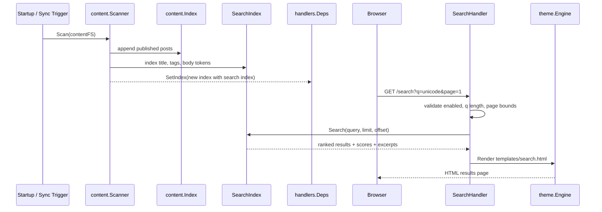
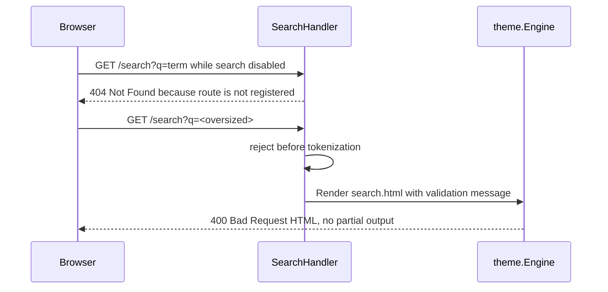
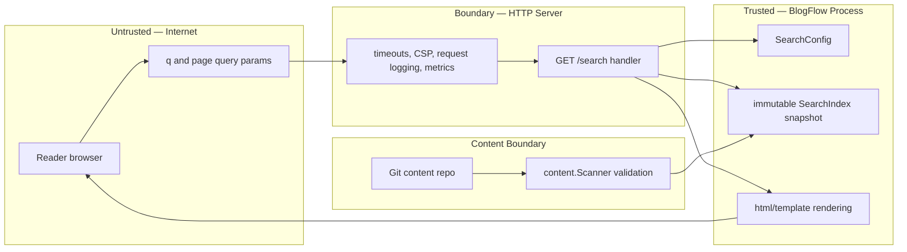

# Full-Text Search — Design Document

> **Status**: Draft  
> **Issue**: [#129](https://github.com/khaines/blogflow/issues/129)  
> **Author**: BlogFlow maintainers  
> **Reviewers**: Cloud-Native Distributed Systems Architect, Cloud-Native Security SME, Cloud-Native Site Reliability Engineer  
> **Last Updated**: 2026-07-20  
> **Supersedes**: —  
> **Superseded by**: —

---

## 1 · Overview

### 1.1 What This Component Is

Full-Text Search adds an optional, server-rendered search experience for BlogFlow posts. It builds an in-memory search index from the existing content scan and exposes a `GET /search?q=` route that renders HTML results through the theme engine without requiring client-side JavaScript.

### 1.2 Functionality It Provides

- Search published blog posts by title, tags, and Markdown body text.
- Render an accessible HTML search page with a query form, result count, excerpts, dates, and relevance ordering.
- Keep search indexes fresh when content is scanned at startup, synchronized by webhook/git-sync, or hot-reloaded in local development.
- Allow operators to enable or disable search through `site.yaml`.
- Support Unicode-aware matching consistent with BlogFlow's existing i18n slug handling.

### 1.3 Why It Is Important

Issue #129 identifies search as a core reader expectation for blogs with more than a small number of posts. BlogFlow's default experience is server-rendered and intentionally avoids requiring JavaScript, so the selected design is **Option B: server-side search, no JavaScript**. This keeps the default theme accessible, works in hardened CSP environments, and preserves BlogFlow's “single static binary with sensible defaults” philosophy.

### 1.4 Requirements Traceability

No formal `REQ-*` requirements are referenced by the issue; the source issue is the requirement authority.

| Requirement | Version | Priority | Summary |
|-------------|---------|----------|---------|
| ISSUE-129-001 | v1 | P0 | Search by title, tags, and body content |
| ISSUE-129-002 | v1 | P0 | Results show title, excerpt, date, and relevance score |
| ISSUE-129-003 | v1 | P0 | Handle Unicode content, aligned with urlize i18n behavior |
| ISSUE-129-004 | v1 | P0 | Configurable through `search.enabled: true` in `site.yaml` |
| ISSUE-129-005 | v1 | P0 | Accessible, keyboard-navigable results |
| ISSUE-129-006 | v1 | P1 | Resolve approach among client-side, server-side, and Pagefind options |

---

## 2 · Logical Architecture

### 2.1 High-Level Architecture


The design uses a **lightweight custom in-memory inverted index** for v1, not Bleve. Bleve is feature-rich and battle-tested, but it adds substantial dependency surface, binary-size pressure, and operational knobs that exceed BlogFlow's current need. A small custom index over title, tags, and body tokens fits the single-binary/distroless model, integrates directly with `content.Index`, and provides deterministic ranking and excerpts with far less complexity.

### 2.2 Component Boundaries & Responsibilities

| Responsibility | Owned by This Component | Owned by |
|----------------|:-----------------------:|----------|
| Tokenizing post title, tags, and body for search | ✅ | — |
| Building posting lists during content scan | ✅ | — |
| Query parsing, bounds checking, ranking, pagination, and excerpts | ✅ | — |
| `GET /search?q=` handler and search page data model | ✅ | — |
| `templates/search.html` and default search form markup | ✅ | — |
| Markdown parsing, rendering, draft filtering, slug indexing | ❌ | `internal/content.Scanner` |
| HTML escaping and template execution | ❌ | `internal/theme` / `html/template` |
| HTTP middleware, CSP, request logging, Prometheus HTTP metrics | ❌ | `internal/server` |
| Git clone/pull, webhook validation, filesystem watch triggers | ❌ | `internal/gitops` / sync layer |
| External search service operation | ❌ | Not in scope |
| Client-side JavaScript search | ❌ | Explicitly out of scope for Option B |

### 2.3 Data Flow

#### Index Build and Query Path



#### Disabled and Invalid Query Paths



### 2.4 Data Model / Schema

Implementation Go types are internal and in-memory only:

```go
type SearchConfig struct {
    Enabled        bool `yaml:"enabled"`        // default false (opt-in)
    MaxResults     int `yaml:"max_results"`      // default 20
    MaxQueryLength int `yaml:"max_query_length"` // default 128 runes
    MinQueryLength int `yaml:"min_query_length"` // default 2 runes
    ExcerptLength  int `yaml:"excerpt_length"`   // default 180 runes
    MaxDocs        int `yaml:"max_docs"`         // default 10,000 posts
    MaxTokens      int `yaml:"max_tokens"`       // default 2,000,000 indexed token occurrences
}

type SearchIndex struct {
    docs      []SearchDoc
    postings  map[string][]Posting // token -> sorted posting list
    docFreq   map[string]int
    maxDocs   int // hard cap: default 10,000 posts
    maxTokens int // hard cap: default 2,000,000 indexed token occurrences
}

type SearchDoc struct {
    ID      int
    Slug    string
    Title   string
    Tags    []string
    Date    time.Time
    Body    string // plain text stripped from rendered HTML or raw markdown text
    Length  int
}

type Posting struct {
    DocID int
    Field string // title, tag, body
    TF    int
}

type SearchResult struct {
    Title   string
    Slug    string
    URL     string
    Date    time.Time
    Excerpt string
    Score   float64
    Tags    []string
}
```

Index storage is bounded by configuration and content size. V1 indexes **posts only**, not static pages. Pages are a documented follow-up outside this implementation spec. Default caps are `max_docs: 10000` and `max_tokens: 2000000`, targeting an approximate search-index heap budget of **≤64 MiB per replica** for typical Markdown corpora. Exact heap use depends on token distribution and Go runtime overhead, so implementation must expose index size metrics and stop indexing additional documents/tokens once caps are reached. Tokenization is Unicode-normalized whitespace tokenization for v1; CJK bigrams are deferred to a follow-up.

### 2.5 API Surface

#### HTTP route

`GET /search?q=<query>&page=<n>` renders `templates/search.html`.

| Field | Behavior |
|-------|----------|
| `q` | Trimmed Unicode string. Empty query renders the search form with no results and HTTP 200. |
| `page` | Optional positive integer. Invalid values coerce to page 1. Out-of-range pages render the last available page, matching list handler behavior. |
| Response | HTML page with query echo, result count, result list, excerpts, dates, pagination links, and relevance score available to templates/metadata for sorting or optional theme display. The default reader-visible body text does not show numeric scores. |
| Disabled | If `search.enabled` is false, the route is not registered; `/search` returns the normal 404 and does not advertise disabled functionality. |
| Invalid query | Queries below min length render a user-facing validation message. Oversized queries return HTTP 400 with an HTML error message. |
| Errors | Search index unavailable or template render failure returns HTTP 500 without partial content. |
| Rate limits | No custom per-route limiter in v1; rely on existing HTTP timeouts, query bounds, and bounded per-request work. |

#### Internal interface

```go
type Searcher interface {
    Search(ctx context.Context, query string, opts SearchOptions) (SearchResponse, error)
}

type SearchOptions struct {
    Limit  int
    Offset int
}

type SearchResponse struct {
    Query      string
    Results    []SearchResult
    Total      int
    Page       int
    TotalPages int
    Duration   time.Duration
}
```

#### Ranking approach

Use BM25-lite weighted term frequency:

- Normalize and tokenize query terms with the same Unicode-normalized whitespace tokenizer used at index build time.
- Score exact token matches with field boosts: title `3.0`, tag `2.0`, body `1.0`.
- Apply inverse document frequency to avoid common terms dominating results.
- Add a small recency tie-breaker only after relevance ties; date must not outrank clear text relevance.
- Sort by score descending, then date descending, then slug ascending for deterministic output.

### 2.6 Dependencies

| Dependency | Type | Communication | Failure Behaviour |
|------------|------|---------------|-------------------|
| `internal/content.Scanner` | Internal package | In-process build-at-scan-time | If indexing fails due to internal invariant violation, fail the scan in strict mode; collect errors in best-effort mode. |
| `internal/content.Index` | Internal data structure | Atomic pointer swap through handlers deps | Search sees either the old complete index or new complete index; never a partially rebuilt index. |
| `internal/server` | Internal package | HTTP route registration and middleware | If search is disabled, the route is not registered and `/search` returns the normal 404. |
| `internal/theme` | Internal package | `html/template` rendering | Render errors return 500 without partial response. |
| `internal/config` | Internal package | YAML and defaults | Invalid search config fails validation at startup/reload. |
| Prometheus client | Library already present | In-process metrics | Metrics failure must not fail search responses. |
| OpenTelemetry | Library already present | In-process spans | Tracing failure must not affect user-visible behavior. |
| Bleve | External library candidate | Not used in v1 | Excluded from the implementation to preserve minimal dependencies and binary size; reconsider only in a future design if advanced analyzers become required. |

### 2.7 Content Integrity & Isolation

Search indexes only content already accepted by the content pipeline. Draft posts, files without valid front matter, malformed front matter, unsafe image/template fields, and duplicate slugs remain excluded by `internal/content.Scanner`. Search must not read arbitrary paths or fetch remote resources; it consumes only the `Post` objects in the current `content.Index` and inherits overlay filesystem isolation from the scan phase.

The excerpt generator must work on plain text, not trusted HTML. Query terms and excerpts are ordinary strings rendered by `html/template`; no search result field should be typed as `template.HTML`.

---

## 3 · Functional Test Scenarios

### 3.1 Happy-Path Scenarios

| # | Scenario | Precondition | Action | Expected Result |
|---|----------|--------------|--------|-----------------|
| 1 | Search title | Search enabled; post title contains “Go internals” | `GET /search?q=internals` | Matching post appears with title, date, excerpt, link, and template metadata score. |
| 2 | Search tags | Search enabled; post has tag `architecture` | `GET /search?q=architecture` | Tagged post appears; tag field contributes to score. |
| 3 | Search body | Search enabled; body contains “overlay filesystem” | `GET /search?q=overlay` | Matching post appears with excerpt around the body match. |
| 4 | Ranked multi-field result | One post matches title and body; another only body | `GET /search?q=search` | Multi-field match ranks above body-only match. |
| 5 | Unicode query | Post contains `Café`, `東京`, or Cyrillic text | Search with normalized equivalent where applicable | Unicode-aware tokenization finds expected posts without panics. |
| 6 | Pagination | More matches than `search.max_results` | `GET /search?q=go&page=2` | Second page renders deterministic subset with prev/next links. |
| 7 | Empty search page | Search enabled | `GET /search` | Search form renders with no error and no result list. |

### 3.2 Edge Cases & Error Scenarios

| # | Scenario | Input / Condition | Expected Behaviour |
|---|----------|-------------------|--------------------|
| 1 | Search disabled | `search.enabled: false` | `/search` returns the normal 404 because the route is not registered. |
| 2 | Query below minimum length | `q=a` when min length is 2 | HTTP 200 or 400 with accessible validation message; no index scan. |
| 3 | Query too long | Query exceeds `max_query_length` | HTTP 400 HTML response; tokenization is skipped. |
| 4 | Stop-word/common term | Query token appears in most posts | Results remain bounded and sorted; request latency stays within target. |
| 5 | No results | Valid query has no matches | Page renders “No results” and preserves the search form value. |
| 6 | Bad page number | `page=-1`, `page=abc`, or very large page | Invalid coerces to 1; excessive page clamps to last page without panic. |
| 7 | Content reload race | Query occurs during index rebuild | Handler uses old complete index or new complete index; no data race. |
| 8 | Template override missing search template | Custom theme omits `search.html` | Embedded default template is used through overlay defaults. |
| 9 | Malicious query string | Query contains HTML/script markup | Query echo is escaped; no executable markup appears. |

### 3.3 Integration Test Boundaries

- **Scanner + search index**: use real Markdown files in an in-memory or test filesystem, real front matter parsing, and real renderer output; assert draft and malformed posts are not searchable.
- **Handler + theme**: use `httptest`, real `handlers.Deps`, and a real theme engine with embedded/default templates; assert status codes and HTML content.
- **Config reload**: validate that enabling/disabling search and changing max results takes effect when config and index are swapped.
- **Sync/hot reload**: simulate `SetIndex` with a rebuilt index and assert old terms disappear while new terms become searchable.
- **Metrics/tracing**: use Prometheus registry/test helpers where possible and OpenTelemetry test spans for search attributes.

### 3.4 Acceptance Criteria Mapping

| Acceptance Criterion | Test Scenario(s) | Coverage |
|----------------------|-------------------|----------|
| Search by title, tags, and body content | §3.1 #1, #2, #3; §3.3 scanner integration | ✅ Covered |
| Results show title, excerpt, date, relevance score | §3.1 #1; handler/template tests verify score is available to templates/metadata, not shown as default reader-visible body text | ✅ Covered |
| Handles Unicode content | §3.1 #5; tokenizer unit tests | ✅ Covered |
| Configurable through `search.enabled: true` | §3.2 #1; config reload tests | ✅ Covered |
| Accessible keyboard-navigable results | §3.1 #7; template accessibility tests | ✅ Covered |
| Server-side, no JavaScript | Handler/theme integration; static template inspection | ✅ Covered |

---

## 4 · Performance

### 4.1 Expected Load Profile

Search is read-heavy and request-driven. Small blogs may see occasional queries; medium blogs may see bursts when readers navigate archives; high-traffic blogs may have sustained search traffic during content launches. Content updates are less frequent than reads, so the index is rebuilt at scan time and served as an immutable snapshot between reloads.

### 4.2 Latency Targets

| Percentile | Target | Measurement Point |
|------------|--------|-------------------|
| p50 | ≤ 10 ms | Search handler request to rendered response for ≤1,000 posts |
| p95 | ≤ 50 ms | Search handler request to rendered response for ≤10,000 posts |
| p99 | ≤ 150 ms | Search handler request to rendered response under bounded worst-case query |

### 4.3 Throughput Targets

- Sustain at least 50 search requests/second per replica for small/medium content sets on typical container CPU limits.
- Preserve existing static/post page throughput by avoiding global locks on query execution.
- Rebuild search index during content scans in O(total indexed tokens) time, with no per-request filesystem reads.

### 4.4 Scaling Strategy

The component scales horizontally with BlogFlow replicas because each replica keeps its own in-memory index. The primary bottlenecks are memory for posting lists and CPU for scoring large candidate sets. Query work is bounded by max query length, `max_docs` (default 10,000), `max_tokens` (default 2,000,000 token occurrences), max result window, and candidate-scoring limits derived from those caps.

### 4.5 Resource Budgets

| Resource | Budget per Replica | Notes |
|----------|-------------------|-------|
| CPU | ≤ 1 core for p95 target on 10,000 posts | Query scoring is CPU-bound and should avoid regex backtracking. |
| Memory | Target ≤64 MiB search-index heap for ~10,000 typical posts | Enforced with `max_docs: 10000` and `max_tokens: 2000000`; actual usage is measured via metrics. |
| Storage | 0 Gi persistent storage for v1 | Index is rebuilt in memory; no on-disk index files. |

### 4.6 Performance Test Plan

- Add tokenizer/index microbenchmarks for 100, 1,000, and 10,000-post synthetic corpora.
- Benchmark common, rare, multi-term, and Unicode queries.
- Measure rebuild duration during scanner benchmarks.
- Add allocation benchmarks for excerpt generation and scoring.
- Include a large-site fixture or generated benchmark in CI only if it stays fast; otherwise run pre-release/manual performance tests.

---

## 5 · Security

### 5.1 Authentication & Authorization

Search is a public reader-facing feature and does not require authentication. It must only expose published posts already served publicly by `/posts/{slug}` and `/tags/{tag}`. Drafts, invalid posts, and non-post filesystem content are excluded by depending on `content.Index.Posts` rather than direct file reads.

### 5.2 Data Classification & Encryption

| Data Element | Classification | Encrypted at Rest | Encrypted in Transit |
|-------------|----------------|:-----------------:|:--------------------:|
| Search query string | Public/Internal operational data | N/A in memory; avoid persistent query logs by default | ✅ when site is served over TLS or behind TLS termination |
| Result title/date/tags/excerpt | Public | Same as public content repository | ✅ when site is served over TLS or behind TLS termination |
| Relevance score | Public | N/A | ✅ when site is served over TLS or behind TLS termination |
| Search metrics counts/latency | Internal | Deployment-dependent metrics storage | Deployment-dependent metrics transport |
| Search logs | Internal | Deployment-dependent log storage | Deployment-dependent log transport |

### 5.3 Input Validation & Sanitization

- Trim query whitespace and reject queries above `search.max_query_length` before tokenization.
- Enforce `search.min_query_length` after Unicode normalization/tokenization.
- Limit query token count and ignore duplicate query tokens to bound scoring work.
- Avoid regular expressions in tokenization and excerpt matching; use rune iteration and simple substring/token windows to prevent ReDoS.
- Render query echoes, excerpts, titles, tags, and validation messages as plain strings through `html/template`.
- Do not log full query strings at INFO level; if debug logging is added, truncate and avoid recording sensitive accidental input.

### 5.4 Content Integrity

Search inherits content integrity from the existing content pipeline: front matter size limits, safe URL validation, template name validation, slug validation, draft exclusion, and markdown rendering with unsafe HTML disabled by default. Search must not mark excerpts or highlighted fragments as trusted HTML unless generated by a carefully reviewed highlighter that escapes all unmatched content first. V1 should avoid HTML highlighting and use plain-text excerpts.

---

## 6 · Threat Model

### 6.1 Trust Boundaries



### 6.2 Threat Actors & Attack Surfaces

| Threat Actor | Attack Surface | Motivation |
|-------------|----------------|------------|
| Anonymous internet user | `/search?q=` | XSS, denial of service, probing content not intended for publication |
| Malicious content author | Markdown/front matter indexed by search | Stored XSS through excerpts, misleading search results, memory blow-up |
| Bot or scraper | Repeated expensive queries | CPU exhaustion and noisy metrics/logs |
| Operator misconfiguration | `search.*` settings | Accidental unbounded memory or disabled expected functionality |
| Compromised content repo | Content scan inputs | Poison index with excessive tokens or unsafe text |

### 6.3 STRIDE Analysis

| Threat Category | Applicable? | Threat Description | Mitigation |
|----------------|:-----------:|--------------------|------------|
| **S**poofing | ❌ | Search has no identity boundary; all users are anonymous readers. | No auth state is trusted or changed by search. |
| **T**ampering | ✅ | Content author can attempt to inject unsafe markup into excerpts. | Use sanitized/stripped plain text and `html/template` escaping. |
| **R**epudiation | ✅ | Abuse may be hard to attribute if only aggregate metrics exist. | Existing request logs include request ID, path, remote/client IP; do not log full queries by default. |
| **I**nformation Disclosure | ✅ | Search could reveal drafts or pages not linked publicly. | Build only from `content.Index.Posts`, which excludes drafts and invalid content. |
| **D**enial of Service | ✅ | Long queries, common-term queries, or huge corpora can cause high CPU/memory. | Query length/token bounds, result limits, `max_docs`/`max_tokens` caps, memory budgets, no regex. |
| **E**levation of Privilege | ❌ | Search does not perform privileged actions. | Keep route read-only and avoid filesystem access from query input. |

### 6.4 Mitigations & Residual Risks

- **XSS mitigation**: V1 excerpts are plain text only; all fields are escaped by templates. Residual risk is low if no future highlighter returns trusted HTML.
- **DoS mitigation**: Bound query length, token count, results, and indexed corpus with default caps of 10,000 posts and 2,000,000 indexed token occurrences, targeting ≤64 MiB search-index heap per replica. Residual risk remains for sites that need larger corpora and must tune caps intentionally.
- **Disclosure mitigation**: Index only published posts from the existing scanner output. Residual risk is that public-but-obscure posts become easier to discover, which is inherent to search.
- **Supply-chain mitigation**: Use the custom index for v1 to avoid adding a large search dependency tree. If a future design proposes Bleve or another search library, perform dependency review and binary-size measurement then.

---

## 7 · Observability

### 7.1 Logging Strategy

| Log Level | When Used | Example |
|-----------|-----------|---------|
| ERROR | Search index build invariant failure or template render failure | `search render failed`, `template=templates/search.html` |
| WARN | Invalid search config on reload, oversized query rejected repeatedly | `search query rejected`, `reason=max_length` |
| INFO | Search enabled/disabled at startup or reload; index rebuild summary | `search index rebuilt`, `posts=120`, `tokens=8400`, `duration=35ms` |
| DEBUG | Diagnostic tokenizer/index details with truncated query | `search query parsed`, `terms=3`, `query_len=24` |

Required structured fields: `request_id` for request logs, `trace_id` when tracing is enabled, route pattern, status, duration, result count, and zero-result boolean. Avoid high-cardinality labels and logs containing full query text at normal levels.

### 7.2 Metrics & Dashboards

| Metric | Type | Labels | Description |
|--------|------|--------|-------------|
| `blogflow_search_queries_total` | Counter | `status` (`ok`, `invalid`, `error`) | Total search requests handled by the search component. Disabled requests hit normal 404 routing because `/search` is not registered. |
| `blogflow_search_query_duration_seconds` | Histogram | `status` | End-to-end search handler latency, separate from global HTTP metrics. |
| `blogflow_search_results_total` | Histogram | none | Distribution of result counts per successful query. |
| `blogflow_search_zero_results_total` | Counter | none | Count of valid queries returning zero results. |
| `blogflow_search_index_documents` | Gauge | none | Number of posts in the active search index. |
| `blogflow_search_index_tokens` | Gauge | none | Number of indexed token occurrences in the active search index. |
| `blogflow_search_index_rebuild_duration_seconds` | Histogram | `status` | Search index rebuild duration during content scans. |
| `blogflow_search_index_memory_bytes` | Gauge | none | Estimated search index heap footprint if practical to compute. |

Dashboard panels should show query rate, p95/p99 latency, zero-result rate, index size, rebuild duration, and errors.

### 7.3 Distributed Tracing

Create a `search.Query` span in the handler and a `search.IndexBuild` span during scan/rebuild. Suggested attributes: `search.enabled`, `search.query_terms_count`, `search.results_count`, `search.zero_results`, `search.page`, `search.limit`, `search.index_docs`, and `search.duration_ms`. Do not attach raw query strings to spans by default.

### 7.4 Alerting Rules & Escalation

| Alert Name | Condition | Severity | Response |
|------------|-----------|----------|----------|
| SearchHighErrorRate | `rate(blogflow_search_queries_total{status="error"}[5m]) / rate(blogflow_search_queries_total[5m]) > 0.05` | 🟠 High | Investigate handler/index/template errors; rollback if tied to release. |
| SearchHighLatency | p99 search duration > 250 ms for 10 minutes | 🟡 Medium | Check corpus size, common queries, CPU saturation, and candidate bounds. |
| SearchIndexRebuildFailed | Any rebuild failure in last 10 minutes | 🔴 Critical if search is enabled | Page on-call for production sites that advertise search. |
| SearchZeroResultSpike | Zero-result rate doubles baseline for 30 minutes | 🟢 Low | Review tokenizer changes, content sync freshness, or UX issues. |

---

## 8 · Rollout & Risk

### 8.1 Rollout Strategy

Implement behind `search.enabled` with **default `false`** for v1. The default theme can ship `templates/search.html` and a conditional search form so enabling search requires only configuration. For hosted deployments, canary by enabling search on one low-traffic site or replica group before broad rollout.

### 8.2 Rollback Plan

Rollback is configuration-first: set `search.enabled: false` and reload/redeploy. Because the route is registered only when enabled, `/search` returns the normal 404 without changing content. If a code regression affects non-search paths, revert the release. Expected rollback time is one config reload/redeploy cycle; no data migration reversal is required because v1 stores no persistent index.

Rollback triggers:

- Search p99 latency exceeds 250 ms for 10 minutes and affects site CPU.
- Search error rate exceeds 5% for 5 minutes.
- Index rebuild memory growth threatens container limits.
- Security review identifies an excerpt/template injection issue.

### 8.3 Risk Register

| Risk | Likelihood | Impact | Mitigation |
|------|:----------:|:------:|------------|
| Custom index ranking is too simple | Medium | Medium | Use field boosts + IDF; document ranking limitations; keep interface replaceable. |
| Large sites consume too much memory | Medium | High | Default off, ≤64 MiB target budget, index size metrics, `max_docs` and `max_tokens` caps. |
| Unicode tokenization misses languages without spaces | Medium | Medium | V1 uses Unicode-normalized whitespace tokenization; CJK bigrams are explicitly deferred to a follow-up. |
| Search route reduces cache/CDN effectiveness | Medium | Low | Keep static pages cacheable; search is dynamic and server-side by design. |
| Excerpt generation introduces XSS | Low | High | Plain-text excerpts only; never return trusted HTML from search. |
| Advanced analyzer features become necessary | Low | Medium | Keep `Searcher` interface so a future design can evaluate Bleve or another library after dependency review. |

### 8.4 Dependencies & Sequencing

1. Add `SearchConfig` defaults, YAML parsing, and validation.
2. Add tokenizer and custom `SearchIndex` under `internal/content` or `internal/search`.
3. Integrate index build with scanner output and atomic handler dependency swaps.
4. Add `SearchHandler`, route registration, page data, metrics, and tracing.
5. Add default `templates/search.html`, header search form/partial, CSS, and theme override documentation.
6. Add unit, integration, accessibility, and benchmark coverage.
7. Enable in a canary environment, observe metrics, and keep default `search.enabled: false` until a later design explicitly changes it.

### 8.5 Launch Checklist

- [ ] All issue #129 acceptance criteria are implemented and tested.
- [ ] Config defaults and validation are documented.
- [ ] Search route is not registered and returns normal 404 behavior when `search.enabled` is false.
- [ ] Unit tests cover tokenizer, ranking, excerpts, bounds, and Unicode.
- [ ] Integration tests cover handler, default template, reload, and disabled mode.
- [ ] Benchmarks establish memory and latency for representative corpus sizes.
- [ ] Security review verifies no trusted HTML is produced by search.
- [ ] Observability includes query count, latency, zero-result rate, index size, and rebuild duration.
- [ ] Rollback by config disable is tested.
- [ ] Theme override guidance documents `templates/search.html` and optional partials.

---

## 9 · Open Questions & Decisions

| # | Question | Status | Resolution |
|---|----------|--------|------------|
| 1 | Should v1 use Bleve or a custom in-memory inverted index? | ✅ Decided | Use a custom in-memory inverted index for v1. Do not add Bleve; the custom index better fits BlogFlow's minimal dependency, smaller binary, and direct scan-time integration goals. |
| 2 | Should the search index be persistent or rebuilt in memory only? | ✅ Decided | Use in-memory-only indexes rebuilt at content scan time. This avoids filesystem writes and preserves distroless/read-only-root compatibility. |
| 3 | What memory budget and corpus size must v1 support? | ✅ Decided | Target ~10,000 posts within an approximate ≤64 MiB search-index heap budget per replica. Enforce `max_docs: 10000` and `max_tokens: 2000000` defaults and expose metrics for actual usage. |
| 4 | Should `search.enabled` default to false or true? | ✅ Decided | Default `search.enabled` to `false`; search is opt-in for v1 while templates and docs make enablement straightforward. |
| 5 | Should pages be searchable in addition to posts? | ✅ Decided | V1 indexes posts only. Static/content pages are a documented follow-up. |
| 6 | What Unicode strategy is required for CJK and languages without whitespace? | ✅ Decided | V1 uses Unicode-normalized whitespace tokenization aligned with existing i18n handling. CJK bigrams are deferred to a follow-up. |
| 7 | Disabled behavior: unregister route, 404, or disabled page? | ✅ Decided | When disabled, the search route is not registered; `/search` returns the normal 404 and does not advertise disabled functionality. |
| 8 | Should result scores be visible to readers or only available in templates/metadata? | ✅ Decided | Relevance scores are available to templates/metadata for sorting or optional custom theme display, but the default reader-visible result body does not show numeric scores. |

---

## 10 · References

- **Source issue**: [#129 — Full-text search for blog posts](https://github.com/khaines/blogflow/issues/129)
- **Design template**: [`docs/engineering/design/000-template.md`](./000-template.md)
- **Design conventions**: [`docs/engineering/design/README.md`](./README.md)
- **Related design docs**: [`docs/engineering/design/overlay-filesystem.md`](./overlay-filesystem.md), [`docs/engineering/design/configuration-system.md`](./configuration-system.md)
- **Relevant source context**: `internal/content/scanner.go`, `internal/content/frontmatter.go`, `internal/content/renderer.go`, `internal/server/handlers/handlers.go`, `internal/server/server.go`, `internal/config/config.go`, `internal/theme/theme.go`, `defaults/templates/`
- **Skill references consulted**: `.github/skills/design-doc/section-map.md`, `.github/skills/design-doc/checklist-refs.md`, `.github/skills/review-fix-loop/SKILL.md`
