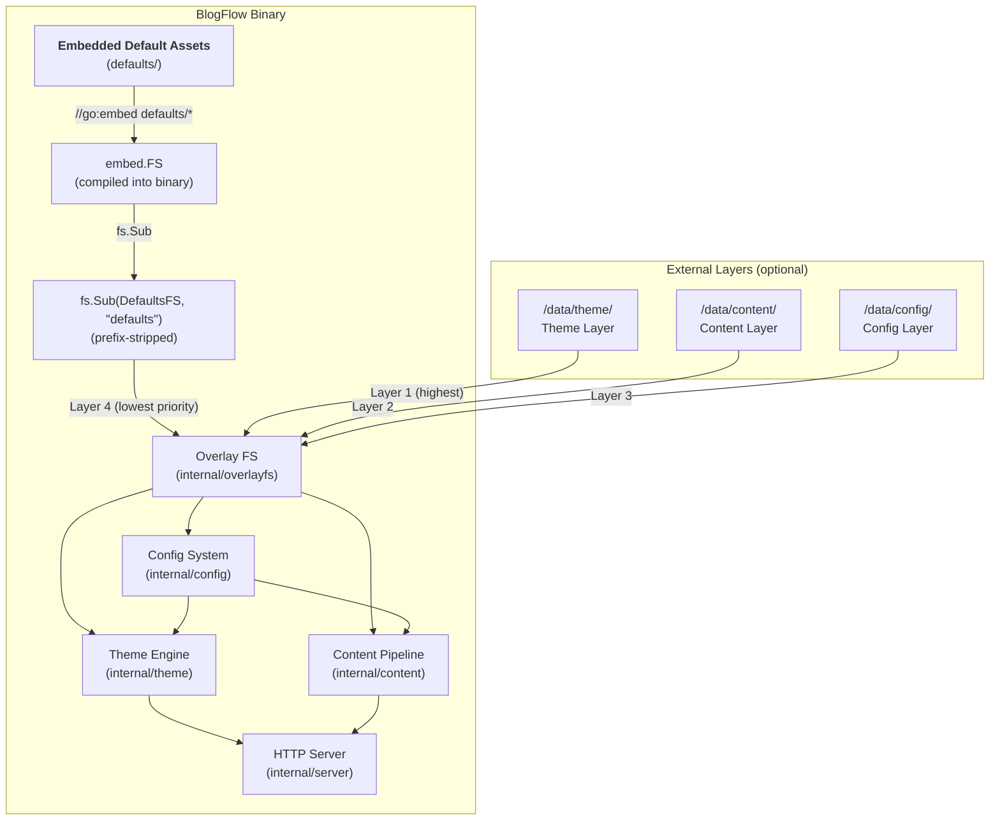
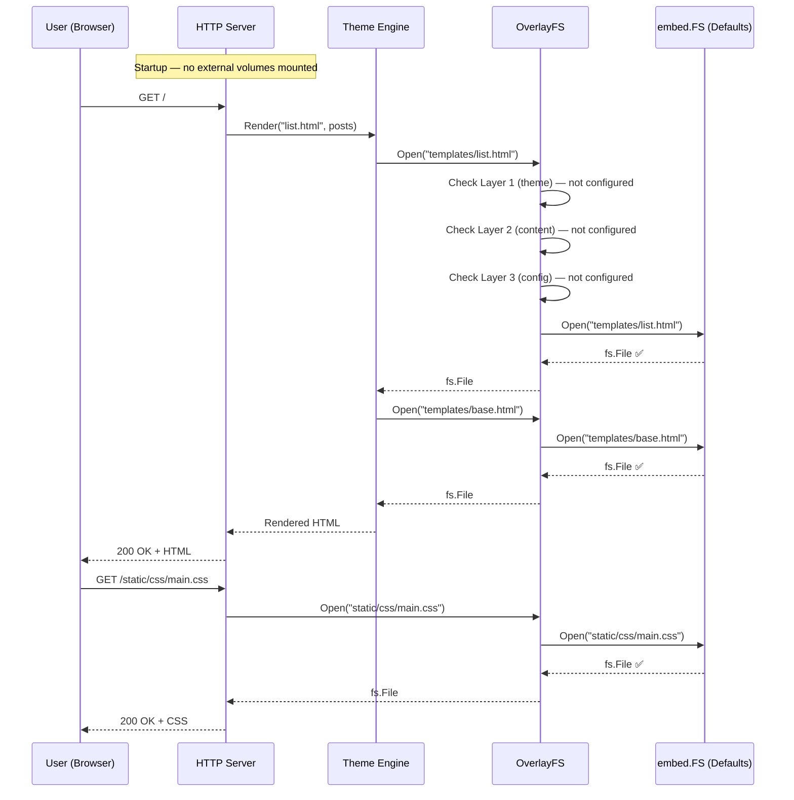
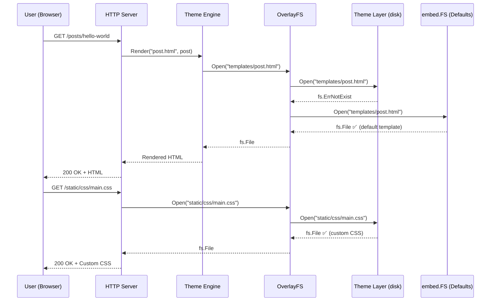
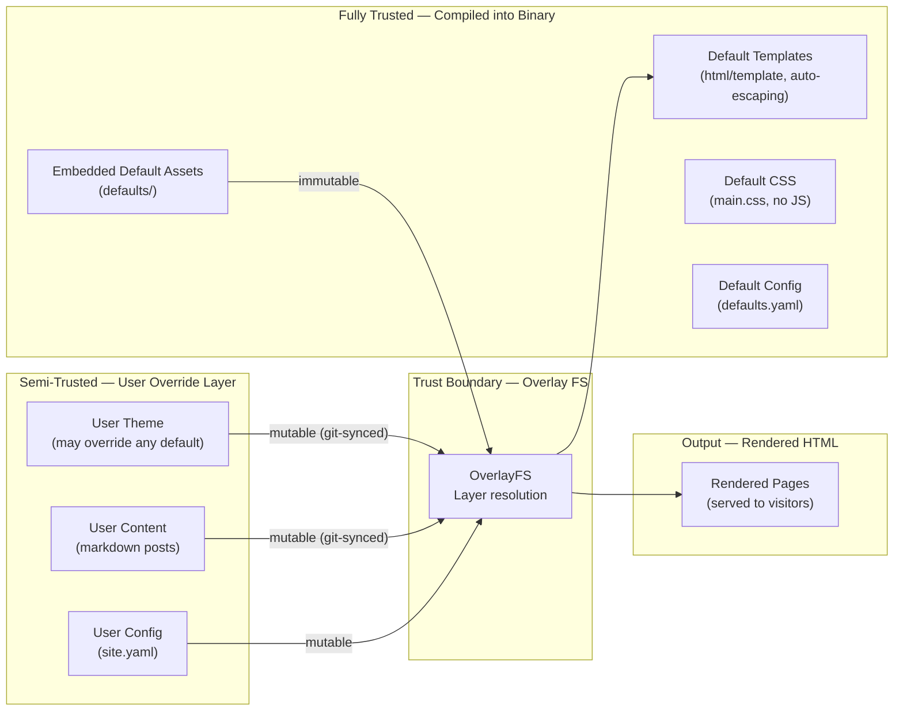
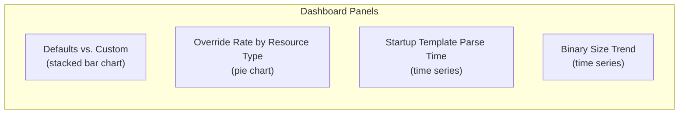
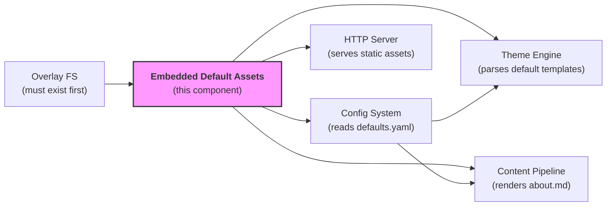

# Embedded Default Assets — Design Document

> **Status**: In Review  
> **Author**: Cloud-Native Front-End Engineer  
> **Reviewers**: Cloud-Native Distributed Systems Architect, Cloud-Native Security SME, Cloud-Native Systems Engineer, Cloud-Native SRE  
> **Last Updated**: 2026-03-22  

---

## 1 · Overview

### 1.1 What This Component Is

The Embedded Default Assets component is the set of templates, stylesheets, configuration, static files, and sample content compiled into the BlogFlow binary via Go's `embed.FS`. It provides the "Level 0" progressive customization experience: a user who supplies only markdown files receives a complete, responsive, accessible, production-ready blog with zero external dependencies. The `defaults/` directory is the source of truth for these assets and forms the lowest-priority layer in the overlay filesystem.

### 1.2 Functionality It Provides

- **Complete default theme** — a clean, minimal, reader-focused design with light/dark mode, responsive layout, and print support
- **Full template set** — base layout, post, list, page, and 404 templates plus reusable partials (header, footer, post metadata, pagination)
- **Default site configuration** — sensible `defaults.yaml` covering site title, description, pagination, date format, and feature toggles
- **Default static assets** — single-file CSS with custom properties for theming, default favicon, and Chroma-compatible syntax highlighting styles
- **Default content** — starter "About" page so the blog is immediately navigable
- **Zero-config operation** — the binary is fully functional with no external files, directories, or configuration
- **Progressive override** — every embedded asset can be replaced by placing a file at the same path in a higher-priority overlay layer

### 1.3 Why It Is Important

BlogFlow's core promise is "one binary, zero config, full override." The embedded defaults are the mechanism that makes "zero config" possible. Without them, every new user would face a blank screen or a mandatory setup process before seeing any output. The defaults also serve as documentation-by-example: they demonstrate the template structure, CSS custom properties, front matter format, and configuration schema that users follow when customizing.

From an operational perspective, the embedded defaults are the ultimate fallback. If all external volumes are unmounted, misconfigured, or corrupted, the binary continues to serve a functional blog from the compiled-in assets. This makes BlogFlow resilient to infrastructure failures and dramatically simplifies first-run, development, and disaster recovery scenarios.

### 1.4 Requirements Traceability

| Requirement | Version | Priority | Summary |
|-------------|---------|----------|---------|
| REQ-EDA-001 | v1 | P0 | Binary ships with a complete, functional blog experience (templates, CSS, config, sample content) |
| REQ-EDA-002 | v1 | P0 | Default theme is responsive (mobile-first, all screen sizes) |
| REQ-EDA-003 | v1 | P0 | Default theme is accessible (WCAG 2.1 AA compliant, semantic HTML) |
| REQ-EDA-004 | v1 | P0 | Light/dark mode via `prefers-color-scheme` (no JavaScript required) |
| REQ-EDA-005 | v1 | P0 | System font stack — no external font loading |
| REQ-EDA-006 | v1 | P0 | No JavaScript required for core reading experience |
| REQ-EDA-007 | v1 | P1 | Print-friendly stylesheet |
| REQ-EDA-008 | v1 | P1 | Chroma-compatible syntax highlighting CSS classes |
| REQ-EDA-009 | v1 | P0 | embed.FS integration with `fs.Sub` prefix stripping for overlay FS compatibility |
| REQ-EDA-010 | v1 | P0 | Default CSP headers via `<meta>` tag — no inline JS, no external resources |
| REQ-EDA-011 | v1 | P1 | Observability: metric tracking when defaults are served vs. custom overrides |

---

## 2 · Logical Architecture

### 2.1 High-Level Architecture



### 2.2 Component Boundaries & Responsibilities

| Responsibility | Owned by This Component | Owned by |
|----------------|:-----------------------:|----------|
| Default template files (base, post, list, page, 404, partials) | ✅ | — |
| Default CSS stylesheet (main.css) | ✅ | — |
| Default site configuration (defaults.yaml) | ✅ | — |
| Default static assets (favicon) | ✅ | — |
| Default content (about page) | ✅ | — |
| `embed.FS` declaration and `fs.Sub` prefix stripping | ✅ | — |
| Layered file resolution (overlay logic) | ❌ | `internal/overlayfs` |
| Template parsing and rendering | ❌ | `internal/theme` |
| Markdown parsing and HTML generation | ❌ | `internal/content` |
| YAML config loading, validation, and merging | ❌ | `internal/config` |
| HTTP routing and static file serving | ❌ | `internal/server` |
| CSS preprocessing or build steps | ❌ | Not applicable (no build step) |

### 2.3 Data Flow

#### Zero-Config Startup — All Assets Served from Defaults



#### Partial Override — User Provides Custom CSS, Defaults Supply Templates



### 2.4 Data Model / Schema

#### Directory Structure

The `defaults/` directory is organized to mirror the paths that the overlay FS, theme engine, content pipeline, and config system expect:

```
defaults/
├── config/
│   └── defaults.yaml         # Default site configuration
├── templates/
│   ├── base.html              # Root layout (head, body, scripts)
│   ├── post.html              # Single blog post
│   ├── list.html              # Post listing (index, tag, archive)
│   ├── page.html              # Static page
│   ├── 404.html               # Not found page
│   └── partials/
│       ├── header.html        # Site header/navigation
│       ├── footer.html        # Site footer
│       ├── post-meta.html     # Post metadata (date, author, tags)
│       └── pagination.html    # Pagination controls
├── static/
│   ├── css/
│   │   └── main.css           # Complete responsive stylesheet
│   └── images/
│       └── favicon.svg        # Default favicon
└── content/
    └── pages/
        └── about.md           # Default "About" page
```

#### embed.FS Integration

```go
package defaults

import (
    "embed"
    "fmt"
    "io/fs"
)

// DefaultsFS embeds the entire defaults/ directory tree into the binary.
// The //go:embed directive includes all files recursively.
//
// Note: The //go:embed defaults/* glob excludes files and directories whose names
// begin with '.' or '_'. No embedded asset names may begin with '.' or '_' unless
// the directive is changed to //go:embed all:defaults.
//go:embed defaults/*
var DefaultsFS embed.FS

// Defaults is the prefix-stripped filesystem ready for overlay FS consumption.
// fs.Sub removes the "defaults/" prefix so paths align with overlay expectations:
//   "templates/base.html" instead of "defaults/templates/base.html"
//
// This is a critical correctness requirement — path mismatch causes complete
// template rendering failure with no graceful degradation.
var Defaults fs.FS

func init() {
    var err error
    Defaults, err = fs.Sub(DefaultsFS, "defaults")
    if err != nil {
        panic(fmt.Sprintf("blogflow: failed to create defaults sub-filesystem: %v", err))
    }
}
```

> **Why `init()` panic?** The `init()` panic is intentional — if the embedded defaults cannot be loaded, the binary is fundamentally broken and must not start. This surfaces build errors immediately rather than producing confusing runtime failures.

> **Why `fs.Sub`?** Go's `embed.FS` preserves the directory prefix from the `//go:embed` directive. The overlay FS expects paths like `templates/base.html`, not `defaults/templates/base.html`. Using `fs.Sub(DefaultsFS, "defaults")` strips the prefix so the embedded filesystem's path namespace aligns with all other layers. This was resolved in the overlay FS design (§9, Q6).

#### Default Configuration Schema (`defaults.yaml`)

```yaml
# defaults/config/defaults.yaml
# Default site configuration — all values can be overridden by user config.

site:
  title: "My Blog"
  description: "A blog powered by BlogFlow"
  language: "en"
  base_url: "https://localhost:8080"   # Default uses HTTPS. In development mode (--dev flag), the server binds to HTTP.

author:
  name: ""
  email: ""

content:
  posts_per_page: 10
  summary_length: 200          # characters
  date_format: "January 2, 2006"
  reading_speed_wpm: 200
  enable_reading_time: true
  enable_tags: true

theme:
  name: "default"
  syntax_highlighting: true
  syntax_theme: "monokai"      # Chroma style name

server:
  port: 8080
  host: "0.0.0.0"
```

### 2.5 API Surface

The embedded defaults do not expose a public API in the traditional sense. They are consumed exclusively through the overlay filesystem. The API surface is the `fs.FS` returned by `fs.Sub`:

```go
package defaults

import "io/fs"

// Defaults provides read-only access to all embedded default assets.
// It implements fs.FS, fs.ReadFileFS, fs.ReadDirFS, and fs.StatFS.
//
// Usage by the overlay FS:
//   ofs := overlayfs.NewOverlayFS(themeFS, contentFS, configFS, defaults.Defaults)
//
// Note: Callers should use NewOverlayFS with the already prefix-stripped
// defaults.Defaults (fs.FS), NOT NewFromPaths which performs its own fs.Sub
// internally. Using NewFromPaths with defaults.Defaults would double-strip
// the prefix and break path resolution.
//
// Usage by the config system (direct read, bypassing overlay):
//   data, err := fs.ReadFile(defaults.Defaults, "config/defaults.yaml")
//
// Usage in tests:
//   entries, err := fs.ReadDir(defaults.Defaults, "templates")
var Defaults fs.FS
```

**Path contract** — consumers access files using these canonical paths:

| Consumer | Path Pattern | Example |
|----------|-------------|---------|
| Theme engine | `templates/*.html` | `templates/base.html` |
| Theme engine | `templates/partials/*.html` | `templates/partials/header.html` |
| Config system | `config/defaults.yaml` | `config/defaults.yaml` |
| HTTP server (static) | `static/**` | `static/css/main.css` |
| Content pipeline | `content/pages/*.md` | `content/pages/about.md` |

### 2.6 Dependencies

| Dependency | Type | Communication | Failure Behaviour |
|------------|------|---------------|-------------------|
| `embed` (stdlib) | Library | Compile-time embedding | N/A — compile error if files missing |
| `io/fs` (stdlib) | Library | In-process (`fs.Sub`) | N/A — interface definitions |
| `internal/overlayfs` | Internal | Passed as lowest-priority layer | If overlay FS rejects the `fs.FS`, startup fails with clear error |
| `html/template` (stdlib) | Library | Templates parsed by theme engine | Parse errors surface at startup |
| goldmark | Library | Markdown parsed by content pipeline | Parse errors returned per-file |
| `internal/config` | Internal | Reads `config/defaults.yaml` directly | Falls back to hardcoded zero-values if `defaults.yaml` is malformed |
| `internal/theme` | Internal | Reads templates via overlay FS | Template parse failure at startup → process exits with error |

### 2.7 Content Integrity & Isolation

**Embedded assets are fully trusted.** The `defaults/` directory is part of the BlogFlow source code repository. Every file is reviewed through the standard PR process, compiled into the binary at build time, and immutable at runtime. There is no mechanism — intentional or accidental — for an external actor to modify embedded assets without rebuilding the binary.

**Supply chain trust boundary:** Embedded default assets occupy a unique trust position: they are compiled into the binary and reviewed as source code, making them as trusted as the Go code itself. This is fundamentally different from user-provided theme/content layers (semi-trusted). Changes to files in `defaults/` require the same code review process as changes to Go source files. The CI pipeline verifies that embedded assets have not been tampered with via checksum validation.

**Template safety:**
- All templates use `html/template` (not `text/template`), which provides automatic contextual escaping for XSS prevention.
- Default templates contain no inline JavaScript. Interactive features (if any) are loaded from external `.js` files served with appropriate `Content-Type` and CSP headers.
- The default `base.html` sets a Content Security Policy via `<meta>` tag that restricts script sources, style sources, and image sources to `'self'`.

**Static asset safety:**
- `main.css` is authored in plain CSS — no preprocessor, no build step, no supply chain risk from npm/node tooling.
- `favicon.svg` is a simple inline SVG. SVG is validated to contain no `<script>` elements or event handlers.

**Default content safety:**
- `about.md` is plain markdown with standard front matter. The content pipeline's goldmark configuration disables raw HTML in markdown by default, so even if the about page contained HTML, it would be escaped.

**Path alignment guarantee:**
- The `fs.Sub(DefaultsFS, "defaults")` call is covered by a unit test that verifies every expected path is accessible. If the directory structure changes without updating the `fs.Sub` prefix, the test fails immediately.

---

## 3 · Functional Test Scenarios

### 3.1 Happy-Path Scenarios

| # | Scenario | Precondition | Action | Expected Result |
|---|----------|--------------|--------|-----------------|
| 1 | Zero-config startup serves default templates | No external volumes mounted | Start binary, request `GET /` | Returns HTML rendered from `list.html` + `base.html` defaults |
| 2 | Default CSS served at expected path | No theme layer | Request `GET /static/css/main.css` | Returns CSS content with `Content-Type: text/css` |
| 3 | Default config loaded on startup | No external config file | Inspect loaded config | Site title is "My Blog", posts per page is 10 |
| 4 | Default 404 page rendered | No external volumes | Request `GET /nonexistent` | Returns 404 status with friendly HTML from `404.html` |
| 5 | Default about page accessible | No external content | Request `GET /about` | Returns rendered HTML from `about.md` |
| 6 | Default favicon served | No theme layer | Request `GET /static/images/favicon.svg` | Returns SVG with `Content-Type: image/svg+xml` |
| 7 | All template partials available | No theme layer | Render any page | Header, footer, post-meta, pagination partials resolve correctly |
| 8 | Dark mode CSS applies automatically | Browser sends `prefers-color-scheme: dark` | Inspect rendered CSS | Dark mode custom properties are active |
| 9 | Post listing shows pagination | Config `posts_per_page: 10`, 15 posts exist | Request `GET /` | First 10 posts shown with pagination controls |
| 10 | Post page shows reading time | Post with 1000 words | Request `GET /posts/example` | Reading time shows "5 min read" |
| 11 | Custom override shadows default | User provides `templates/post.html` in theme layer | Request `GET /posts/example` | User's custom template is used, not the default |
| 12 | Partial override mixes layers | User overrides `header.html`, keeps default `footer.html` | Render any page | Custom header + default footer both render correctly |
| 13 | `fs.Sub` prefix stripping works | Binary compiled with `defaults/` directory | `fs.ReadFile(Defaults, "templates/base.html")` | Returns file contents without error |
| 14 | `ReadDir` lists all default templates | No external volumes | `fs.ReadDir(Defaults, "templates")` | Returns entries for base.html, post.html, list.html, page.html, 404.html, partials/ |

### 3.2 Edge Cases & Error Scenarios

| # | Scenario | Input / Condition | Expected Behaviour |
|---|----------|-------------------|--------------------|
| 1 | `defaults/` directory missing at compile time | `//go:embed defaults/*` matches no files | Compile error — build fails |
| 2 | `fs.Sub` with wrong prefix | `fs.Sub(DefaultsFS, "wrong")` | Returns `fs.FS` that resolves nothing; startup validation catches it |
| 3 | Template parse error in default template | Malformed `{{` syntax in `base.html` | Template parse fails at startup; process exits with descriptive error |
| 4 | Default CSS is empty | `main.css` has 0 bytes | Page renders with no styling; functional but visually bare |
| 5 | Missing partial reference | `base.html` references `{{template "sidebar" .}}` but no `sidebar.html` exists | Template execution error; logged at ERROR level |
| 6 | Concurrent reads of embedded assets | 100 goroutines read `main.css` simultaneously | Thread-safe — `embed.FS` is immutable and inherently safe for concurrent reads |
| 7 | Very large embedded asset | A static file > 1 MB embedded | Binary size increases; `embed.FS` handles large files correctly |
| 8 | Binary size audit | All defaults embedded | Total embedded size < 100 KB (templates + CSS + config + favicon + about page) |
| 9 | defaults.yaml with unknown fields | Future config key added but not yet supported | Config loader with strict unmarshalling rejects unknown fields; falls back to hardcoded defaults |
| 10 | User overrides `defaults.yaml` in config layer | Custom `config/defaults.yaml` in `/data/config/` | Config system loads user's file; overlay FS serves it from config layer instead of embedded |

### 3.3 Integration Test Boundaries

| Integration Point | Real in Tests | Mocked in Unit Tests | Notes |
|-------------------|:------------:|:-------------------:|-------|
| `embed.FS` (compiled defaults) | ✅ | — | Tests use the actual embedded filesystem |
| Overlay FS layer resolution | ✅ in integration | ✅ via `fstest.MapFS` in unit | Integration tests verify full layer stack |
| Theme engine template parsing | ✅ in integration | ❌ | Verified by rendering all default templates |
| Config system defaults loading | ✅ in integration | ❌ | Verified by asserting default config values |
| HTTP server static file serving | ✅ in integration | ❌ | Verified by HTTP requests to `/static/` paths |
| Content pipeline markdown rendering | ✅ in integration | ❌ | Verified by rendering `about.md` |
| CSS accessibility validation | ❌ | ❌ | Manual review + automated contrast checking in CI |

### 3.4 Acceptance Criteria Mapping

| Acceptance Criterion | Test Scenario(s) | Coverage |
|----------------------|-------------------|----------|
| Binary works with zero external files | §3.1 #1, #2, #3, #4, #5, #6 | ✅ Covered |
| Default theme is responsive | §3.1 #8 + manual viewport testing | ✅ Covered |
| Light/dark mode works automatically | §3.1 #8 | ✅ Covered |
| All templates render without error | §3.1 #1, #4, #5, #7, #9, #10, #14 | ✅ Covered |
| Override mechanism works (partial + full) | §3.1 #11, #12 | ✅ Covered |
| `fs.Sub` prefix stripping is correct | §3.1 #13, §3.2 #2 | ✅ Covered |
| No JavaScript required for core experience | §3.1 #1 + CSP validation in §5 | ✅ Covered |
| WCAG 2.1 AA compliance | §3.3 CSS accessibility validation | ✅ Covered |
| Embedded asset total size < 100 KB | §3.2 #8 | ✅ Covered |

---

## 4 · Performance

### 4.1 Expected Load Profile

Embedded default assets are on the hot path during initial startup (template parsing, config loading) and on cache misses. In steady state, the rendered HTML cache and HTTP cache headers absorb the majority of reads. The embedded `fs.FS` is backed by in-memory data compiled into the binary, so reads are memory-speed with no disk I/O.

| Blog Tier | Daily Visitors | Default Asset Reads/sec (steady) | Default Asset Reads/sec (peak) |
|-----------|:--------------:|:--------------------------------:|:------------------------------:|
| Small (defaults only) | ~100 | 0 (all cached after startup) | ~10 (startup burst) |
| Medium (partial override) | ~5,000 | < 1 (defaults for non-overridden partials) | ~20 (cache rebuild) |
| High-traffic (full theme) | ~50,000+ | 0 (all assets overridden by theme layer) | ~5 (fallback on theme layer error) |

**Key insight**: For zero-config deployments, embedded assets are read once at startup (template parsing) and once per cache rebuild. The `embed.FS` is in-process memory — there is no disk I/O, no network call, no filesystem stat. Performance is dominated by downstream template rendering, not asset resolution.

### 4.2 Latency Targets

| Percentile | Target | Measurement Point |
|------------|--------|-------------------|
| p50 | ≤ 5 µs | `embed.FS.Open()` — in-memory, no I/O |
| p95 | ≤ 10 µs | `embed.FS.ReadFile()` — includes allocation |
| p99 | ≤ 50 µs | `fs.ReadDir()` on embedded directory — merge overhead |

These targets are dramatically faster than disk-backed layers because `embed.FS` operations are purely in-memory.

### 4.3 Throughput Targets

- **Sustained**: Not applicable — embedded assets are read at startup and on cache rebuilds, not per-request.
- **Burst (startup)**: ~50 file reads in < 10 ms (all templates + config + static asset manifest).
- **Bottleneck**: None — `embed.FS` is in-memory and lock-free for concurrent reads.

### 4.4 Scaling Strategy

No scaling needed. Embedded assets are compiled into every replica of the BlogFlow binary. They scale automatically with horizontal pod scaling — each replica has its own copy in memory.

### 4.5 Resource Budgets

| Resource | Budget per Replica | Notes |
|----------|-------------------|-------|
| CPU | Negligible | In-memory reads, no computation |
| Memory | < 100 KB | Total size of all embedded assets (CSS ~15 KB, templates ~20 KB, config ~1 KB, favicon ~2 KB, about page ~1 KB) |
| Storage | 0 (in binary) | Assets are compiled into the binary; no runtime storage |
| Binary size impact | < 100 KB | Acceptable for a 15 MB binary (< 1% increase) |

**Binary size CI enforcement:** CI validates that the compiled binary with embedded defaults does not exceed 15 MB. The embedded assets budget is < 100 KB. A CI step runs `du -sh defaults/` and fails if it exceeds 500 KB (generous headroom for future additions like more themes). Additionally, the following test enforces the budget:

```go
func TestEmbeddedTotalSize(t *testing.T) {
    const maxBytes = 100 * 1024
    total := countEmbeddedBytes(t, DefaultsFS, "defaults")
    if total > maxBytes {
        t.Errorf("embedded defaults size %d bytes exceeds budget %d bytes", total, maxBytes)
    }
}
```

### 4.6 Performance Test Plan

**Benchmark suite** (`defaults_bench_test.go`):

| Benchmark | Description | Pass Threshold |
|-----------|-------------|---------------|
| `BenchmarkDefaultsOpen` | Open a template from `embed.FS` | ≤ 5 µs/op |
| `BenchmarkDefaultsReadFile` | ReadFile for `main.css` | ≤ 10 µs/op |
| `BenchmarkDefaultsReadDir` | ReadDir on `templates/` | ≤ 10 µs/op |
| `BenchmarkDefaultsParseTemplates` | Parse all default templates | ≤ 5 ms total |
| `BenchmarkDefaultsRenderPost` | Render a post with default templates | ≤ 2 ms/op |
| `BenchmarkDefaultsOverlayFallthrough` | Open file that falls through 3 empty layers to defaults | ≤ 200 µs/op |

Benchmarks run on every PR via `go test -bench=. -benchmem -count=5 ./internal/defaults/...`.

---

## 5 · Security

### 5.1 Authentication & Authorization

Not applicable. Embedded defaults are compiled into the binary and are universally accessible to all BlogFlow subsystems. There is no per-file access control — all embedded assets are public by design (they form the default blog content visible to all readers).

### 5.2 Data Classification & Encryption

| Data Element | Classification | Encrypted at Rest | Encrypted in Transit |
|-------------|----------------|:-----------------:|:--------------------:|
| Templates (`.html`) | Public | N/A (in binary) | ✅ (HTTPS to client) |
| Stylesheet (`main.css`) | Public | N/A (in binary) | ✅ (HTTPS to client) |
| Configuration (`defaults.yaml`) | Internal | N/A (in binary) | N/A (not transmitted) |
| Favicon (`favicon.svg`) | Public | N/A (in binary) | ✅ (HTTPS to client) |
| Default content (`about.md`) | Public | N/A (in binary) | ✅ (HTTPS to client) |

No data in the embedded defaults is confidential or restricted. The `defaults.yaml` is classified as "Internal" because it contains operational defaults (port, host), but these are non-sensitive and documented.

### 5.3 Input Validation & Sanitization

Embedded assets are **outputs**, not inputs — they are authored by the BlogFlow maintainers and compiled into the binary. However, the following validation is applied:

**At build time (CI checks):**
- Templates are parsed by `html/template` in a CI test to catch syntax errors before release.
- `defaults.yaml` is validated against the config schema in a CI test.
- `main.css` is checked for valid CSS syntax.
- `favicon.svg` is validated to contain no `<script>` elements, `on*` event handlers, or `<foreignObject>` elements.
- Embedded SVG files (e.g., `favicon.svg`) are hand-authored and reviewed as source code. They must not contain `<script>` elements, event handler attributes (`onclick`, etc.), external references (`xlink:href` to remote URIs), `<use>` or `<image>` with external `href`/`xlink:href`, or `<style>` with `@import` or external `url()`. A CI check validates embedded SVGs against these rules.
- `about.md` is parsed by goldmark to verify valid markdown.

**At runtime:**
- Templates are parsed once at startup. Parse errors cause immediate process exit with a descriptive error.
- `defaults.yaml` is loaded through the config system's strict YAML unmarshaller. Unknown fields are rejected.

### 5.4 Content Integrity

**Immutability guarantee:** Embedded assets cannot be modified at runtime. Go's `embed.FS` provides no write interface. An attacker who compromises the running process cannot alter the embedded defaults — they are read-only memory mapped from the binary.

**CSP enforcement in default templates:**

The `base.html` template includes a Content Security Policy that locks down resource loading:

```html
<meta http-equiv="Content-Security-Policy"
      content="default-src 'none'; script-src 'none'; object-src 'none'; connect-src 'none'; style-src 'self'; img-src 'self'; font-src 'self'; base-uri 'self'; form-action 'self'">
```

> **Explicit directives:** `script-src 'none'`, `object-src 'none'`, and `connect-src 'none'` are stated explicitly rather than relying on `default-src 'none'` inheritance. This avoids accidental inheritance bugs if `default-src` is ever changed and makes the policy self-documenting for reviewers.

This CSP:
- Explicitly blocks all JavaScript execution (`script-src 'none'`)
- Explicitly blocks plugins/embeds (`object-src 'none'`)
- Explicitly blocks fetch/XHR (`connect-src 'none'`)
- Allows stylesheets only from the same origin (`style-src 'self'`)
- Allows images only from the same origin (`img-src 'self'`)
- Blocks all external resource loading (no CDN, analytics, or web fonts)
- Blocks form submissions to external origins

**HTTP-level CSP enforcement:** The default theme sets CSP via `<meta http-equiv="Content-Security-Policy">` in `base.html` as a baseline. However, the HTTP server **MUST** also send a `Content-Security-Policy` response header — this takes precedence over the meta tag and covers non-HTML responses. The HTTP middleware (defined in `internal/server`) is responsible for the response header. The `base.html` meta tag provides defense-in-depth for cases where the middleware is bypassed or misconfigured. This is a cross-component security contract: the server enforces the CSP floor, and users can extend but not eliminate it.

**CSP reporting:** The default CSP does not include `report-uri` or `report-to` directives, as these require a reporting endpoint that may not exist in all deployments. Operators can add CSP reporting by overriding `base.html` or configuring the HTTP middleware. See §9 Open Questions for recommended enhancement.

**No inline JavaScript:** The default theme relies entirely on CSS for interactivity (dark mode via `prefers-color-scheme`, responsive layout via media queries). No `<script>` tags appear in any default template. This eliminates an entire class of XSS vectors.

**No external resource loading:** The default theme loads zero external resources — no CDN-hosted libraries, no analytics scripts, no web fonts, no tracking pixels. This ensures privacy by default and eliminates supply chain risk from third-party CDNs.

---

## 6 · Threat Model

### 6.1 Trust Boundaries



### 6.2 Threat Actors & Attack Surfaces

| Threat Actor | Attack Surface | Motivation |
|-------------|----------------|------------|
| Supply chain attacker | Build pipeline — inject malicious code into `defaults/` directory | Compromise all BlogFlow deployments at once |
| Malicious contributor | PR to `defaults/` directory — inject XSS in templates or CSS | Inject scripts into all zero-config deployments |
| User overriding defaults | Theme layer shadows `base.html` to remove CSP `<meta>` tag | Weaken security posture to enable further attacks |
| Binary tampering | Modified binary with altered embedded assets | Inject malicious content without source code changes |

### 6.3 STRIDE Analysis

| Threat Category | Applicable? | Threat Description | Mitigation |
|----------------|:-----------:|--------------------|------------|
| **S**poofing | ❌ | Embedded defaults have no identity or auth context | N/A |
| **T**ampering | ✅ | Attacker modifies `defaults/` in source repo to inject malicious templates | PR review required; CI validates all templates parse cleanly; binary checksums for distribution integrity; HTTP-level CSP header provides tamper-resistant security floor |
| **R**epudiation | ❌ | All changes to `defaults/` are tracked in git history | Git history provides full audit trail |
| **I**nformation Disclosure | ❌ | Embedded defaults contain no secrets, credentials, or internal paths | Defaults are public by design |
| **D**enial of Service | ✅ | Extremely large file embedded in `defaults/` bloats binary and memory usage | CI check: total embedded size must be < 100 KB; PR review for any new file in `defaults/` |
| **E**levation of Privilege | ✅ | User overrides `base.html` to remove CSP header, enabling XSS in user-controlled content | Server sets CSP response header — user can extend but not eliminate the security floor; layer priority is explicit; operators control which volumes are mounted; monitoring alerts on template changes in theme layer |

### 6.4 Mitigations & Residual Risks

| Threat | Mitigation | Residual Risk |
|--------|-----------|---------------|
| Supply chain attack on `defaults/` | PR review, CI template validation, signed releases, binary checksums | **Low** — relies on GitHub branch protection and reviewer diligence |
| Malicious template contribution | `html/template` auto-escaping, CSP `<meta>` tag, no inline JS policy, CI SVG validation | **Low** — multiple layers of defense |
| CSP removal via theme override | Server enforces CSP via HTTP response header (cannot be removed by theme override); `base.html` meta tag provides defense-in-depth; documented security contract; operator controls mounts; monitoring for CSP header absence | **Low** — HTTP-level CSP header provides a server-enforced floor that theme overrides cannot bypass |
| Binary tampering | Distribute via signed container images pinned by SHA256 digest; distroless base minimizes attack surface | **Low** — standard supply chain best practice |
| Oversized embedded asset | CI enforces total `defaults/` size < 100 KB | **Low** — automated enforcement |

---

## 7 · Observability

### 7.1 Logging Strategy

| Log Level | When Used | Example |
|-----------|-----------|---------|
| ERROR | Default template fails to parse at startup | `"default template parse error" template="base.html" error="unexpected EOF"` |
| ERROR | `fs.Sub` prefix stripping fails | `"failed to create defaults sub-filesystem" prefix="defaults" error="..."` |
| WARN | Default config (`defaults.yaml`) has validation warnings | `"default config validation warning" field="site.base_url" warning="using localhost default"` |
| INFO | Defaults loaded successfully at startup | `"embedded defaults loaded" templates=6 partials=4 static_files=2 config="defaults.yaml"` |
| INFO | Total embedded asset size logged at startup | `"embedded assets size" total_bytes=42380` |
| DEBUG | Serving file from embedded defaults (not overridden) | `"serving from defaults" path="templates/base.html" resource_type="template"` |
| DEBUG | File overridden by higher-priority layer | `"default overridden" path="templates/post.html" overridden_by="theme"` |

### 7.2 Metrics & Dashboards

| Metric | Type | Labels | Description |
|--------|------|--------|-------------|
| `blogflow_defaults_used` | Counter | `resource_type` (`template`, `static`, `config`, `content`) | Incremented when a file is served from the embedded defaults layer |
| `blogflow_defaults_overridden` | Counter | `resource_type`, `overriding_layer` (`theme`, `content`, `config`) | Incremented when a default file is shadowed by a higher-priority layer |
| `blogflow_defaults_template_parse_duration_seconds` | Histogram | — | Time to parse all default templates at startup |
| `blogflow_defaults_startup_total_files` | Gauge | `resource_type` | Number of embedded default files by type |

**Dashboard: Default Assets Usage**



- **Defaults vs. Custom ratio** — stacked bar showing `blogflow_defaults_used` vs. `blogflow_defaults_overridden` by resource type. A fully customized deployment should show zero defaults used for templates.
- **Override rate** — percentage of requests served from defaults vs. custom. Useful for understanding how many users are customizing.
- **Startup parse time** — tracks template parse duration across releases to detect regressions in template complexity.

### 7.3 Distributed Tracing

The embedded defaults layer participates in traces through the `ContextOverlayFS` wrapper (see overlay FS design §7.3). When a file is resolved from the defaults layer, the span attributes include:

| Attribute | Value | Notes |
|-----------|-------|-------|
| `fs.layer` | `"defaults"` | Identifies the embedded defaults layer |
| `fs.layer_index` | `3` (or last layer index) | Defaults are always the lowest-priority layer |
| `fs.embedded` | `true` | Distinguishes embed.FS from disk-backed layers |

No additional spans are created by the defaults component itself — it relies on the overlay FS tracing infrastructure.

### 7.4 Alerting Rules & Escalation

| Alert Name | Condition | Severity | Response |
|------------|-----------|----------|----------|
| `DefaultTemplateParseFailure` | ERROR log: default template parse error at startup | 🔴 Critical | Binary is broken — rollback to previous version; investigate build pipeline |
| `DefaultsSubFSFailure` | ERROR log: `fs.Sub` prefix stripping failure | 🔴 Critical | Binary is broken — rollback; check `//go:embed` directive and directory structure |
| `UnexpectedDefaultsUsage` | `blogflow_defaults_used{resource_type="template"}` rate > 0 for 30 min when theme layer is configured | 🟡 Warning | Theme layer may be incomplete — verify all expected templates are present in theme repo |
| `DefaultsOnlyDeployment` | `blogflow_defaults_overridden` rate = 0 for 24 hours in production | 🟡 Warning | No customization detected — may be intentional (zero-config) or may indicate volume mount failure |

> **Alert overlap note:** The `blogflow_defaults_used` metric complements the overlay FS `blogflow_overlay_layer_hit_total{layer='defaults'}` counter. The overlay metric counts all default-layer hits (including config lookups); the EDA metric specifically tracks template/static/content defaults usage. Alerts should reference the EDA metric for "is the default theme being used?" and the overlay metric for "is the defaults layer being hit at all?" `DefaultsOnlyDeployment` fires for intentional zero-config deployments after 24h to remind operators to verify no volume mount is silently missing. The overlay FS `OverlayDefaultsOnly` fires faster (30 min) when a theme layer IS configured but not being hit — indicating a mount failure.

---

## 8 · Rollout & Risk

### 8.1 Rollout Strategy

The embedded defaults are rolled out as part of the BlogFlow binary. They follow the same release cadence as all other components. The rollout phases:

1. **Phase 1 — Template and CSS authoring**: Create all template files, CSS, and config in the `defaults/` directory. Peer review by the front-end engineer and security SME.
2. **Phase 2 — embed.FS integration**: Add the `//go:embed` directive and `fs.Sub` call. Unit tests verify all paths are accessible.
3. **Phase 3 — Overlay FS wiring**: Register the embedded defaults as the lowest-priority layer in the overlay FS. Integration tests verify fallback behavior.
4. **Phase 4 — Zero-config smoke test**: Build the binary and run it with no external files. Verify every page renders, CSS loads, and configuration defaults apply.

Since the defaults are a library component compiled into the binary, there is no canary or blue-green deployment. Quality is ensured by CI validation and integration testing.

**Kubernetes probes:** Template parse failure causes process exit (exit code 1). The Kubernetes readiness probe verifies embedded defaults are accessible via the overlay FS. The liveness probe is a simple HTTP `/healthz` that returns 200 only after successful startup validation. Failed startup → pod does not reach Running state → alert fires on `PodCrashLoopBackOff` after 3 restarts.

### 8.2 Rollback Plan

- **Template/CSS regression**: Revert the commit that modified `defaults/`. Re-build and re-deploy the binary. Rollback time: ~30 min (revert PR + CI build + deploy).
- **embed.FS integration failure**: Revert the `//go:embed` commit. Consumers fall back to reading from disk-only via the overlay FS. Requires external files to be present.
- **Nuclear option**: The `blogflow_no_overlay` build tag (documented in overlay FS design §8.2) bypasses the overlay entirely, pointing consumers at direct filesystem access.

### 8.3 Risk Register

| Risk | Likelihood | Impact | Mitigation |
|------|:----------:|:------:|------------|
| Default theme looks outdated or unprofessional | Medium | Medium | Design review by front-end engineer; community feedback; iterative improvement |
| Binary size bloat from embedded assets | Low | Low | CI enforces < 100 KB total; current estimate ~40 KB |
| `fs.Sub` prefix mismatch breaks all template resolution | Low | 🔴 Critical | Unit test verifies every expected path; startup validation panics on failure |
| Default CSS conflicts with user's custom templates | Medium | Low | CSS uses namespaced custom properties; minimal specificity; documented override points |
| Default config values are wrong for production | Medium | Medium | Config is designed for development; documentation clearly states production should override `base_url`, `host` |
| Chroma syntax highlighting styles drift from goldmark output | Low | Low | CI test renders a code block and validates CSS class names match |
| Missing accessibility (a11y) requirements discovered post-launch | Medium | Medium | Manual a11y audit before launch; automated contrast checking in CI; community reporting |

### 8.4 Dependencies & Sequencing



**Deployment order:**
1. **Overlay FS** — must be implemented first (provides the layer abstraction)
2. **Embedded Default Assets** ← this component (provides the defaults layer)
3. **Config System** — depends on `defaults.yaml` for default values
4. **Theme Engine** — depends on default templates for zero-config rendering
5. **Content Pipeline** — depends on default templates (via theme) and default content
6. **HTTP Server** — depends on all of the above

### 8.5 Launch Checklist

**Code Quality:**
- [ ] All default templates parse without error (`html/template`)
- [ ] All default templates render with sample data without error
- [ ] `defaults.yaml` validates against config schema
- [ ] `main.css` passes CSS linting (no syntax errors)
- [ ] `favicon.svg` validated — no `<script>`, no `on*` handlers, no `<foreignObject>`
- [ ] `about.md` renders correctly through goldmark
- [ ] `fs.Sub` prefix stripping verified by unit test
- [ ] Total embedded size < 100 KB verified in CI

**Design Quality:**
- [ ] Responsive design verified at 320px, 768px, 1024px, 1440px viewports
- [ ] Light mode and dark mode visually reviewed
- [ ] Typography: line length ≤ 65ch, comfortable line height
- [ ] WCAG 2.1 AA: color contrast ratios ≥ 4.5:1 for text, ≥ 3:1 for large text
- [ ] Semantic HTML validated (heading hierarchy, landmark regions, alt text)
- [ ] Print stylesheet tested — no navigation, no decorative elements, readable

**Security:**
- [ ] CSP `<meta>` tag present in `base.html`
- [ ] `Content-Security-Policy` HTTP response header configured in `internal/server` middleware
- [ ] No inline JavaScript in any template
- [ ] No external resource loading (no CDN, analytics, fonts)
- [ ] Security SME review completed (§5 and §6)
- [ ] SVG favicon validated for malicious content — no `<script>`, `on*` handlers, `<foreignObject>`, external `<use>`/`<image>` refs, `<style>` with `@import` or external `url()`

**Integration:**
- [ ] Zero-config smoke test: binary starts and serves all pages with no external files
- [ ] Partial override test: user template + default partials work together
- [ ] Full override test: all defaults replaced by theme layer
- [ ] Overlay FS metrics emit correctly (`blogflow_defaults_used`)

**Operational Readiness:**
- [ ] Observability: metrics registered, dashboards deployed
- [ ] Alert rules deployed and tested
- [ ] Runbook created for: `DefaultTemplateParseFailure`, `DefaultsSubFSFailure`, `UnexpectedDefaultsUsage`
- [ ] Documentation updated (user guide for customizing defaults)

---

## 9 · Open Questions & Decisions

| # | Question | Status | Resolution |
|---|----------|--------|------------|
| 1 | Should `defaults.yaml` include all possible config keys with zero-values, or only the keys with non-zero defaults? | ✅ Resolved | Only non-zero defaults. The config system provides zero-values for missing keys. This keeps `defaults.yaml` minimal and serves as documentation of the "opinionated defaults." |
| 2 | Should the default theme include a JavaScript-based dark mode toggle, or rely solely on `prefers-color-scheme`? | ✅ Resolved | CSS-only via `prefers-color-scheme`. No JS toggle. This satisfies REQ-EDA-006 (no JS required) and simplifies the CSP. Users who want a toggle can add it in their theme override. |
| 3 | Should the default `about.md` be a real page with sample content, or a placeholder? | ✅ Resolved | Real content — a brief welcome message explaining the blog is powered by BlogFlow, with instructions for customization. This makes the zero-config experience feel complete, not broken. |
| 4 | Should syntax highlighting CSS be in `main.css` or a separate `syntax.css`? | ✅ Resolved | In `main.css`. A single CSS file means a single HTTP request. The syntax highlighting rules add ~3 KB and are scoped to `.chroma` class names, so there is no conflict risk. |
| 5 | Where should the `//go:embed` directive live — `cmd/blogflow/main.go` or a dedicated `internal/defaults/` package? | ✅ Resolved | Dedicated `internal/defaults/` package. This keeps the embed declaration close to the assets and allows other packages to import `defaults.Defaults` without depending on the CLI entry point. |
| 6 | Should the default CSS use a CSS reset or normalize? | ✅ Resolved | Minimal custom reset (box-sizing, margin reset on body) — not a full reset library. Keeps the CSS self-contained with no external dependencies. |
| 7 | Should `defaults/` include a `robots.txt` or `sitemap.xml` template? | 🟡 Open | These are useful for SEO but add complexity. Leaning toward including `robots.txt` as a static default and generating `sitemap.xml` in the content pipeline. Decision deferred to content pipeline design. |
| 8 | Should embedded defaults include an RSS/Atom feed template? | 🟡 Open | Feed generation is a content pipeline concern. The `defaults/` directory may include a `feed.xml` template, but the rendering logic belongs in `internal/content`. Decision deferred to content pipeline design. |
| 9 | Should the default CSP include `report-uri` / `report-to` directives? | 🟡 Open | CSP violation reporting requires an endpoint that may not exist in all deployments. Recommended enhancement: add `report-to` directive pointing to a configurable reporting endpoint, or expose a built-in `/csp-report` handler that emits `blogflow_csp_violations_total` metrics. Decision deferred until the HTTP server design is finalized. |

---

## 10 · References

- **Requirements**: REQ-EDA-001 through REQ-EDA-011 (defined in §1.4)
- **ADRs**: See `docs/engineering/adr/` for BlogFlow ADRs
- **Related design docs**:
  - [Overlay Filesystem](./overlay-filesystem.md) — the layer resolution mechanism that serves embedded defaults as the lowest-priority layer
  - Config System (planned) — consumes `defaults.yaml`
  - Theme Engine (planned) — consumes default templates
  - Content Pipeline (planned) — consumes default content and templates
- **Architecture context**: [Cloud-Native Front-End Engineer agent spec](../../persona/agents/cloud-native-front-end-engineer-agent.md)
- **Security review**: [Cloud-Native Security SME agent spec](../../persona/agents/cloud-native-security-sme-agent.md)
- **Project instructions**: [Copilot Instructions](../../../.github/copilot-instructions.md)
- **Go stdlib references**:
  - [`embed` package](https://pkg.go.dev/embed) — `embed.FS` for compile-time file embedding
  - [`io/fs.Sub`](https://pkg.go.dev/io/fs#Sub) — prefix stripping for `embed.FS`
  - [`html/template`](https://pkg.go.dev/html/template) — auto-escaping template engine
- **CSS references**:
  - [WCAG 2.1 AA](https://www.w3.org/WAI/WCAG21/quickref/) — accessibility compliance target
  - [`prefers-color-scheme`](https://developer.mozilla.org/en-US/docs/Web/CSS/@media/prefers-color-scheme) — automatic dark mode
  - [Chroma syntax highlighter](https://github.com/alecthomas/chroma) — CSS class name compatibility
- **Template structure reference**:

  ```
  base.html
  ├── partials/header.html     (site header, navigation)
  ├── {{block "content" .}}    (page-specific content)
  │   ├── post.html            (single blog post)
  │   ├── list.html            (post listing, pagination)
  │   ├── page.html            (static page)
  │   └── 404.html             (not found)
  └── partials/footer.html     (site footer)
  ```
