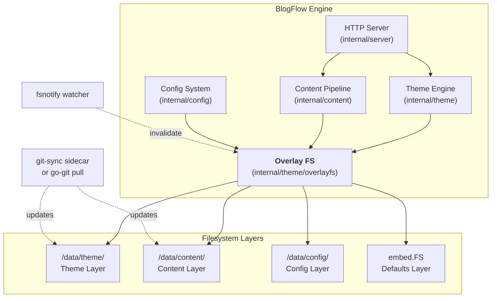
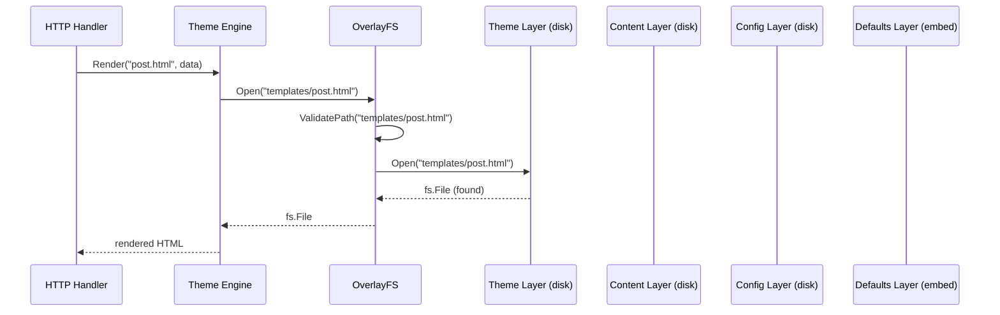
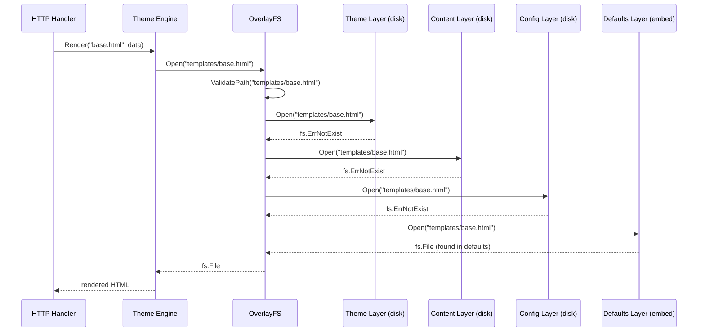
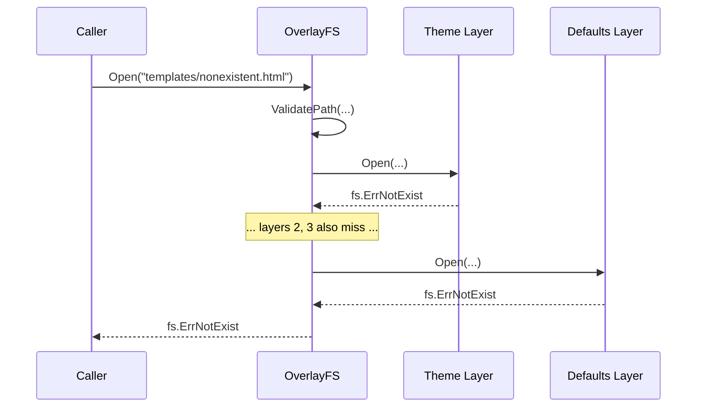
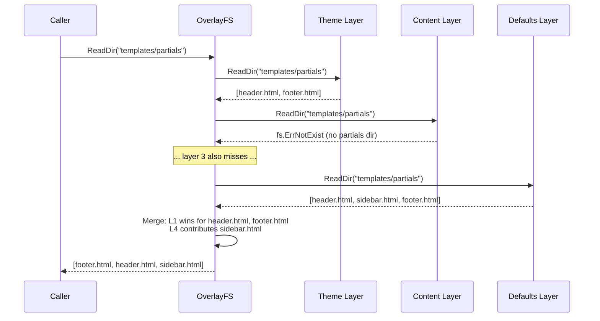
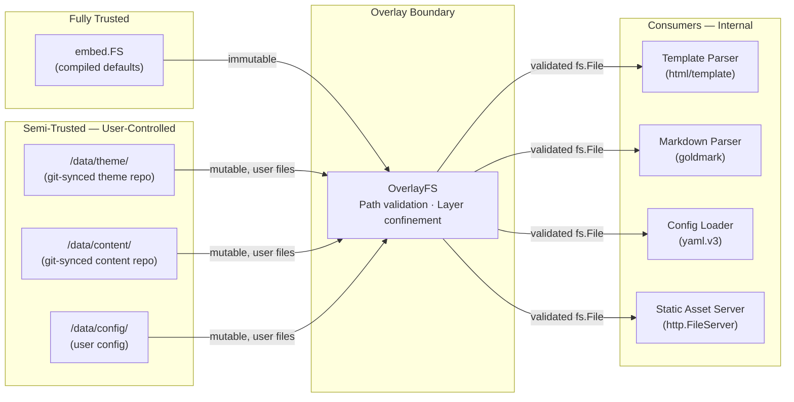
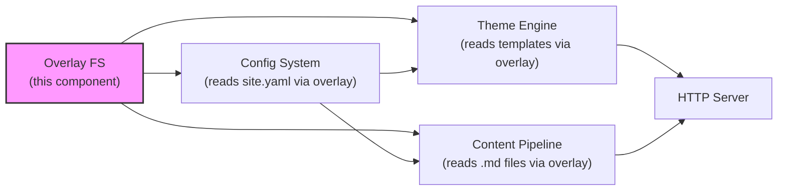

# Overlay Filesystem — Design Document

> **Status**: In Review  
> **Author**: Cloud-Native Distributed Systems Architect  
> **Reviewers**: Cloud-Native Security SME, Cloud-Native Systems Engineer, Cloud-Native SRE  
> **Last Updated**: 2026-03-22  

---

## 1 · Overview

### 1.1 What This Component Is

The Overlay Filesystem is BlogFlow's core file resolution abstraction. It implements Go's `io/fs.FS` interface as a layered stack where higher-priority layers shadow lower ones. Every file lookup — templates, content, static assets, configuration — flows through this single resolution mechanism, making it the foundational component on which the config system, theme engine, content pipeline, and HTTP server all depend.

### 1.2 Functionality It Provides

- **Layered file resolution** — opens the first matching file found by walking layers from highest to lowest priority
- **Union directory listing** — merges directory entries from all layers, with higher layers winning on name collisions
- **Standard `io/fs.FS` compatibility** — any Go code expecting `fs.FS`, `fs.ReadFileFS`, `fs.ReadDirFS`, or `fs.StatFS` works without modification
- **Progressive customization** — the binary ships with complete defaults; users override any file by placing it in an external directory
- **Hot-reload readiness** — layers backed by disk can be swapped or invalidated at runtime without restarting the process
- **Zero-config operation** — with no external files, the embedded defaults layer provides a fully functional blog

### 1.3 Why It Is Important

BlogFlow's value proposition is "one binary, zero config, full override." The overlay FS is the mechanism that makes this possible. Without it, the engine would need separate code paths for "use the default template" vs. "use the user's template" in every component. The overlay collapses this into a single `fs.Open()` call — callers are unaware of which layer served the file. This keeps the content pipeline, theme engine, and config system simple, testable, and decoupled from deployment topology.

### 1.4 Requirements Traceability

| Requirement | Version | Priority | Summary |
|-------------|---------|----------|---------|
| REQ-OFS-001 | v1 | P0 | Implement `io/fs.FS` with layered resolution (first match wins) |
| REQ-OFS-002 | v1 | P0 | Union `ReadDir` merging entries from all layers |
| REQ-OFS-003 | v1 | P0 | Support `embed.FS` as the immutable defaults layer |
| REQ-OFS-004 | v1 | P0 | Path traversal prevention on all operations |
| REQ-OFS-005 | v1 | P1 | Negative cache for upper-layer misses |
| REQ-OFS-006 | v1 | P1 | Layer invalidation API for hot-reload |
| REQ-OFS-007 | v1 | P2 | Metrics for layer hit/miss observability |
| REQ-OFS-008 | v1 | P0 | Minimum Go 1.22 enforced; startup assertion panics if runtime version < 1.22 |
| REQ-OFS-009 | v1 | P2 | Recommend git commit signing for theme repos; template function allowlist enforced |

---

## 2 · Logical Architecture

### 2.1 High-Level Architecture



### 2.2 Component Boundaries & Responsibilities

| Responsibility | Owned by This Component | Owned by |
|----------------|:-----------------------:|----------|
| Layered file resolution (`Open`, `Stat`, `ReadFile`) | ✅ | — |
| Union directory listing (`ReadDir`) | ✅ | — |
| Path validation and traversal prevention | ✅ | — |
| Layer ordering and registration | ✅ | — |
| Negative cache for miss optimization | ✅ | — |
| Layer invalidation signaling | ✅ | — |
| Template parsing and rendering | ❌ | `internal/theme` |
| Markdown parsing and HTML generation | ❌ | `internal/content` |
| YAML config loading and validation | ❌ | `internal/config` |
| Git clone/pull operations | ❌ | `internal/gitops` |
| Rendered HTML cache | ❌ | `internal/content` |
| fsnotify watch setup | ❌ | `internal/gitops` |
| HTTP routing and response writing | ❌ | `internal/server` |

### 2.3 Data Flow

#### Happy Path — File Found in Theme Layer



#### Fallback Path — File Not in Upper Layers



#### Error Path — File Not Found Anywhere



#### Union ReadDir Flow



### 2.4 Data Model / Schema

The overlay FS has no persistent data model — it is a runtime abstraction over `io/fs.FS` implementations. Its internal state consists of:

```go
// OverlayFS implements fs.FS, fs.ReadFileFS, fs.ReadDirFS, and fs.StatFS
// with layered resolution. Layers are checked in order; first match wins.
type OverlayFS struct {
    layers []fs.FS // highest priority first

    // Optional negative cache: tracks paths confirmed absent from
    // upper layers to avoid repeated stat calls on hot paths.
    negCache sync.Map // map[string]negCacheEntry

    mu sync.RWMutex // protects layers slice during hot-reload

    // maxNegCacheEntries bounds the negative cache size. When exceeded,
    // new entries are not cached (graceful degradation — extra stat calls,
    // no correctness impact). Default: 100,000.
    maxNegCacheEntries int
    negCacheCount      atomic.Int64 // current entry count
}

type negCacheEntry struct {
    // firstCandidateLayer is the index of the first layer that may
    // contain this path. Layers [0, firstCandidateLayer) are known
    // misses and skipped on subsequent lookups.
    firstCandidateLayer int
    cachedAt            time.Time
}
```

**Layer types used at runtime:**

| Layer | Priority | Backing `fs.FS` | Mutability |
|-------|:--------:|-----------------|------------|
| Theme | 1 (highest) | `os.DirFS("/data/theme")` | Mutable (git-sync or go-git) |
| Content | 2 | `os.DirFS("/data/content")` | Mutable (git-sync or go-git) |
| Config | 3 | `os.DirFS("/data/config")` | Mutable (manual or git-sync) |
| Defaults | 4 (lowest) | `embed.FS` | Immutable (compiled into binary) |

### 2.5 API Surface

#### Public Go Interfaces

```go
package overlayfs

import (
    "embed"
    "io/fs"
)

// OverlayFS is a layered filesystem where higher-priority layers
// shadow lower ones. It implements fs.FS, fs.StatFS, fs.ReadFileFS,
// and fs.ReadDirFS.
type OverlayFS struct { /* ... */ }

// NewOverlayFS creates a new overlay with the given layers.
// Layers are in priority order: layers[0] is checked first.
// Nil layers are silently skipped.
func NewOverlayFS(layers ...fs.FS) *OverlayFS

// NewFromPaths constructs the standard 4-layer BlogFlow overlay.
// Empty path strings cause that layer to be omitted.
// The defaults embed.FS is always included as the lowest layer.
func NewFromPaths(themePath, contentPath, configPath string, defaults embed.FS) (*OverlayFS, error)

// Open implements fs.FS. Returns the file from the highest-priority
// layer that contains it, or fs.ErrNotExist if no layer has it.
func (o *OverlayFS) Open(name string) (fs.File, error)

// ReadFile implements fs.ReadFileFS. Reads the entire file from the
// highest-priority layer that contains it.
func (o *OverlayFS) ReadFile(name string) ([]byte, error)

// ReadDir implements fs.ReadDirFS. Returns the UNION of directory
// entries across all layers. For duplicate names, the entry from the
// highest-priority layer wins. Entries are sorted by name.
func (o *OverlayFS) ReadDir(name string) ([]fs.DirEntry, error)

// Stat implements fs.StatFS. Returns file info from the highest-priority
// layer that contains the path.
func (o *OverlayFS) Stat(name string) (fs.FileInfo, error)

// InvalidateLayer clears negative cache entries for a specific layer.
// Called when files within a layer change (e.g., file edit, new file).
func (o *OverlayFS) InvalidateLayer(layerIndex int)

// InvalidateAll clears the entire negative cache.
func (o *OverlayFS) InvalidateAll()

// ReplaceLayer atomically replaces a layer's backing fs.FS and clears
// its negative cache entries. Used after git-sync symlink swaps where
// the base directory path has changed (e.g., /data/content-rev1 →
// /data/content-rev2). The caller must provide the new fs.FS.
// This is the correct method for handling symlink swaps — InvalidateLayer
// alone is insufficient because the old os.DirFS still points to the
// previous directory.
func (o *OverlayFS) ReplaceLayer(layerIndex int, newFS fs.FS) error

// LayerCount returns the number of active layers.
func (o *OverlayFS) LayerCount() int

// resolveInfo is internal — exposed only via tracing span attributes
// and debug logging. Must NOT appear in HTTP responses or
// client-visible error messages.
func (o *OverlayFS) resolveInfo(name string) (*Resolution, error)

// OpenFile opens a file and returns both the handle and its FileInfo
// from the same layer resolution. Prevents TOCTOU races between
// separate Stat() and Open() calls during concurrent layer updates.
func (o *OverlayFS) OpenFile(name string) (fs.File, fs.FileInfo, error)

// Resolution describes which layer served a file.
type Resolution struct {
    Path       string // validated path
    LayerIndex int    // 0-based index of the layer that served it
    LayerName  string // human-readable name ("theme", "content", "config", "defaults")
}
```

#### Path Validation Contract

All public methods enforce the following before touching any layer:

```go
// validatePath rejects paths that could escape the overlay boundary.
// Returns a cleaned path or an error.
func validatePath(name string) (string, error) {
    if !fs.ValidPath(name) {
        return "", &fs.PathError{Op: "open", Path: name, Err: fs.ErrInvalid}
    }
    // fs.ValidPath already rejects: empty, absolute, "..", trailing slash,
    // backslash, null bytes. We get this for free from the Go stdlib.
    return name, nil
}
```

#### Error Fallthrough Policy

Only `fs.ErrNotExist` triggers fallthrough to the next layer. All other errors — including `EACCES` (permission denied), `EIO` (I/O error), and `ETIMEDOUT` — are returned immediately to the caller. This prevents silent degradation where infrastructure failures cause the overlay to serve stale defaults.

Error classification:
| Error | Behavior | Rationale |
|-------|----------|-----------|
| `fs.ErrNotExist` | Fall through to next layer | File genuinely absent — expected overlay behavior |
| `fs.ErrPermission` (EACCES) | Return error immediately | Permission misconfiguration — must surface to operator |
| I/O errors (EIO, ETIMEDOUT) | Return error immediately | Infrastructure failure — must not be masked |
| Any other OS error | Return error immediately | Unknown failure — fail safe, don't degrade silently |
```

### 2.6 Dependencies

| Dependency | Type | Communication | Failure Behaviour |
|------------|------|---------------|-------------------|
| `io/fs` (stdlib) | Library | In-process | N/A (interface definitions) |
| `embed` (stdlib) | Library | In-process | N/A (compile-time, always available) |
| `os` (stdlib) | Library | Filesystem I/O | Return `fs.ErrNotExist` or wrapped OS error |
| `sync` (stdlib) | Library | In-process | N/A (concurrency primitives) |
| `internal/gitops` | Internal | Layer invalidation callback | If watcher fails, negative cache may serve stale misses until explicit invalidation or process restart. Risk bounded by watcher reliability and maxNegCacheEntries limit. |
| `fsnotify` | Library | In-process (via `internal/gitops`) | Retry watch; degrade to polling or serve stale |

### 2.7 Content Integrity & Isolation

**Go version requirement:** BlogFlow requires Go 1.22+ where `os.DirFS` is hardened against symlink escape via `openat2(2)` with `RESOLVE_BENEATH` on Linux. The `NewFromPaths` constructor asserts `runtime.Version() >= 1.22` at startup and panics if the requirement is not met. Defense-in-depth: before returning an `fs.File` from user-controlled layers (1–3), the implementation performs an `os.Lstat` on the resolved path; if the file is a symlink whose target is outside the layer root, `fs.ErrInvalid` is returned and a WARN is logged.

**Overlay boundary confinement:**
- Each disk-backed layer is constructed with `os.DirFS(basePath)`, which confines reads to the specified directory subtree. `os.DirFS` rejects absolute paths and `..` traversal at the OS level.
- On top of `os.DirFS`, the overlay itself calls `fs.ValidPath()` before any layer access, providing defense in depth.
- Symlinks within a layer directory that escape the base path are resolved by `os.DirFS` semantics — Go's `os.DirFS` follows symlinks but will not open paths outside the root. For additional hardening, the `NewFromPaths` constructor calls `filepath.EvalSymlinks` on each base path at startup to ensure the canonical path is used.

**Untrusted content handling:**
- Layers 1–3 contain user-provided files from git repositories. The overlay FS itself does not interpret file contents — it only resolves and returns `fs.File` handles.
- Downstream consumers apply appropriate parsing:
  - Templates: parsed by `html/template` (auto-escaping for XSS prevention)
  - Markdown: parsed by goldmark with raw HTML disabled by default
  - Static assets: served with `Content-Type` derived from file extension, `X-Content-Type-Options: nosniff` header
  - YAML config: parsed with strict unmarshalling into typed Go structs — unknown fields rejected

**Layer 4 (embed.FS) trust:**
- The embedded defaults layer is compiled into the binary and is immutable at runtime. It is fully trusted — its contents are reviewed as part of the source code review process.

**Config isolation**: The configuration system does NOT use the full 4-layer overlay for loading site.yaml. Instead, it reads only from the config layer and defaults layer. This prevents content or theme repos from shadowing operator configuration — a deliberate namespace partition.

**Template engine mandate**: All user-facing HTML output MUST use `html/template`, never `text/template`. Non-HTML outputs (RSS XML, sitemap XML, Atom feeds) use `encoding/xml` or `text/template` with explicit output escaping — these outputs contain no user-controlled template content.

**File type awareness**: The overlay FS does not enforce file type restrictions — it serves any syntactically valid path. However, downstream consumers MUST enforce extension-based restrictions: the HTTP static asset server only serves known-safe extensions (.html, .css, .js, .png, .jpg, .svg, .ico, .woff2, .xml, .json). The template loader only reads .html files. The content pipeline only reads .md files. This is documented as a security contract between the overlay FS and its consumers.

---

## 3 · Functional Test Scenarios

### 3.1 Happy-Path Scenarios

| # | Scenario | Precondition | Action | Expected Result |
|---|----------|--------------|--------|-----------------|
| 1 | Open file from highest-priority layer | `templates/post.html` exists in theme layer | `Open("templates/post.html")` | Returns file from theme layer |
| 2 | Open file from defaults (fallback) | `templates/base.html` only exists in embed.FS | `Open("templates/base.html")` | Returns file from defaults layer |
| 3 | Open file from middle layer | `site.yaml` exists in config layer but not theme or content | `Open("site.yaml")` | Returns file from config layer |
| 4 | ReadFile returns correct content | File content differs between layers | `ReadFile("templates/post.html")` | Returns bytes from highest-priority layer |
| 5 | ReadDir merges entries | Theme has `[a.html, b.html]`, defaults has `[b.html, c.html]` | `ReadDir("templates")` | Returns `[a.html, b.html, c.html]` where `b.html` is from theme |
| 6 | ReadDir returns sorted entries | Multiple layers contribute entries | `ReadDir("templates/partials")` | Entries are sorted lexicographically by name |
| 7 | Stat returns info from highest layer | File exists in two layers with different sizes | `Stat("static/style.css")` | Returns `FileInfo` from highest-priority layer |
| 8 | NewFromPaths with all layers | All four path arguments are valid directories | `NewFromPaths(theme, content, config, defaults)` | `OverlayFS` with 4 layers, `LayerCount() == 4` |
| 9 | NewFromPaths with empty paths | Theme and content paths are empty strings | `NewFromPaths("", "", configPath, defaults)` | `OverlayFS` with 2 layers (config + defaults) |
| 10 | ResolveInfo identifies layer | File exists in content layer | `ResolveInfo("posts/hello.md")` | `Resolution{LayerIndex: 1, LayerName: "content"}` |
| 11 | ReadDir root directory | All layers have files at root | `ReadDir(".")` | ReadDir(".") returns union of all root-level entries from all 4 layers |

### 3.2 Edge Cases & Error Scenarios

| # | Scenario | Input / Condition | Expected Behaviour |
|---|----------|-------------------|--------------------|
| 1 | File not found in any layer | Path does not exist anywhere | Return `fs.ErrNotExist` |
| 2 | Path traversal with `..` | `Open("../etc/passwd")` | Return `fs.ErrInvalid`, log WARN |
| 3 | Absolute path | `Open("/etc/passwd")` | Return `fs.ErrInvalid`, log WARN |
| 4 | Path with null byte | `Open("templates/post\x00.html")` | Return `fs.ErrInvalid` |
| 5 | Path with backslash | `Open("templates\\post.html")` | Return `fs.ErrInvalid` (rejected by `fs.ValidPath`) |
| 6 | Empty path | `Open("")` | Return `fs.ErrInvalid` |
| 7 | Dot path (root) | `Open(".")` | Return root directory file handle |
| 8 | ReadDir on nonexistent directory | No layer has the directory | Return `fs.ErrNotExist` |
| 9 | ReadDir when some layers lack directory | Theme has dir, content does not, defaults has dir | Merge theme + defaults entries, skip missing layers |
| 10 | Nil layer in constructor | `NewOverlayFS(themeFS, nil, defaultsFS)` | Nil layer silently skipped, 2 active layers |
| 11 | Zero layers | `NewOverlayFS()` | All operations return `fs.ErrNotExist` |
| 12 | Concurrent reads | Multiple goroutines call `Open` simultaneously | Thread-safe, no data races |
| 13 | Concurrent read + invalidation | `Open` during `InvalidateLayer` | No panic, consistent result (before or after invalidation) |
| 14 | Layer with permission error | OS returns `EACCES` on a disk layer | Return wrapped OS error immediately. Do NOT fall through — only `fs.ErrNotExist` triggers fallthrough. Log WARN with layer name and error details. |
| 15 | Symlink escape attempt | Symlink in `/data/content/` points to `/etc/` | `os.DirFS` prevents escape; return `ErrNotExist` or `ErrInvalid` |
| 16 | Very deep nested path | `Open("a/b/c/d/e/f/g/h/file.txt")` | Normal resolution if path is valid; no artificial depth limit |
| 17 | File replaced during read | File is overwritten between `Open` and `Read` | OS-level behavior — file handle sees content at open time (POSIX semantics) |
| 18 | Symlink in user layer pointing outside root | Content layer has symlink → /etc/passwd | Return fs.ErrInvalid, log WARN with path and target |
| 19 | Stat then Open during concurrent layer swap | Stat resolves layer 2, swap occurs, Open resolves layer 4 | OpenFile() returns consistent handle+info from same layer |

### 3.3 Integration Test Boundaries

| Integration Point | Real in Tests | Mocked in Unit Tests | Notes |
|-------------------|:------------:|:-------------------:|-------|
| `embed.FS` (defaults layer) | ✅ | — | Use `testing/fstest.MapFS` as a stand-in |
| Disk filesystem (`os.DirFS`) | ✅ in integration | ✅ via `fstest.MapFS` in unit | Integration tests use `t.TempDir()` |
| `internal/gitops` invalidation | ❌ | ✅ | Test the `InvalidateLayer` API directly |
| `internal/theme` template loading | ❌ | ✅ | Theme engine tested separately with mock `fs.FS` |
| `internal/content` content scanning | ❌ | ✅ | Content pipeline tested separately with mock `fs.FS` |

### 3.4 Acceptance Criteria Mapping

| Acceptance Criterion | Test Scenario(s) | Coverage |
|----------------------|-------------------|----------|
| Files resolve from highest-priority layer | §3.1 #1, #2, #3, #4 | ✅ Covered |
| ReadDir returns union of all layers | §3.1 #5, #6 | ✅ Covered |
| Path traversal is blocked | §3.2 #2, #3, #4, #5, #6, #15 | ✅ Covered |
| Works with zero external files (defaults only) | §3.1 #9 | ✅ Covered |
| Thread-safe under concurrent access | §3.2 #12, #13 | ✅ Covered |
| Nil/empty layers handled gracefully | §3.1 #9, §3.2 #10, #11 | ✅ Covered |
| Layer invalidation clears caches | §3.2 #13, §4.6 | ✅ Covered |
| Standard `fs.FS` interface compliance | All §3.1 scenarios | ✅ Covered |

---

## 4 · Performance

### 4.1 Expected Load Profile

The overlay FS sits on the hot path for every HTTP request that requires file resolution. However, in production, a rendered HTML cache in the content pipeline absorbs the majority of reads — the overlay is only hit on cache misses and cache rebuilds.

| Blog Tier | Daily Visitors | Overlay Reads/sec (steady) | Overlay Reads/sec (peak) |
|-----------|:--------------:|:--------------------------:|:------------------------:|
| Small | ~100 | < 1 (most cached) | ~10 (after content update) |
| Medium | ~5,000 | ~5 (cache misses + partials) | ~50 (full cache rebuild) |
| High-traffic | ~50,000+ | ~20 (cache misses) | ~200 (full cache rebuild) |

The peak scenario is a full cache rebuild triggered by a content or theme update. During rebuild, every template + content file is read once through the overlay. For a blog with 500 posts and 20 templates, this is ~520 file reads in a burst.

### 4.2 Latency Targets

| Percentile | Target | Measurement Point |
|------------|--------|-------------------|
| p50 | ≤ 50 µs | `OverlayFS.Open()` to file handle returned |
| p95 | ≤ 200 µs | `OverlayFS.Open()` including disk I/O on miss |
| p99 | ≤ 1 ms | `OverlayFS.Open()` worst case (4 layers, cold cache) |

These are per-file-operation latencies. End-to-end HTTP request latency is governed by the content pipeline and rendered HTML cache, not the overlay FS.

**NFS caveat**: Targets assume local-disk PVC (SSD/NVMe). For NFS-backed volumes (EFS, GCP Filestore), cold stat() calls take 10–50ms; p99 target is 50–200ms per layer. Negative cache warm-up after first rebuild is critical. Recommend local-disk StorageClass for production.

### 4.3 Throughput Targets

- **Sustained**: 1,000 file operations/sec on a single core (dominated by OS filesystem cache)
- **Burst**: 5,000 file operations/sec during a full cache rebuild
- **Bottleneck**: disk I/O on cache-cold reads; mitigated by OS page cache and negative caching

### 4.4 Scaling Strategy

The overlay FS scales **vertically** within the BlogFlow process. It is a stateless, in-memory abstraction over filesystem calls — no horizontal scaling needed.

- **Scaling bottleneck**: filesystem `stat()` calls on upper layers that don't contain the requested file. With 4 layers, worst case is 4 `stat()` calls per lookup.
- **Mitigation**: Negative cache records "path not found in layer N," allowing future lookups to skip layers 0..N-1 for that path and go directly to the layer that has it.
- **OS page cache**: After the first read, file contents live in the OS page cache. Subsequent reads are memory-speed.

### 4.5 Resource Budgets

| Resource | Budget per Replica | Notes |
|----------|-------------------|-------|
| CPU | Negligible (< 1% of request CPU) | Dominated by template rendering downstream |
| Memory | ~2 MB for negative cache | Bounded by maxNegCacheEntries (default 100K, configurable). At capacity, new misses skip caching — worst case is extra stat() calls, no correctness failure. |
| Storage | 0 (stateless) | Reads from existing volumes, no writes |

### 4.6 Performance Test Plan

**Benchmark suite** (`overlayfs_bench_test.go`):

| Benchmark | Description | Pass Threshold |
|-----------|-------------|---------------|
| `BenchmarkOpen_TopLayer` | Open a file that exists in layer 1 | ≤ 50 µs/op |
| `BenchmarkOpen_BottomLayer` | Open a file that falls through to layer 4 | ≤ 200 µs/op |
| `BenchmarkOpen_NotExist` | Open a file that doesn't exist anywhere | ≤ 200 µs/op |
| `BenchmarkOpen_NegCacheHit` | Open a file with a warm negative cache | ≤ 10 µs/op |
| `BenchmarkReadDir_Union` | ReadDir with entries in 3 of 4 layers | ≤ 500 µs/op |
| `BenchmarkOpen_Parallel` | 8 goroutines calling Open concurrently | No race detector warnings |

Benchmarks run on every PR via `go test -bench=. -benchmem -count=5 ./internal/theme/overlayfs/...`.

**Regression detection**: CI runs `benchstat` comparing current results against `testdata/bench-baseline.txt`. Any regression > 2× on a named benchmark fails the PR. Baseline is updated when performance improvements are merged.

---

## 5 · Security

### 5.1 Authentication & Authorization

The overlay FS does not handle authentication or authorization directly. It is an internal component invoked by other BlogFlow subsystems. Access control is enforced at two levels:

- **HTTP layer**: The HTTP server controls which URLs are routable. Static assets are served from an explicit `/static/` prefix; templates are never directly accessible via HTTP.
- **Filesystem layer**: Each disk-backed layer is confined to its base directory by `os.DirFS`. The overlay FS validates all paths with `fs.ValidPath()` before delegation.

There is no per-file ACL. All files visible through the overlay are considered readable by the BlogFlow process. This is appropriate because the process runs as UID 65532 (nonroot) with read-only access to content volumes.

### 5.2 Data Classification & Encryption

| Data Element | Classification | Encrypted at Rest | Encrypted in Transit |
|-------------|----------------|:-----------------:|:--------------------:|
| Templates (`.html`) | Internal | N/A (filesystem) | ✅ (HTTPS to client) |
| Content (`.md`) | Public (after rendering) | N/A (filesystem) | ✅ (HTTPS to client) |
| Configuration (`.yaml`) | Internal | N/A (filesystem) | N/A (not transmitted) |
| Static assets (CSS/JS/images) | Public | N/A (filesystem) | ✅ (HTTPS to client) |
| Embedded defaults | Public | N/A (compiled in) | ✅ (HTTPS to client) |

No data handled by the overlay FS is classified as confidential or restricted. Configuration files must never contain secrets — the copilot instructions and security SME spec are explicit that secrets are injected via environment variables, not config files.

### 5.3 Input Validation & Sanitization

**Path validation** (enforced on every public method):

| Check | Implementation | Threat Mitigated |
|-------|---------------|-----------------|
| `fs.ValidPath(name)` | Go stdlib — rejects empty, absolute, `..`, backslash, null bytes, trailing slash | Path traversal, null byte injection |
| `os.DirFS` confinement | Each layer rooted at its base directory | Directory escape |
| `filepath.EvalSymlinks` on base paths | Constructor resolves symlinks at startup | Symlink-based root escape |
| Non-interpretation of file content | Overlay returns raw bytes; parsing is the caller's responsibility | Injection via file content |

**Size limits**: The overlay FS does not enforce file size limits. Downstream consumers (template parser, markdown parser, config loader) enforce their own limits. The content pipeline rejects markdown files > 10 MB; the config loader rejects YAML files > 1 MB.

**Unicode normalization**: Path inputs are not Unicode-normalized. The overlay assumes paths are presented in NFC form by callers. A startup warning is logged on macOS (`runtime.GOOS == "darwin"`) in non-test builds advising against production use on macOS due to HFS+/APFS NFD normalization differences.

### 5.4 Content Integrity

**Path traversal prevention:**
- `fs.ValidPath()` is the first check in every public method. It rejects any path containing `..`, any absolute path, any path with backslash or null bytes. This is a Go stdlib function with well-tested behavior.
- `os.DirFS()` provides a second layer of defense. Even if a path somehow bypassed `fs.ValidPath()`, `os.DirFS` will not open files outside its root directory.

**Symlink handling:**
- At construction time, `NewFromPaths` calls `filepath.EvalSymlinks` on each base path. If `/data/content` is a symlink to `/data/content-abc123` (common with git-sync), the resolved path is used.
- Symlinks *within* a layer directory are followed by the OS, but `os.DirFS` confines them to the subtree. A symlink from `/data/content/evil` → `/etc/passwd` would be rejected.

**TOCTOU mitigation**: Callers should prefer `Open()`-then-`Stat()` on the returned file handle (atomic, single layer resolution) over `Stat()`-then-`Open()` (two-phase, may resolve from different layers during concurrent invalidation). The API provides `OpenFile(name string) (fs.File, fs.FileInfo, error)` as a convenience that returns both atomically.

**Git-sync symlink swap:**
- git-sync updates content by atomically swapping a symlink (e.g., `/data/content` → `/data/content-rev1` becomes `/data/content` → `/data/content-rev2`). The overlay FS handles this by re-evaluating `os.DirFS` after an invalidation signal. The watcher detects the symlink change and calls `InvalidateLayer`.

---

## 6 · Threat Model

### 6.1 Trust Boundaries



### 6.2 Threat Actors & Attack Surfaces

| Threat Actor | Attack Surface | Motivation |
|-------------|----------------|------------|
| Malicious content author | Content layer files (markdown, front matter) | Inject XSS via markdown, overwrite templates, escalate access |
| Compromised theme repo | Theme layer files (templates, CSS, JS) | Inject malicious JavaScript via template control, deface site, bypass CSP headers, exfiltrate visitor data. Note: html/template auto-escaping does NOT protect here — the attacker controls the template itself. |
| Compromised git-sync sidecar | Symlink swap mechanism | Replace content root, inject arbitrary files |
| Path traversal attacker | Any `Open`/`ReadFile`/`Stat` call with crafted path | Read files outside overlay boundary (e.g., `/etc/passwd`, env vars) |
| Denial-of-service | Thousands of requests for nonexistent paths | Exhaust filesystem I/O with stat storms |
| User-authored symlink in content/theme git repo | Content/theme layer files (symlinks) | Escape overlay root to read credentials, secrets, or system files |
| Operator routing misconfiguration | HTTP server serves non-public file types from overlay | Expose .pem/.key/.env files from content layer via direct URL |

### 6.3 STRIDE Analysis

| Threat Category | Applicable? | Threat Description | Mitigation |
|----------------|:-----------:|--------------------|------------|
| **S**poofing | ❌ | Overlay FS has no identity/auth — not applicable | N/A |
| **T**ampering | ✅ | Attacker modifies files in a disk layer to alter rendered output (e.g., inject `<script>` in a template) | Templates from user-controlled layers (theme, content) are treated as semi-trusted input. `html/template` auto-escaping protects data values injected INTO templates but does NOT protect against a malicious template itself. Actual mitigations: (a) operator controls which theme repo is mounted, (b) git commit signing recommended for theme repos (REQ-OFS-009), (c) template function allowlist — only safe functions registered (no functions returning `template.HTML`, `template.JS`, or `template.URL` types), (d) monitoring for unexpected template changes. |
| **R**epudiation | ✅ | Attacker modifies content and denies responsibility | Git history provides audit trail. Overlay FS logs layer resolution at DEBUG level. |
| **I**nformation Disclosure | ✅ | Path traversal escapes overlay root to read sensitive files (`/etc/passwd`, secrets mount) | `fs.ValidPath()` + `os.DirFS` confinement + `filepath.EvalSymlinks` at construction. Templates never served raw — only rendered output. |
| **D**enial of Service | ✅ | Flood of requests for nonexistent paths causes stat storm across all 4 layers | Negative cache prevents repeated misses. Rendered HTML cache absorbs repeated hits. Rate limiting at HTTP layer. |
| **E**levation of Privilege | ✅ | Attacker places a file in a higher-priority layer to shadow a safe default (e.g., override `base.html` to remove CSP headers) | Layer priority is explicit and documented. **Namespace partitioning**: the config loader reads ONLY from the config and defaults layers (bypassing theme and content layers). This prevents content repo authors from shadowing operator config. Template and content resolution uses all layers. Operators control which directories are mounted. Monitoring alerts on unexpected theme/config changes. |

### 6.4 Mitigations & Residual Risks

| Threat | Mitigation | Residual Risk |
|--------|-----------|---------------|
| Path traversal | `fs.ValidPath()` + `os.DirFS` + `filepath.EvalSymlinks` | **Low** — relies on Go stdlib correctness; well-tested |
| Template injection | `html/template` auto-escaping; raw HTML disabled in goldmark | **Medium** — Attacker who controls theme templates can inject arbitrary HTML/JS. Mitigated by operator mount control and recommended commit signing, but no technical enforcement in the overlay FS itself. |
| Layer shadowing (EoP) | Documented layer priority; operator controls mounts | **Medium** — if attacker gains write to theme volume, they can shadow defaults. Mitigated by read-only mounts where possible and monitoring. |
| DoS via stat storm | Negative cache; rendered HTML cache; HTTP rate limiting | **Low** — negative cache bounds stat calls to one per unique path per cache lifetime |
| Symlink escape | `os.DirFS` confinement + `filepath.EvalSymlinks` | **Medium** — Pre-1.22 builds lack protection; defense-in-depth `lstat` check added for all user-controlled layers. |
| git-sync compromise | Out of scope for overlay FS; mitigated by K8s RBAC and pod security | **Accepted** — if the sidecar is compromised, it can write arbitrary files to the volume. Overlay FS cannot prevent this; defense is at the cluster level. |

---

## 7 · Observability

### 7.1 Logging Strategy

| Log Level | When Used | Example |
|-----------|-----------|---------|
| ERROR | Layer construction failure (base path does not exist or is inaccessible) | `"failed to initialize theme layer" path="/data/theme" error="no such directory"` |
| WARN | Path traversal attempt blocked | `"path validation rejected" path="../etc/passwd" error="invalid path" remote_addr="10.0.0.5"` |
| WARN | Layer access error (permission denied) | `"layer access error" layer="theme" path="templates/post.html" error="permission denied"` |
| INFO | Layer initialized successfully | `"overlay layer initialized" layer="theme" path="/data/theme"` |
| INFO | Layer invalidated (hot-reload) | `"layer cache invalidated" layer="content" trigger="fsnotify"` |
| DEBUG | File resolution path (which layer served the file) | `"file resolved" path="templates/post.html" layer="theme" layer_index=0 duration_us=42` |
| DEBUG | Negative cache hit | `"negative cache hit" path="templates/post.html" skip_layers=2` |

DEBUG-level logs are sampled at 1% in production (configurable via `BLOGFLOW_OVERLAY_DEBUG_SAMPLE_RATE`). Full DEBUG output in development mode. Prefer span attributes (§7.3) for per-file resolution data in production.

All log entries include `component="overlayfs"` for filtering. Path traversal warnings include the request context (`request_id`, `remote_addr`) when available.

### 7.2 Metrics & Dashboards

| Metric | Type | Labels | Description |
|--------|------|--------|-------------|
| `blogflow_overlay_resolve_duration_seconds` | Histogram | `op` (`open`, `stat`, `readfile`, `readdir`) | Time to resolve a file through the layer stack |
| `blogflow_overlay_layer_hit_total` | Counter | `layer` (`theme`, `content`, `config`, `defaults`) | Number of times each layer served a file |
| `blogflow_overlay_miss_total` | Counter | — | Files not found in any layer |
| `blogflow_overlay_negcache_hit_total` | Counter | — | Negative cache hits (avoided layer checks) |
| `blogflow_overlay_negcache_size` | Gauge | — | Current number of entries in the negative cache |
| `blogflow_overlay_path_rejected_total` | Counter | `reason` (`traversal`, `absolute`, `invalid`) | Path validation rejections (security signal) |
| `blogflow_overlay_invalidation_total` | Counter | `layer` | Layer cache invalidation events |
| `blogflow_overlay_layer_error_total` | Counter | `layer`, `error_type` (`permission_denied`, `io_error`, `timeout`) | Non-ErrNotExist errors per layer |
| `blogflow_overlay_readdir_entries_total` | Histogram | `layer` | Entries contributed per layer in ReadDir union merge |

**Dashboard: Overlay FS Health**
- Layer hit distribution (stacked bar by layer) — shows how many files come from customization vs. defaults
- Resolve latency heatmap (p50/p95/p99)
- Path rejection rate (security anomaly detection)
- Negative cache hit ratio (efficiency indicator)

### 7.3 Distributed Tracing

The `ContextOverlayFS` wrapper (not the raw `OverlayFS`) creates child spans. The wrapper extracts trace context from `context.Context` and injects `request_id`, `remote_addr` into WARN-level log entries for security correlation.

| Span Name | Attributes | Notes |
|-----------|------------|-------|
| `overlayfs.open` | `fs.path`, `fs.layer`, `fs.layer_index`, `fs.cached` | Created on every file resolution |
| `overlayfs.readdir` | `fs.path`, `fs.entry_count`, `fs.layers_checked` | Created on directory union merge |

Spans are only created if an active trace context exists in the calling goroutine (via `context.Context`). The overlay FS never creates root spans — it always participates in a trace started by the HTTP handler.

### 7.4 Alerting Rules & Escalation

| Alert Name | Condition | Severity | Response |
|------------|-----------|----------|----------|
| `OverlayHighRejectRate` | `blogflow_overlay_path_rejected_total` rate > 10/min for 5 min | 🟠 High | Investigate potential path traversal attack; review HTTP access logs |
| `OverlayLayerUnavailable` | Layer initialization failure logged at ERROR level | 🔴 Critical | Check volume mounts; verify git-sync sidecar is running; check PVC status |
| `OverlayHighLatency` | `blogflow_overlay_resolve_duration_seconds` p99 > 5 ms for 10 min | 🟡 Warning | Check disk I/O; verify OS page cache is warm; check for inode exhaustion |
| `OverlayDefaultsOnly` | `blogflow_overlay_layer_hit_total{layer="theme"}` rate = 0 for 30 min | 🟡 Warning | Theme layer may be missing or empty; verify volume mount |
| `OverlayNegCacheHighWatermark` | `blogflow_overlay_negcache_size` > 75K entries for 5 min | 🟡 Warning | Investigate path diversity; consider increasing limit or adding HTTP rate limiting |
| `OverlayContentLayerUnavailable` | `blogflow_overlay_layer_hit_total{layer="content"}` rate = 0 for 10 min | 🔴 Critical | Content layer missing — blog posts not serving; check git-sync, PVC status |
| `OverlayLayerIOErrors` | `blogflow_overlay_layer_error_total` rate > 0 for 5 min | 🟠 High | Infrastructure errors on a layer; check disk, NFS, permissions |

---

## 8 · Rollout & Risk

### 8.1 Rollout Strategy

The overlay FS is a foundational library component — it is not deployed independently. It ships as part of the BlogFlow binary. Rollout strategy:

1. **Phase 1 — Library implementation**: Implement `OverlayFS` with full test coverage. Merge to `main` via PR.
2. **Phase 2 — Integration**: Wire overlay FS into config loader, theme engine, and content pipeline. Each integration is a separate PR. Pre-condition: embed.FS defaults directory must contain at minimum one template and one config default before Phase 2 integration PRs are merged.
3. **Phase 3 — Default theme**: Populate `defaults/` with the embedded default theme and config. Verify the binary works with zero external files.
4. **Phase 4 — Hot-reload**: Add `InvalidateLayer` integration with fsnotify and git-sync watcher.

Since this is a library, there is no canary or blue-green deployment. Quality is ensured by test coverage, benchmarks, and integration testing in the CI pipeline.

### 8.2 Rollback Plan

- **Pre-integration (Phase 1)**: Revert the merge commit. No downstream impact.
- **Post-integration (Phase 2+)**: If the overlay FS introduces a regression, revert to the previous approach of direct filesystem access in each consumer. This is feasible because the overlay FS is behind the `fs.FS` interface — consumers can be pointed at a plain `os.DirFS` or `embed.FS` directly.
- **Rollback time**: Phase 1 (library only): ~30 min (revert PR + CI build). Phase 2+ (integrated): 2–4 hours (revert integration PRs across config/theme/content). Each integration is a separate PR, enabling surgical rollback. During integration phase, a build tag `blogflow_no_overlay` compiles consumers with direct os.DirFS/embed.FS access as a fallback.

### 8.3 Risk Register

| Risk | Likelihood | Impact | Mitigation |
|------|:----------:|:------:|------------|
| Performance regression from stat storms (4 stat calls per file lookup) | Medium | Medium | Negative cache; rendered HTML cache absorbs repeated hits; benchmarks in CI |
| Symlink handling differences across OS (Linux vs. macOS vs. Windows) | Low | Medium | `filepath.EvalSymlinks` at construction; integration tests on Linux (production OS); macOS tested in dev |
| Race condition during hot-reload (read during layer swap) | Low | High | `sync.RWMutex` protects layer slice; negative cache cleared atomically on invalidation |
| Negative cache goes stale (file added to upper layer but cache says "not there") | Medium | Low | Invalidation signal from file watcher clears cache; cache bounded by maxNegCacheEntries (default 100K) |
| `embed.FS` path prefix mismatch (e.g., `defaults/templates/` vs. `templates/`) | Low | High | Impact: High — all template rendering fails; blog is completely inoperable until binary is redeployed with corrected prefix. No graceful degradation possible. The `fs.Sub()` call is a critical correctness requirement covered by unit tests. |
| ReadDir union merge is O(N×M) for N layers × M entries | Low | Low | Typical blogs have < 50 templates and < 1000 content files; merge is fast |
| Disk full on content PVC | Medium | High | PVC capacity alert at 80%; git-sync --max-sync-failures with alerting |
| Inode exhaustion on ext4 PVC | Low | High | Monitor node_filesystem_files_free; document inode density requirements in deployment guide |
| NFS latency spike (EFS/Filestore) | Medium | Medium | Recommend local-disk PVC for production; add NFS caveat to §4.2 latency targets; negative cache critical for NFS environments |

### 8.4 Dependencies & Sequencing



**Deployment order:**
1. **Overlay FS** ← must be implemented first (this document)
2. **Config system** — depends on overlay FS for reading `site.yaml` and `defaults.yaml`
3. **Theme engine** — depends on overlay FS for template resolution + config for theme settings
4. **Content pipeline** — depends on overlay FS for `.md` file discovery + config for rendering settings
5. **HTTP server** — depends on all of the above

### 8.5 Launch Checklist

- [ ] All acceptance criteria from §3.4 are met
- [ ] Unit tests pass with `go test -race ./internal/theme/overlayfs/...`
- [ ] Benchmarks pass thresholds defined in §4.6
- [ ] `go vet` and `staticcheck` report no issues
- [ ] Integration test: binary starts with only `embed.FS` defaults (zero external files)
- [ ] Integration test: binary starts with all 4 layers populated
- [ ] Integration test: `ReadDir` returns union of entries from multiple layers
- [ ] Path traversal tests pass (§3.2 #2–#6, #15)
- [ ] Negative cache invalidation verified under concurrent access
- [ ] Security review completed (§5 and §6 reviewed by Security SME)
- [ ] Observability: metrics registered, log format verified, span attributes documented
- [ ] Documentation: GoDoc comments on all exported types and functions
- [ ] No TODO or FIXME comments left in production code

**Operational Readiness:**
- [ ] Runbook created for overlay FS failure scenarios (layer unavailable, permission errors, cache overflow)
- [ ] Alert rules deployed and smoke-tested in staging
- [ ] Dashboard deployed and functional in staging
- [ ] Graceful degradation tested: all disk layers unavailable, only embed.FS serves
- [ ] Open questions §9 Q2, Q3, Q4 resolved
- [ ] Volume mount health verified in K8s integration test
- [ ] Hot-reload tested under concurrent read load (race detector enabled)
- [ ] Negative cache size monitored; stays within configured bounds under load

---

## 9 · Open Questions & Decisions

| # | Question | Status | Resolution |
|---|----------|--------|------------|
| 1 | Should `ReadDir` return a merged view or only entries from the highest layer that has the directory? | ✅ Resolved | Merged (union) view — required for template partial discovery and content listing. Higher layer wins on name collisions. |
| 2 | Should the negative cache have a TTL or only invalidate on explicit signal? | ✅ Resolved | Explicit invalidation only (no TTL). Cache is bounded by maxNegCacheEntries (default 100K). §2.6 dependency note updated: if watcher fails, cache may serve stale misses until process restart — bounded risk. |
| 3 | Should the overlay FS accept `context.Context` for cancellation and tracing? | ✅ Resolved | The core OverlayFS stays context-free (stdlib fs.FS compliant). A ContextOverlayFS wrapper accepts context.Context, checks ctx.Done() before each layer call, creates OTel spans, and extracts request_id/remote_addr for security logging. The wrapper is the public API surface for BlogFlow consumers; the raw OverlayFS is internal. |
| 4 | Where should the overlay FS package live: `internal/theme/overlayfs` or `internal/overlayfs`? | ✅ Resolved | internal/overlayfs (top-level internal package). Used by theme, content, and config — nesting under theme would create a false ownership signal. |
| 5 | Should `NewFromPaths` validate that base directories exist at construction time, or defer to first access? | ✅ Resolved | Validate at construction. Fail fast with a clear error message if a configured path does not exist. Omitted (empty string) paths are fine. |
| 6 | Should `embed.FS` path prefix stripping use `fs.Sub()` or a custom wrapper? | ✅ Resolved | Use `fs.Sub()` from Go stdlib. It handles prefix stripping correctly and returns a valid `fs.FS`. |

---

## 10 · References

- **Requirements**: REQ-OFS-001 through REQ-OFS-009 (defined in §1.4)
- **ADRs**: See `docs/engineering/adr/` for BlogFlow ADRs
- **Architecture context**: [Cloud-Native Distributed Systems Architect agent spec](../../persona/agents/cloud-native-distributed-systems-architect-agent.md)
- **Security review**: [Cloud-Native Security SME agent spec](../../persona/agents/cloud-native-security-sme-agent.md)
- **Go stdlib references**:
  - [`io/fs` package](https://pkg.go.dev/io/fs) — `FS`, `ReadFileFS`, `ReadDirFS`, `StatFS`, `ValidPath`
  - [`embed` package](https://pkg.go.dev/embed) — `embed.FS`
  - [`os.DirFS`](https://pkg.go.dev/os#DirFS) — directory-confined filesystem
  - [`fs.Sub`](https://pkg.go.dev/io/fs#Sub) — subtree of an `fs.FS`
  - [`testing/fstest`](https://pkg.go.dev/testing/fstest) — `MapFS` for testing
- **Related design docs**: Config System (planned), Theme Engine (planned), Content Pipeline (planned)
- **Project instructions**: [Copilot Instructions](../../../.github/copilot-instructions.md)
